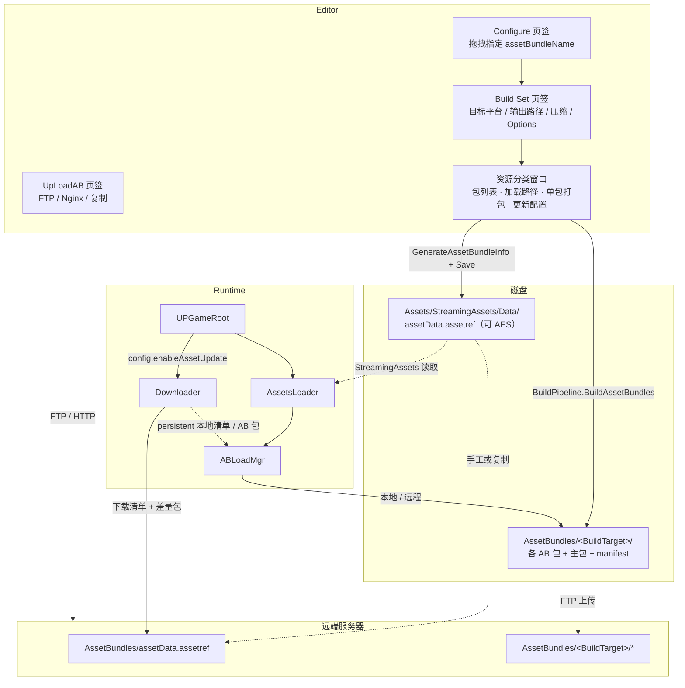
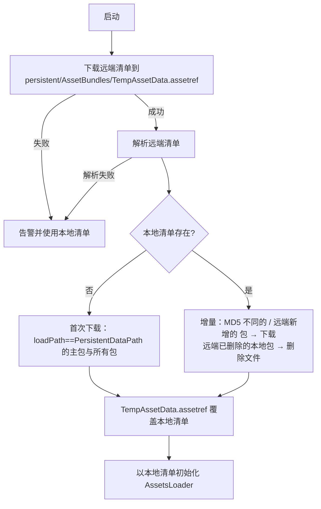

# AssetBundle 打包与热更系统

> 位置：`Editor/AssetBundleTools/`（打包/上传工具，属 `UPandaGF.Editor`）
> 运行时：`Runtime/Manager/AssetsMgr/`、`Runtime/Manager/GameRoot/SourcesLoadMgr/`、`Runtime/Manager/GameRoot/UPGameRoot.cs`

一套「官方 AssetBundle Browser 二次开发 + 自研清单 / 热更 / 加载链路」的完整方案：

- **打包**：可视化指定包名、单包或含依赖打包、逐包设置加载位置、生成资源清单。
- **上传**：FTP 或 Nginx（HTTP）。
- **加载**：编辑器直读 / AssetBundle 双模式，支持 `StreamingAssets`、`PersistentDataPath`、`RemotePath` 三种位置。
- **热更**：清单 MD5 增量比对，只下载变更包，并清理远端已删除的包。

---

## 1. 目录结构

```
Editor/AssetBundleTools/AssetEditor/
├── AssetBundleBrowserMain.cs              主窗口（4 个页签）
├── AssetBundleManageTab.cs                Configure 页签：拖拽给资源指定包名
├── AssetBundleTree.cs / AssetListTree.cs / BundleDetailList.cs
├── AssetBundleModel/                      Browser 数据模型（ABModel / ABModelBundleInfo / ABModelAssetInfo）
├── MessageSystem.cs / MessageList.cs      工具内消息面板
├── AssetBundleBuildTab.cs                 Build Set 页签：构建参数
├── AssetBundleClassificationWindow.cs     ★ 资源分类窗口（大小/MD5/依赖/加载路径/打包/清单生成）
├── AssetBundleDataSource/                 数据源抽象（默认走 AssetDatabase + BuildPipeline）
├── InspectTab/                            Inspect 页签：查看已构建包里有哪些资源
└── UpLoad/                                UpLoadAB 页签：FTP / Nginx 上传
    ├── UpLoadABEditor.cs
    ├── UpLoadFTP.cs
    └── NginxUploader.cs

Runtime/Manager/
├── GameRoot/UPGameRoot.cs                 启动、热更编排、加载方式配置
├── GameRoot/SourcesLoadMgr/
│   ├── IAssetsLoader.cs                   资源加载接口
│   ├── AssetsLoader.cs                    双模式实现（Editor 直读 / AB）
│   ├── ABSourcesRelated.cs                清单数据模型 + ABLoadPath 枚举
│   └── EditorSourcesMgr.cs                编辑器直读（AssetDatabase）
└── AssetsMgr/
    ├── AssetBundleMgr/ABLoadMgr.cs        AB 加载：主包 / manifest / 依赖 / 资源 / 卸载
    ├── AssetBundleMgr/ABUpdata/AssetBundelUpdataMgr.cs   【已废弃】旧的 txt 对比文件热更
    ├── ResourcesLoader.cs                 Resources 加载（同时定义了 AssetBundleClassificationWindowConfig）
    └── StreamingAssetsLoadTool.cs         跨平台 StreamingAssets 读取
```

---

## 2. 架构与数据流



---

## 3. 编辑器侧使用流程

### 3.1 指定包名（Configure 页签）

拖拽资源到包节点，或右键新建包 —— 本质是写 `AssetImporter.assetBundleName`。支持变体（`bundle.variant`）。

### 3.2 打包（Build Set 页签）

| 项 | 说明 |
|---|---|
| `Build Target` | 目标平台（枚举），默认 `StandaloneWindows` |
| `Output Path` | 默认 `AssetBundles/<Build Target>`；`Browse` 可改，`Reset` 恢复默认 |
| `压缩[Compression]` | 无压缩 / LZMA(`StandardCompression`) / LZ4(`ChunkBasedCompression`) |
| 高级开关 | 排除类型信息、强制重建、忽略类型树更改、追加哈希、严格模式、试运行构建 |
| `清理文件夹[Clear Folders]` | 勾选后构建前询问并删除输出目录（同时勾了 `[Copy to StreamingAssets]` 时，只额外删除拷贝目标 `Assets/StreamingAssets/<Output Path>`，**不会**动 StreamingAssets 里的其它内容） |
| `[Copy to StreamingAssets]` | 构建后把输出目录**按原层级**拷到 `Assets/StreamingAssets/<Output Path>`（如 `Assets/StreamingAssets/AssetBundles/StandaloneWindows`）；该目录名需与 `UPGameRoot.Config.LoadAssetPath` 一致，运行时才找得到 |

### 3.3 资源分类窗口（Build Set 页签内的核心面板）

- **主包行**：主包名 = **输出目录的目录名**（Unity 用输出目录名命名 manifest 包；默认路径下恰好等于 `Build Target` 名，自定义目录后即为该目录名）；主包加载位置单独设置。产物查找支持工程内相对路径与绝对路径。
- **包列表**：`包名 / 大小 / 依赖数量 / 加载配置`，前 3 列可点击排序；双击行查看详情（资源清单 + 依赖清单，可逐条"定位"）。
- **工具栏**：
  - `搜索`：按包名或包内资源路径过滤；
  - `更新配置`：重新扫描工程 → 生成清单 `assetData.assetref`（见 3.4）；
  - `Build All`：调用 `Build Set` 的参数执行全量打包，随后自动刷新列表并重新生成清单。
- **右键菜单**：`Build This Bundle`（只打该包）/ `Build This Bundle + Dependencies`（含全部依赖）/ 详细信息 / 在 Project 中高亮 / 复制包名 / 在资源管理器中显示 / 复制 AssetBundle 路径 / 复制 MD5 码。

> ⚠️ 单包构建会用"只包含这些包"的 manifest **覆盖输出目录里的主包**，其它包的依赖信息会丢失。正式出包 / 上传前请用 `Build All` 做一次全量打包，再点「更新配置」。
- **加密设置折叠面板**：显示清单的存放位置（StreamingAssets 下 `/Data/`）、文件名（`assetData`）、后缀（`.assetref`），提供 AES `Key` / `IV` / `使用加密` 开关；下方还会**检测场景中 `UPGameRoot.Config.AssetAESConfig` 与本窗口配置是否一致**（不一致时给出黄色警告），并提供「同步到场景中的 UPGameRoot」按钮（已带 `Undo`，记得保存场景；**运行时真源是 `StreamingAssets/Data/GameRootConfig.json`，同步完要在 UPGameRoot 面板再点一次「保存到 Json」**）。

### 3.4 生成清单

点「更新配置」执行 `GenerateAssetBundleInfo()`：

1. 遍历 `AssetDatabase.GetAllAssetBundleNames()`，逐个统计包内资源、依赖、已构建文件大小与 MD5（列表里显示"未构建"的包会被打上 `isBuilt = false`）；
2. **跳过未构建的包**：它们没有真实的大小 / MD5，写进清单只会让热更的 MD5 比对与下载判断全部失真；控制台会打印一条告警（最多列 10 个包名）；
3. **主包未构建时不写清单**：直接报错返回，避免用一份空清单覆盖上一次可用的 `assetData.assetref`（必须先 `Build All` 或右键构建）；
4. 遍历 `AssetDatabase.GetAllAssetPaths()`（排除 `Assets/Plugins` 与 `.cs`），把每个被分配到**已构建**包里的资源登记为 `资源路径 -> {包名, 资源名}`；所属包未构建的资源同样跳过（否则运行时 `GetABLoadPath` 会因查不到包信息抛 `KeyNotFoundException`）；
5. 与上一次清单比对，控制台打印「已更改 / 新增 / 已被移除」（未构建的包会被当作"已被移除"，属预期）；
6. 序列化 → 可选 AES 加密 → 写入 `Assets/StreamingAssets/Data/assetData.assetref`。

### 3.5 上传（UpLoadAB 页签）

| 功能 | 说明 |
|---|---|
| `上传方式` | `FTP` 或 `HTTP` |
| FTP | 默认地址 `ftp://127.0.0.1/AssetBundles/<BuildTarget>/`，账号密码存 `EditorPrefs`；只上传**无后缀文件**与 `.txt` |
| HTTP | 打开 `NginxUploader` 窗口，手动选文件/目录上传到 nginx（默认 `http://localhost:8090/upload`） |
| 复制资源到 StreamingAssets | 把打包输出目录整体拷到 `Assets/StreamingAssets/<输出路径>` |
| 复制资源到目标路径 | 先**清空目标目录**再整体复制，结束后打开资源管理器 |
| 保存 | 配置存 `Assets/Editor/EditorConfig/UpLoadABEditorConfig.json` |

---

## 4. 清单数据格式与路径约定

### 4.1 数据模型（`ABSourcesRelated.cs`）

```csharp
public class ABSourcesRelated
{
    public AssetBundleLoadInfo mainBundleInfo;                              // 主包
    public Dictionary<string, AssetBundleLoadInfo> bundleInfo;              // key = 包名
    public Dictionary<string, AssetRelatedArg> sourcesDic;                  // key = 资源路径（Assets/...）
}

public class AssetBundleLoadInfo { string bundleName; long size; string md5; ABLoadPath loadPath; }
public class AssetRelatedArg    { string bundleName; string sourceName; }   // sourceName = 文件名（无扩展名）

public enum ABLoadPath { StreamingAssetsPath, PersistentDataPath, RemotePath }
```

> 清单是 `BinaryFormatter` 序列化的产物（内含 `Dictionary`，无法直接用 `JsonUtility`），可再经 AES 加密。更换格式必须 Editor 写入端与运行时读取端同步迁移。

### 4.2 磁盘 / 远端路径约定

| 用途 | 路径 |
|---|---|
| 打包输出 | `AssetBundles/<BuildTarget>/`（工程根） |
| 编辑器生成的清单 | `Assets/StreamingAssets/Data/assetData.assetref` |
| 远端清单 | `{remoteURL}/AssetBundles/assetData.assetref` |
| 远端的 AB 包 | `{remoteURL}/{LoadAssetPath}/<包名>`（`LoadAssetPath` 默认 `AssetBundles/StandaloneWindows/`）|
| 本地清单副本 | `{persistentDataPath}/AssetBundles/assetData.assetref` |
| 本地 AB 包 | `{persistentDataPath}/{LoadAssetPath}/<包名>` |
| 加密 / 上传配置 | `Assets/Editor/EditorConfig/AssetBundleBuildConfig.json`、`UpLoadABEditorConfig.json` |
| 工具界面状态 | `Library/AssetBundleBrowserBuild.dat`、`Library/AssetBundleBrowserInspect.dat` |

---

## 5. 运行时加载

### 5.1 `UPGameRoot` 配置（Inspector / Json）

配置整体封装在可序列化对象 `UPGameRootConfig` 中（对外通过 `UPGameRoot.Config` 只读访问），并持久化为 `Assets/StreamingAssets/Data/GameRootConfig.json`：

| 字段（`UPGameRoot.Config.`） | 说明 |
|---|---|
| `method` | `Editor`（AssetDatabase 直读）/ `Assetbundles`（走 AB） |
| `enableAssetUpdate` | 启动时执行资源热更（仅 `Assetbundles` 模式有意义） |
| `LoadAssetPath` | 资源相对路径，默认 `AssetBundles/StandaloneWindows/` |
| `remoteURL` | 远端根地址，默认 `http://127.0.0.1:80/`；本工程当前 Json 里填的是 `http://127.0.0.1:8090/`（与 3.5 的 nginx 上传端口一致） |
| `downloadBatchTimeout` | 等待一批下载完成的超时（秒，默认 300） |
| `AssetAESConfig` | 清单 AES 配置（必须与 3.3 的「使用加密」成对配置） |

> **优先级：Json > 面板。** `UPGameRoot.Init()` 的第一步读 `GameRootConfig.json`，读到就以它为准；Json 缺失 / 解析失败 / 内容为空才用面板（代码）里的值。所以**只改面板不点「保存到 Json」对启动无效**；想让某个场景用不同配置，改那个 Json 或直接删掉它。
> 面板底部提供「保存到 Json」/「从 Json 读取」/「定位文件」三个按钮（详细流程见 `Runtime/Manager/GameRoot/README.md` 第 5 节）。

### 5.2 调用方式

```csharp
IAssetsLoader loader = UPGameRoot.Instance.GetAssetsLoader();
Sprite icon = await loader.LoadAsync<Sprite>("Assets/ArtAssets/UI/icon.png"); // 路径 = 清单里的资源路径
loader.LoadSceneAsync("Assets/Scenes/Main.unity", assetLoadComplete, sceneLoadComplete);
```

| 层 | 职责 |
|---|---|
| `AssetsLoader` | 按 `sourcesDic[path]` 解析出包名 + 资源名，再交给 `ABLoadMgr`；编辑器模式直接 `AssetDatabase.LoadAssetAtPath` |
| `ABLoadMgr` | 加载主包 → 读 `AssetBundleManifest` → 递归加载依赖 → `LoadAssetAsync`；进度通过 `ABLoadProgressEvent`（`EventCenter`）广播 |

| `ABLoadMgr` 公开 API | 说明 |
|---|---|
| `Task Init(pathUrl, mainName, mainLoadPath)` | 加载主包并取得 manifest |
| `Task<AssetBundle> GetAssetBundle(abName, loadPath)` | 加载指定包及其依赖 |
| `void GetAssetBundle(abName, loadPath, callback)` | 同上（协程回调版） |
| `Task<T> LoadResAsync<T>(abName, resName, loadPath)` | 异步加载资源 |
| `void LoadResAsync<T>(...)` / `void LoadResAsync(..., Type, ...)` | 回调式加载资源 |
| `bool UnLoadAB(name)` | 卸载单个包（`Unload(false)`） |
| `void ClearAB()` | 卸载全部包并清空缓存与 manifest |

### 5.3 `ABLoadPath` 三种加载位置的差异

| 取值 | 编辑器取值 | 加载方式 | 适用 |
|---|---|---|---|
| `StreamingAssetsPath` | 0 | `UnityWebRequestAssetBundle` | 随包体分发、无需更新的资源 |
| `PersistentDataPath` | 1 | `AssetBundle.LoadFromFileAsync` | 需要热更下载到本地的资源 |
| `RemotePath` | 2 | `UnityWebRequestAssetBundle`（`remoteURL` + `PathUrl`） | 直接走 CDN / 服务器，不落盘 |

### 5.4 错误处理约定（调用方必读）

- 资源缺失 / AB 未就绪：打印错误日志并返回 `null`（异步）或回调 `null`（回调式），**不抛异常**，调用方必须判空。
- `LoadSceneAsync` **没有失败回调**：AB 模式下资源缺失只会回调 `assetLoadComplete`，`sceneLoadComplete` 不会触发。
- `LoadAssemblyAsync` 可能返回 `null`。

---

## 6. 热更语义（`UPGameRoot.UpdateAssets`）



要点：

1. **只有 `ABLoadPath.PersistentDataPath` 的包参与热更**；`StreamingAssets` 的包随包体、`RemotePath` 的包每次直连远端。
2. **主包同理**：`mainBundleLoadPath`（清单里的 `mainBundleInfo.loadPath`）必须是 `PersistentDataPath` 才会被下载/更新；为其他值时启动会打印 `主包加载位置为 X，本次热更不会下载主包` 的告警。
3. 清单比对以 **MD5** 为准；本地清单缺失时按"首次下载"处理。
4. 下载失败**不会回滚**：使用已下载成功的部分并打印红色汇总（最多 10 条明细），启动流程继续。
5. 断点续传由 `DownloadMgr` 提供且**默认关闭**（与 MD5 增量语义冲突），详见 `Runtime/Manager/DownloadMgr/README.md`。

---

## 7. 编辑器工具与菜单

| 菜单 | 位置 |
|---|---|
| `UPandaGF -> AB包工具 -> AssetBundle Browser` | `AssetBundleBrowserMain.ShowWindow` |
| `UPandaGF -> Tools -> 创建常用目录文件夹` | 会自动创建 `AssetBundles` 等 8 个目录 |
| `UPandaGF -> 创建UPGameRoot` / `GameObject -> UPandaGF -> 创建UPGameRoot` | 创建 `UPGameRoot`（Inspector 即资源加载/热更/AES 配置面板） |

> 菜单分组约定：模块级工具放 `UPandaGF -> Runtime -> <模块>`，AB 工具属**框架级**，按原路径放在 `UPandaGF -> AB包工具`。

---

## 8. 已知限制与注意事项

| # | 限制 | 影响 |
|---|---|---|
| 1 | 包名本身含 `.` 时 Unity 无法区分"基础包名"与"变体名"（官方 AB Browser 有同样提示）；本工具按 Unity 规则取"最后一个 `/` 之后的短名里最后一个 `.`"之后作为变体 | 仅影响列表里的"变体"显示；包内资源 / 依赖统计与打包均不受影响（`GetAllAssetBundleNames()` 返回的就是含变体的全名，直接传给 `GetAssetPathsFromAssetBundle` 是正确用法） |
| 2 | 未构建的包**不会**写入清单；主包未构建时本次「更新配置」不落盘 | 忘了打包时清单会缺包，运行时报"该资源不存在"；控制台会给告警，请先 `Build All` 再生成清单 |
| 3 | **单包 / 含依赖构建会用只含这些包的 manifest 覆盖输出目录里的主包** | 其它包的依赖信息会丢；正式出包/上传前请用 `Build All` 全量打包再「更新配置」 |
| 4 | 清单为 `BinaryFormatter` 序列化 | 换 JSON 需 Editor 端与运行时同步迁移（`sourcesDic` 含 `Dictionary`） |
| 5 | `ClearAB()` 后必须重新 `Init` | 已一并清理 `manifest`，之后 `GetAssetBundle` 会以"主包未加载"报错，属预期行为 |
| 6 | AES 配置实际有三处：`AssetBundleBuildConfig.json`（打包端）、`UPGameRoot.Config.AssetAESConfig`（场景）、`GameRootConfig.json`（**运行时真源**） | 工具能检测「打包端 vs 场景」是否一致并一键同步（见 3.3）；但启动时以 `GameRootConfig.json` 为准，同步后需在 UPGameRoot 面板再点一次「保存到 Json」，否则仍会按旧 Json 运行 |
| 7 | 打包期间编辑器阻塞、没有真实进度 | `BuildPipeline` 是同步调用，只给"正在构建…"提示（不再假装有百分比） |
| 8 | 上传页签只自动挑输出目录里的"无后缀文件 + `.txt`" | 清单请用「只上传清单（assetData.assetref）」按钮上传 |
| 9 | `AssetBundelUpdataMgr` 类仍存在（标 `[Obsolete]`） | 已从 `PoolUseScene.unity` 移除组件引用；其逻辑本身有缺陷（成功/失败分支判反、`ABCompareInfo.txt.txt` 双后缀、重复键抛异常），勿使用 |

---

## 9. 变更记录

**2026-09-16**

- 配置来源变更：`UPGameRoot` 上的散字段（`method` / `enableAssetUpdate` / `LoadAssetPath` / `remoteURL` / `downloadBatchTimeout` / `EnableDebugModel` / `AssetAESConfig`）已封装进 `UPGameRootConfig` 对象（`UPGameRoot.Config`），并支持落地为 `Assets/StreamingAssets/Data/GameRootConfig.json`：`UPGameRoot` 启动的**第一步**读该 Json（读到即以它为准），面板改完点「保存到 Json」写回。
- 本窗口 3.3 的「同步到场景中的 UPGameRoot」写入位置改为 `UPGameRoot.Config.AssetAESConfig`（原来直接写 `UPGameRoot.AssetAESConfig`）。
- 旧场景 / Prefab 里遗留的 `reomoteURL` / `EnableDebugModel` 等序列化键**不再被读取**（字段已搬进 `config` 对象）——请在面板重设一次并保存到 Json。
- 详见 `Runtime/Manager/GameRoot/README.md`（配置项与 Json 优先级）。

**2026-09-11**

- `ABLoadMgr`：
  - 依赖包 / 目标包加载失败**不再写入 `null` 缓存**（原实现会让 `null` 被判定为"已加载"，导致后续永远不再重试），并在失败时中止本次加载、打印明确的包名链路；
  - 协程版 `LoadAssetBundle` 补齐"已加载直接回调"检查，消除并发/重复加载时的 `Add` 重复键异常；
  - `LoadResAsync` 两个 Task 重载与两个回调协程改为按返回值判空，消除 `KeyNotFoundException` 与"回调永不触发导致调用方挂起"；
  - `ClearAB` 补清 `_loadingBundles` 与 `manifest`；
  - 删除未使用的 `isInit` 字段（消除 `CS0414` 警告）。
- `UPGameRoot.DownloadFirstTime`：主包仅在 `loadPath == PersistentDataPath` 时下载，否则打印告警，避免"下载了但运行时从不使用"的假更新。
- `AssetBundleClassificationWindow`（清单正确性）：
  - `AssetBundleInfo` 新增 `isBuilt`；未构建的包不再把 `md5 = "未构建"` 这类占位值写进清单，`GetAssetBundleInfo` 直接跳过它们并汇总告警（最多列 10 个）；
  - 主包未构建时「更新配置」**不再覆盖** `assetData.assetref`，改为报错并保留上一次可用的清单；
  - 未构建包内的资源不再登记进 `sourcesDic`，避免运行时 `GetABLoadPath` 抛 `KeyNotFoundException`；
  - 变体识别改为与 Unity 一致（先取最后一个 `/` 之后的短名，再按短名里最后一个 `.` 分割），修正含 `.` 或带路径层级的包名被误判为变体；
  - 详情面板的 `MD5`、右键「复制 MD5 码 / 在资源管理器中显示」对未构建项改为显示 / 禁用。
- 核对结论（未做改动）：变体包**没有** API 用错 —— Unity 只提供 `GetAssetPathsFromAssetBundle(name)` 与 `GetAssetBundleDependencies(name, recursive)`（不存在 `...AndAssetBundleVariant` 重载），而 `GetAllAssetBundleNames()` 返回的就是 `name.variant` 全名，官方 AB Browser 也是把全名直接传给这两个 API。
- 第二批（同日）—— 打包 / 上传 / 配置一致性：
  - **主包名与包路径不再硬编码**：主包名改为"输出目录的目录名"（`GetLastPathSegment`）；`GetBuildPathForBundle` 改为支持工程内相对路径、工程内/外绝对路径（原来只认含 `AssetBundles/` 的路径，自定义输出目录后主包恒显示"未构建"）；
  - **上传页签补上清单**：`FTPUpLoadABConfig` 新增「清单上传地址」（默认 `ftp://127.0.0.1/AssetBundles/`，与 `UPGameRoot.UpdateAssets` 的读取位置一致）；「上传AB包和清单」会在传完 AB 包后自动上传 `assetData.assetref`，另提供「只上传清单」按钮；HTTP 分支给出提示与清单本地路径（本地路径与分类窗口共用 `AssetDataFullPath`，不再重复硬编码）；
  - **`[Copy to StreamingAssets]` 恢复并修正**：目标改为 `Assets/StreamingAssets/<Output Path>`（保留层级；原实现会散落到 StreamingAssets 根目录，运行时按 `LoadAssetPath` 找不到）；「清理文件夹」原来会 `Directory.Delete(Assets/StreamingAssets, true)` **清空整个 StreamingAssets**，现在只删该拷贝目标；
  - **AES 配置一致性**：加密折叠面板会检测场景中 `UPGameRoot.AssetAESConfig` 与本窗口 JSON 是否一致（不一致给警告）并支持一键同步到场景（`Undo` + 标记场景脏）；`PoolUseScene.unity` 里补上了 `AssetAESConfig`（与当前 JSON 一致：不加密）；
  - **工程清理**：删掉未使用的 `using log4net;`（去掉对 `com.unity.collab-proxy` 的隐式依赖）；去掉假的构建进度条与 `Task.Run(Thread.Sleep)`（改为诚实的"正在构建…"提示，保留防重入）；「加载配置」的写回从 `OnGUI` 行内改为绘制结束后统一同步 `sourcesDic`（被搜索过滤的行也能生效）；从 `PoolUseScene.unity` 移除已废弃的 `ABUpdataMgr` 组件（含明文 FTP 密码）并清掉 `UPGameRoot` 上遗留的 `MainName`/`MainPackageLoadPath`/`assetUpdataConfig` 陈旧序列化字段。
- 新增本文档。

---

## 10. FAQ

**Q1：运行时报"该资源不存在：Assets/xxx"？**
清单里 `sourcesDic` 的 key 就是 `AssetDatabase` 的资源路径，必须与调用方传入的字符串完全一致。资源改名 / 移动目录 / 新增资源后，都要重新点「更新配置」。

**Q2：改了资源，热更却没生效？**
依次检查：① 是否重新打包；② 是否点了「更新配置」；③ 新清单是否已上传到远端 `AssetBundles/assetData.assetref`；④ 该包的加载位置是否为 `PersistentDataPath`；⑤ 主包是否也需要更新（主包 `loadPath` 必须是 `PersistentDataPath`）。

**Q3：主包是什么？文件名怎么来的？**
`BuildPipeline.BuildAssetBundles` 会用输出目录的**叶子目录名**生成 manifest bundle（即"主包"），因此默认 `AssetBundles/StandaloneWindows/` 下主包名就是 `StandaloneWindows`。

**Q4：远端目录应该长什么样？**
```
AssetBundles/assetData.assetref
AssetBundles/StandaloneWindows/StandaloneWindows      ← 主包
AssetBundles/StandaloneWindows/<其它包名>
```

**Q5：AES 打开后运行时报反序列化失败？**
打包时的加密开关必须与运行时 `UPGameRoot.AssetAESConfig` 一致（`Key` / `IV` 也要一致）。注意配置有两份存储，见"已知限制 11"。

**Q6：AB 模式下场景加载卡住不回调？**
`LoadSceneAsync` 没有失败回调，资源缺失时 `sceneLoadComplete` 不会触发，启动流程需自备超时兜底（参考 `GameLaunchExample`）。

**Q7：能只打一个包吗？**
可以：在资源分类窗口右键 → `Build This Bundle`（只打该包）或 `Build This Bundle + Dependencies`（含依赖）。注意单包构建后仍建议重新点「更新配置」刷新清单。

**Q8：点了「更新配置」，为什么清单里少了几个包？**
因为你还没打包：输出目录里找不到对应文件的包会被跳过，控制台会打印 `有 N 个 AssetBundle 尚未构建…` 的告警。先 `Build All`（或右键单个包构建）再点「更新配置」。若**主包**也没构建，本次根本不会写清单文件（报错并保留上一份可用的清单）。

**Q9：远端明明上传了新 AB 包，热更却没下载？**
热更的第一步是下载远端 `AssetBundles/assetData.assetref` 并按 MD5 比对，清单没更新就不会触发下载。用 `UpLoadAB` 页签的「上传AB包和清单」（或「只上传清单」），「清单上传地址」应对应 `{remoteURL}/AssetBundles/`。

**Q10：运行时报清单解密失败 / AB 模式没起来？**
打包窗口的「使用加密 / Key / IV」必须与场景中 `UPGameRoot.AssetAESConfig` 一致。展开「加密设置」看提示：不一致会显示黄色警告，点「同步到场景中的 UPGameRoot」并保存场景即可。
