# 交互式任务评分系统（InteractiveTaskScoringSystem）

分步骤进行的流程，涉及工具选择、对象交互、动画播放和动态评分。

> - 代码位置：`Assets/Scripts/upanda-framework/Runtime/Game/InteractiveTaskScoringSystem/`
> - 命名空间：`UPandaGF.RunTime.InteractiveTaskScoringSystem`
> - 编码约定：模块既有源码为 **GBK（无 BOM）+ CRLF**（改动请走 GBK 流程，否则中文注释会被破坏）；本次新增的 `Example/`、编辑器脚本为 UTF-8
> - 依赖：`UPandaGF.Runtime` 程序集内的 `EventCenter`、`PLogger`、`LazySingletonBase`
> - 当前状态：**已提供一键生成的演示场景**（见第 4 节）与**配置体检工具**（见第 4.4 节），可直接 Play 验证

---

## 1. 它解决什么问题

把"实训/教学类多步骤任务"抽象成一条可配置的流程链：

- **步骤（Step）**：一个任务由若干步骤按顺序执行；
- **操作组（Operation Group）**：一个步骤内的操作可以"必须按顺序"（串联）或"做够几个即可"（并联）；
- **操作检查（Operation Check）**：每个操作对应一个场景交互物，点击后判定对错；
- **交互实体（Task Entity）**：场景中被点击的物体（扳手、螺丝、开关…），通过 ID 与检查项关联；
- **评分**：按错误次数结算每步得分，累计总分；跳过步骤不计分。

适用：设备操作训练、维修流程演练、消防/应急流程教学等"步骤 + 点选"的交互场景。

---

## 2. 目录结构与文件职责

```
InteractiveTaskScoringSystem/
├── ReadMe.md                       ← 本文档
├── Core/                           ★ 纯逻辑层（不依赖 UnityEngine，可单测/可复用）
│   ├── TaskStepRuntime.cs          每步运行状态（错误/得分/完成/跳过/耗时）—— 原寄生在配置资产上
│   ├── TaskProgress.cs             任务进度（下标/总分/推进/完成判定）
│   ├── ScorePolicy.cs              IScorePolicy + ScoreContext + IScorePolicyEx + 默认策略 + 线性扣分策略
│   ├── DifficultyScorePolicy.cs    难度分级：简单/普通/困难 + 超时扣分（P2）
│   ├── ReplayLog.cs                动作级回放日志（ReplayEntry / ReplayLog，可 JSON 落盘）（P2）
│   └── ITaskHost.cs                任务宿主接口（交互实体只依赖它，便于测试/多实例）
├── Data/
│   ├── TaskConfig.cs               TaskStepData（步骤数据）+ TaskConfig（ScriptableObject）+ TaskConfigJsonData
│   ├── PartsConfig.cs              PartConfig / PartsConfig（零件配置，预留，当前无引用）
│   └── ToolsConfig.cs              ToolConfig / ToolsConfig（工具配置，预留，当前无引用）
├── Task/
│   ├── TaskDataManager.cs          任务总调度：初始化、点击路由、步骤推进、总分、操作记录
│   └── TaskStepBase.cs             单个步骤：激活实体、持有操作组、评分结算
├── Operation/
│   ├── OperationCheckBase.cs       叶子操作：四阶段状态机 + 目标实体校验
│   ├── OperationGroupBase.cs       操作组基类：收集子步骤、完成回调、跳过
│   ├── SeriesOperationGroup.cs     串联组：按下标顺序逐个进行
│   └── ParallelOperationGroup.cs   并联组：完成数量达到 completeCount 即通过
├── TaskInteractive/
│   ├── TaskEntityBase.cs           交互实体抽象基类 + InteractiveTrigger 接口
│   ├── TaskEntityManager.cs        实体注册表（stepID → 实体），懒加载单例
│   └── TaskTriggerExample.cs       示例触发器：鼠标事件 → InteractiveTrigger（在全局命名空间）
└── Example/                        ← 本次新增的演示代码（可整目录删除，不影响模块）
    ├── DemoInteractiveEntity.cs    示例交互实体（实现 TaskEntityBase + EntityOperationCheck）
    └── DemoTaskHud.cs              示例 HUD（订阅步骤事件与提示事件，OnGUI 显示）

编辑器扩展（位于框架 Editor 程序集）：
Editor/CustomInspector/InteractiveTaskScoringSystem/
├── TaskDataManagerEditor.cs        一键创建任务节点 / 运行时"步骤提示、步骤跳过"按钮
├── TaskStepBaseEditor.cs           添加操作检查组（串联/并联），并校验"一个步骤只能有一个组"
├── OperationGroupBaseEditor.cs     添加基础操作检查 / 子操作组
├── OperationCheckBaseEditor.cs     一键"查找对应实体"（按 ID 在场景中搜索）
├── InteractiveTaskDemoBuilder.cs   ★ 一键生成演示场景（配置资产 + 实体预制体 + 场景）
├── InteractiveTaskValidator.cs     ★ 流程校验 + 自动修复（纯逻辑，可被 CI/脚本调用）
├── InteractiveTaskValidatorWindow.cs  ★ 校验器窗口（菜单：UPandaGF/Runtime/交互任务评分系统/任务流程校验器）
├── InteractiveTaskReplayWindow.cs  ★ 回放复盘查看器（菜单：…/回放复盘查看器；P2）
└── InteractiveTaskSelfCheck.cs     ★ 纯逻辑自检（菜单：…/运行逻辑自检；项目未装 Test Runner，用它代替）
```

---

## 3. 架构与调用链

```mermaid
graph LR
    A["鼠标点击<br/>TaskTriggerExample"] --> B["TaskEntityBase.OnSelect()"]
    B --> C["TaskDataManager.OperationCheck()"]
    C --> D["TaskStepBase.OperationCheck()<br/>(当前步骤)"]
    D --> E["OperationGroupBase<br/>串联 / 并联"]
    E --> F["OperationCheckBase.CheckOperation()<br/>比对 TargetEntity / EntityOperationCheck"]
    F -->|通过| G["OpearationExecute()<br/>→ TargetEntity.Execute(callback)"]
    G --> H["组完成 → TaskStepBase.Submit()<br/>结算分数"]
    H --> I["TaskDataManager.CompleteStep()<br/>→ MoveToNextStep()"]
```



一次完整点击的流程：

1. `TaskTriggerExample` 捕获 `OnMouseDown` → `InteractiveTrigger.OnSelect()`；
2. `TaskEntityBase.OnSelect()` → `TaskDataManager.Instance.OperationCheck(this)`（会先判断是否点在 UI 上、是否有 TaskDataManager）；
3. `TaskDataManager` 把请求转给"当前步骤" → 步骤转给它的操作组；
4. 操作组按自己的规则（串联：只查当前下标的子操作；并联：遍历所有子操作）调用 `CheckOperation`；
5. 叶子操作 `OperationCheckBase` 校验：
   - `TargetEntity`（运行时通过 `TaskEntityManager` 按 ID 查找，或用 Inspector 手动指定）；
   - 若目标实体实现了 `EntityOperationCheck`，用它自己的 `ConditionMet(arg)` 判定；
6. 通过 → 阶段切到 `Execute` → 调用 `TargetEntity.Execute(callback)` 播放动作；
7. 动作结束回调 → 阶段切到 `Complete` → 逐级上报（组 → 步骤）；
8. `TaskStepBase.Submit()` 结算分数 → `TaskDataManager.CompleteStep()` 记日志、累加总分、切下一步。

### 状态机

| 枚举 | 取值 | 说明 |
| --- | --- | --- |
| `TaskState` | `Ready` / `InProgress` / `TaskComplete` | 步骤级状态 |
| `OperationPhase` | `Prepare` → `TargetCheck` → `Execute` → `Complete` | 操作级状态；`Prepare` 阶段点击一律判为不通过（防误触），`Execute` 阶段重复点击不会重复执行 |

### ID 规则（关键）

- 步骤 ID：直接取 `TaskConfig` 里的 `TaskStepData.stepID`；
- 操作组 ID / 叶子操作 ID：由编辑器 `Reset()` 自动生成为 `父ID-同级序号`（如 `Step1-0`、`Step1-0-1`）；
- **实体靠 `TaskEntityBase.StepIDGroup` 反向匹配这些 ID**；移动子物体顺序会改变自动生成的 ID，需要重新 Reset 或手填。

### 评分规则

| 错误次数 | 得分 |
| --- | --- |
| 0 | `baseScore` |
| 1 | `baseScore / 2` |
| ≥2 | 0 |

- 分数在"步骤完成"时结算并累加到 `TaskDataManager.totalScore`；
- `isSkip = true` 的步骤不计入总分；
- 在串联/并联组中点击**不匹配的物体**会 `AddErroTimes()` 并弹出"操作错误!!!"提示（故意设计为"乱点=扣分"）；**动画执行中/已完成后的点击不算错误**。

---

## 4. 快速上手（推荐：一键生成演示场景）

1. 等 Unity 编译完成（菜单出现 `UPandaGF`）；
2. 点击菜单 **`UPandaGF → Runtime → 交互任务评分系统 → 创建演示场景`**；
3. 生成物（都在 `Runtime/Game/InteractiveTaskScoringSystem/Example/Demo/`）：
   - `TaskConfig_Demo.asset`：2 个步骤（Step1 基础分 10、Step2 基础分 20）；
   - `DemoInteractiveEntity.prefab`：可交互方块（含 `TaskTriggerExample` + `DemoInteractiveEntity`）；
   - `InteractiveTaskDemo.unity`：含 4 个方块（A/B/C/D）、`TaskDataManager`、`DemoTaskHud`、地面、EventSystem；
4. 直接点 **Play**。

### 演示内容

| 对象 | 步骤 | 操作组 | 期望操作 |
| --- | --- | --- | --- |
| EntityA → EntityB | Step1（10 分） | 串联 | 必须先点 A 再点 B，顺序颠倒算错误 |
| EntityC、EntityD | Step2（20 分） | 并联（需 2 个） | 两个都点一次，顺序不限 |

运行时：

- 可交互的方块变青色，鼠标悬停变黄色，执行时上弹+旋转，成功后变绿色；
- 左上角 HUD 显示：总分、当前步骤、本步得分/错误次数、已完成数量、最近提示；
- 快捷键：**G** = 触发当前步骤引导（方块闪烁），**K** = 跳过当前步骤，**S** = 保存回放日志（落到 `StreamingAssets/replay_*.json`，用「回放复盘查看器」打开）；
- 乱点其它方块 → 弹出"操作错误!!!"提示并记一次错误（会影响该步得分）。

### 4.4 配置体检：任务流程校验器（强烈建议）

模块的配置分散在「配置资产 + 场景层级 + 实体 StepIDGroup」三处，且操作/组的 ID 由层级推导，配错时往往只在运行时打一行日志、甚至静默跳过步骤。搭完任务后请先体检一次：

**菜单：`UPandaGF → Runtime → 交互任务评分系统 → 任务流程校验器`**

| 校验项 | 级别 |
| --- | --- |
| 场景是否有 `TaskDataManager`（且只有一个）、`taskSteps` 是否配置 | 错误 / 警告 |
| 配置资产的步骤数量 vs 场景 `TaskStepBase` 节点数量 | 错误 |
| 配置里的 `stepID` 是否为空 / 重复 | 错误 |
| 每步是否绑定正确的 `TaskStepData`、是否只有一个操作组、是否存在空组 | 警告 / 错误 |
| 操作/组的 ID 是否为空、是否与层级推导值不一致（移动过节点） | 警告 |
| 操作 ID 是否被某实体的 `StepIDGroup` 声明（否则运行时必然报"实体ID获取失败"） | 错误 |
| 操作 ID 是否被多个实体重复声明 | 错误 |
| 实体是否声明了不会被任何操作引用的"孤儿 ID" | 警告 |
| 步骤的 `EnableEntity` 是否为空或引用了不存在的实体 | 警告 |
| `TargetEntity` 未预设（运行时按 ID 自动查找，可忽略） | 提示 |

操作方式：

- **「校验当前场景」**：体检并列出全部问题（点击条目可定位/选中出问题的对象）；
- 单条问题右侧 **「修复」**：只修这一条；
- **「一键修复（ID→属性）」**：先按层级重算所有操作 ID，再重新校验并应用其余可自动修复项（同步步骤顺序、补全 `EnableEntity`、填充 `TargetEntity`）；
- **「复制报告」**：把体检报告复制到剪贴板，便于贴到 issue / 交接文档。

> 校验逻辑是纯静态方法 `InteractiveTaskValidator.ValidateScene()`，可在 CI 或自己的编辑器脚本里直接调用。

### 4.5 重新开始任务（重玩）

- 运行时调用 `TaskDataManager.Instance.RestartTask()`（等价于再次 `InitializeTask()`）；
- Play 模式下也可用 `TaskDataManager` 检视面板上的 **「重新开始任务」** 按钮。

`RestartTask()` 会复位：总分、当前步骤下标、每步的**错误次数 / 得分 / 完成 / 跳过**标记，以及**所有操作与操作组的状态机**（回到 `Prepare`）。

> 注意：这里复位的是**数据状态**。实体自身的视觉/启用状态由你的 `TaskEntityBase` 实现决定（如 `EnableInteractive`/`DisableInteractive`），需要完全还原请自行在扩展点处理，或重载场景。

---

## 5. 手工搭建一架任务流程（不用编辑器扩展也可以）

1. **建配置资产**：`Assets → Create → UPandaGF → InteractiveTaskScoringSystem → 任务配置`，填写 `stepsConfig`（每个步骤的 `stepID`、`description`、`baseScore`、`tip`）；
2. **任务根节点**：新建空物体 → 挂 `TaskDataManager` → 把配置资产拖到 `taskSteps`；
3. **任务节点**：在根节点下为每个步骤建一个子节点 → 挂 `TaskStepBase`；
   - `taskStepData`：指向配置里对应的那一个步骤（**顺序必须与配置数组一致**）；
   - `EnableEntity`：进入该步骤时要激活的实体 ID 列表；
4. **操作组**：在任务节点下建一个子节点 → 挂 `SeriesOperationGroup`（串联）或 `ParallelOperationGroup`（并联）；
   - 一个任务节点下**只能有一个操作组**；
   - 并联组需设置 `completeCount`（需要完成的子操作数量，0 或 ≤0 表示"全部完成"）；
5. **叶子操作**：在操作组下建子节点 → 挂 `OperationCheckBase`；
   - `OperatingStepID` 要与实体 `StepIDGroup` 中的 ID 一致（可用编辑器上的"查找对应实体"按钮自动填 `TargetEntity`）；
   - 也可以把叶子操作换成**另一个操作组**，从而嵌套多级流程；
6. **交互实体**：被点击的物体 → 挂一个 `TaskEntityBase` 的具体实现 → 填 `StepIDGroup`；
   - 必须自己挂触发器（`TaskTriggerExample`，或自行实现 `InteractiveTrigger` 并转发鼠标/射线事件）；
7. **检查清单**
   - `TaskConfig.stepsConfig.Length == 场景中 TaskStepBase 数量`（不一致会直接报错并中止初始化）；
   - 场景中有且仅有一个 `TaskDataManager`；
   - 若实体实现了 `EntityOperationCheck`，操作就能自定义判定条件；
   - 相机上有一个能点到物件的 `Collider`（示例用鼠标事件，需要 PhysicsRaycaster 或 `OnMouseXXX`）。

---

## 6. 扩展指南

### 6.1 自定义交互实体

```csharp
public class MyValve : TaskEntityBase, EntityOperationCheck
{
    public bool ConditionMet(TaskEntityBase arg) => arg == this;   // 自定义判定
    public override void EnableInteractive() { /* 高亮 */ }
    public override void DisableInteractive() { /* 取消高亮 */ }
    public override void EnableGuide() { /* 引导：描边/箭头/UI */ }
    public override void Execute(UnityAction callback)
    {
        // 播放动画/换工具模型…结束后必须调用 callback，否则流程会卡住
        callback?.Invoke();
    }
    public override void OnEnter() { } public override void OnExit() { }
    public override void OnStay() { } public override void OnSelectExit() { }
    public override void Skip() { }
}
```

### 6.2 自定义操作组

继承 `OperationGroupBase`，实现 `OperationCheck`、`CheckEnable`、`CheckOperation`、`OpearationExecute`、`OperationInstructions` 即可复用基类的子步骤收集、完成回调与跳过逻辑。

### 6.3 监听任务进度

```csharp
TaskDataManager.Instance.OnStepStarted   += step => { };
TaskDataManager.Instance.OnStepCompleted += step => { };
TaskDataManager.Instance.OnTaskCompleted += () => { };
EventCenter.Instance.AddEventListener<TaskTipsInfoEvent>(e => Debug.Log(e.info));   // 模块内部提示
```

---

## 7. 设计目标与实现情况

| 设计目标 | 状态 | 说明 |
| --- | --- | --- |
| 状态管理（准备/进行中/执行中/完成） | ✅ | `TaskState` + `OperationPhase` 双状态机 |
| 数据记录（进度与得分） | ✅ | `OperationRecord` 记录每步完成情况；`GetReplayData()` 取原始记录 |
| 教程系统（引导提示） | ✅ | 引导链路完整（`OperationInstructions` → `EnableGuide`），具体表现由实体实现 |
| 音效反馈 | ❌ | 未实现，可在自定义实体的 `OnSelect/Execute/Skip` 中播放 |
| 难度分级（动态扣分权重） | ✅ | `DifficultyScorePolicy`（简单/普通/困难 + 超时扣分），由 `TaskDataManager.scorePolicy` 注入各步骤 |
| 回放功能 | ✅ | 动作级日志 `ReplayLog`（可落盘 JSON）+ 可视化复盘查看器（时间轴/定位/导出 CSV）；不做真实重演（见限制 13） |

---

## 8. 本次修复记录（2026-09）

### A 类：打包阻断（Runtime 程序集引用 UnityEditor）

Runtime 程序集在 Player 构建时**不引用 UnityEditor.dll**（已实测编译参数 `Library/Bee/artifacts/*P.dag/UPandaGF.Runtime.rsp`），未保护的 `using UnityEditor;` 会导致 `CS0246` 构建失败。

| 文件 | 处理 |
| --- | --- |
| `Task/TaskDataManager.cs` | `using UnityEditor;` 用 `#if UNITY_EDITOR … #endif` 包住 |
| `Manager/GameRoot/GameLaunchExample.cs` | 同上（顺带修复，同属 Runtime 程序集） |
| `Manager/GameRoot/SourcesLoadMgr/EditorSourcesMgr.cs` | 同上 |

### B 类：空引用与越界

| 位置 | 问题 | 修复 |
| --- | --- | --- |
| `OperationCheckBase.Start()` | 实体查找失败后仍 `TargetEntity.GetComponent<>()` → 必崩 | 查找失败直接 `return` |
| `OperationCheckBase.Start()` | `TargetEntity` 在 Inspector 手动指定时不会获取 `EntityOperationCheck` | 把接口获取移出 `if` 分支 |
| `OperationCheckBase.OperationEnable()/OperationSkip()` | `TargetEntity` 为空时空引用 | 加空判断与警告 |
| `TaskDataManager.currentTaskStep` | 空数组时 `Clamp(0,0,-1)` = -1 → 索引越界 | 空数组返回 `null` |
| `TaskDataManager.OperationCheck/OperationInstructions/SkipTask` | `taskStates` 未初始化时空引用 | 加空判断 |
| `TaskDataManager.CompleteStep` | `taskStates[currentStepIndex]` 越界 | 加下标范围判断 |
| `TaskDataManager.RecordOperation` | 记录表未初始化/缺 key 时抛异常 | 惰性建表 + 补 key |
| `TaskStepBase.OperationInstructions()/SkipTask()` | 无操作组时空引用 | 加空判断（无组时直接跳过） |
| `TaskEntityBase.OnSelect()` | 场景无 `TaskDataManager` 时空引用 | 加判断与报错 |
| `TaskEntityBase.Awake()` | 强制 `AddComponent<TaskTriggerExample>()`（生产隐患、重复挂载） | 移除，改为显式挂载 |
| `TaskEntityManager.Register()` | `arg`/`StepIDGroup` 为空时空引用；空 ID 会污染注册表 | 加判空与空 ID 跳过 |
| `TaskTriggerExample` | 未实现 `InteractiveTrigger` 时鼠标事件空引用 | 初始化时校验 + 每次调用前判空 |
| `OperationGroupBase.OperationSkip()` | `ChildStep` 为 null / 含 null 元素时抛异常 | 加判空 |
| `SeriesOperationGroup` | 越界访问 `ChildStep[currentIndex]`；空子步骤空引用 | 加下标与空元素判断 |
| `ParallelOperationGroup` | 空元素空引用 | 加判空 |

### C 类：逻辑隐患

| 位置 | 问题 | 修复 |
| --- | --- | --- |
| `TaskStepBase.Init()` | 未配置操作组时提前 `return`，导致 `EnableEntity` 不被解析；且警告信息不完整 | 不再提前返回，改为明确告警 |
| `TaskStepBase.Submit()` | 可能被重复调用（跳过与执行回调叠加）导致步骤重复推进/重复计分 | 加 `TaskState.TaskComplete` 幂等判断 |
| `TaskStepBase.HandleScore()` | `if (taskState == TaskComplete)` 在 `Submit` 中恒为真（死判断） | 加注释说明并保留兼容 |
| `TaskStepBase.Init()` | `EnableEntity` 未配置时空引用 | 加判空 |
| `ParallelOperationGroup.OperationEnable()` | `if (completeCount == 0)` 为不可达死代码；`OperationCount != 0` 冗余判断 | 删除死代码、简化条件 |
| `SeriesOperationGroup` / `ParallelOperationGroup` | 动画执行中再次点击会被判为"操作错误"并扣分 | 新增 `OperationGroupBase.HasTargetCheckStep()`，无待检查子步骤时忽略本次点击 |
| `TaskEntityManager` 报错信息 | 打印的是数组类型名，且父物体为空时空引用 | 改为打印具体 ID 与对象名 |
| `TaskDataManager.OnDestroy()` | 无实体时也会创建 `TaskEntityManager` 单例 | 新增 `TaskEntityManager.HasRegistered` 静态判断 |
| 调试残留 | `Debug.Log("操作错误！！！")`、`Debug.Log(arg.gameObject.name)`、各组"检查启动"日志 | 清理 |

> 校验方式：`get_errors` 编译零错误；逐文件字节级校验（CRLF 完整、无 BOM、花括号配平）；内联注入的 46 处修复行缩进全部复核。

### P0 优化（2026-09 追加）

| 项 | 内容 |
| --- | --- |
| **配置体检工具** | 新增 `InteractiveTaskValidator`（校验/修复逻辑）+ `InteractiveTaskValidatorWindow`（窗口）。把"配错只在运行时报一行日志、甚至静默跳过步骤"变成开工前的显式报告；支持一键按层级重算 ID、同步步骤顺序、补全 `EnableEntity`、填充 `TargetEntity` |
| **真重置 / 重新开始** | `InitializeTask()` 现在会复位总分、步骤下标、每步的错误次数/得分/完成/跳过标记（原先只重置 `currentScore`：重玩时错误会累加导致分数偏低，`isSkip` 残留会让本步分数永远不计入总分）；新增 `RestartTask()` + 编辑器按钮；新增 `OperationResettable` 接口、`TaskStepBase.ResetStepState()`、`OperationCheckBase/OperationGroupBase.ResetOperation()`，把操作状态机一并复位（否则重玩时停留在 `Complete` 阶段会让点击被忽略、任务卡住） |
| 顺带修复 | `ParallelOperationGroup` 不再改写配置字段 `completeCount`（原写法会在运行时把设计值 0 变成 `OperationCount`，并可能被序列化回场景），改用运行时字段 `runtimeCompleteCount` |

### P1 优化（2026-09 追加）：纯逻辑分层 + 配置/状态分离

| 项 | 内容 |
| --- | --- |
| **配置/状态分离** | 错误次数/得分/完成/跳过 原先写在 `TaskStepData`（ScriptableObject）上，已移到 **`TaskStepRuntime`**（纯 C#，每个步骤每次 `Init` 重建一份）：配置资产回归“只读”，重玩/多实例/存档都不会互相污染；`TaskStepBase.Runtime` / `TaskDataManager.GetRuntime(index)` 可取用，`TaskStepRuntime` 支持 `JsonUtility` 往返（存档） |
| **纯逻辑分层** | 新增 `Core/`：`TaskProgress`（下标/总分/推进/完成判定，替代原先直接维护 `currentStepIndex`/`totalScore`）、`ScorePolicy`（`IScorePolicy` + 默认三档 + 线性扣分，评分可插拔）、`TaskStepRuntime`、`ITaskHost`。这四个类不依赖 `UnityEngine`，可直接被单测覆盖 |
| **接口化** | `TaskEntityBase` 不再直接调单例，而是通过 **`ITaskHost`**（由 `TaskDataManager` 实现）提交点击 → 便于注入假宿主做测试、也为将来“一个进程跑多份任务”留口子；评分策略由 `TaskDataManager.scorePolicy` 注入到各步骤（`TaskStepBase.ScorePolicy`） |
| **逻辑自检** | 项目未安装 `com.unity.test-framework`，因此提供菜单 **`UPandaGF/Runtime/交互任务评分系统/运行逻辑自检`**：一键跑 22 项断言（评分三档/线性扣分、Runtime 复位与 Duration、JsonUtility 往返、TaskProgress 边界与幂等）；P2 追加后共 43 项，弹窗 + 日志输出结果；装了 Test Runner 后可原样搬成 NUnit |

> 相容性：`TaskStepBase.currentScore` / `erroTimes` 改为**只读属性**（值来自 `Runtime`）；`TaskDataManager` 的 `currentStepIndex` / `totalScore` 改为**只读属性**（值来自 `TaskProgress`）；`CompleteStep` 参数由 `TaskStepData` 改为 `TaskStepBase`。除这些外对外 API 未变。

### P2 优化（2026-09 追加）：难度分级 + 回放复盘 + 顺序/组显式配置

| 项 | 内容 |
| --- | --- |
| **难度分级（评分可插拔）** | 新增 `ScoreContext`（基础分 / 错误次数 / **本步耗时** / 是否跳过）与增强接口 **`IScorePolicyEx`**：实现它就能拿到耗时做超时扣分，只实现旧 `IScorePolicy` 的写法不受影响（`TaskStepBase` 自动回退）。新增 **`DifficultyScorePolicy`**：简单（每次错误扣 10%，保底 70%）/ 普通（≡ 默认三档）/ 困难（错一次即 0 分），并支持 `parTime` + `overtimePenaltyPerSecond` 超时扣分。用法：`TaskDataManager.Instance.scorePolicy = DifficultyScorePolicy.Create(TaskDifficulty.Hard, 15f, 2f);` |
| **动作级日志** | 新增 `Core/ReplayLog.cs`（纯 C#，JsonUtility 可直接序列化）：记录 `Task_Start / Step_Enter / Step_Error / Step_Skip / Step_Complete / Task_Complete / Task_Restart`，每条带 `offset`（相对任务开始的秒数）以及当时的得分/错误次数。统一由 `ITaskHost.RecordStepAction(...)` 写入，`enableReplayLog = false` 可关闭 |
| **落盘与复盘** | `TaskDataManager.SaveReplayLog()` 把日志写成 JSON 落到 StreamingAssets（示例 HUD 里按 **S** 即可），`LoadReplayLog(path)` 读回。新增窗口 **`UPandaGF → Runtime → 交互任务评分系统 → 回放复盘查看器`**：载入当前会话日志或 JSON → 时间轴逐条列出（错误标红）→ 「定位」在场景里选中对应 `TaskStepBase`；支持播放/拖时间轴自动跟随、按步骤筛选、导出 CSV、复制时间轴 |
| **步骤顺序显式化** | `TaskStepData.order`（默认 0）：`TaskDataManager.SortStepsByOrder()` 按 order 做**稳定排序**（order 相同或全为 0 → 保持节点层级顺序，**旧数据行为不变**）。`InitializeTask` 里操作记录的键也改为取步骤自身绑定的 `stepID`，不再依赖配置数组下标 |
| **操作组显式引用** | `TaskStepBase.operationGroupRef`：留空则沿用 `GetComponentInChildren<OperationGroupBase>()`（旧行为），填了就用指定组 → 操作组不必是直接子节点，也能在多个组之间精确挑选 |
| **自检与校验** | 自检从 22 项扩到 **43 项**（新增难度/超时/回放断言）；校验器的「按顺序应为」判断改用与运行时一致的 `order` 排序口径，避免误报 |

> 相容性：`IScorePolicy` / `TaskStepBase.HandleScore()` / `TaskStepData` 既有字段全部保留，新增的都是**可选字段 + 默认回退**，旧场景与旧代码不需要任何改动。

---

## 9. 已知限制与注意事项

1. **配置数量必须与场景节点数量一致**：`TaskDataManager.InitializeTask()` 会校验 `stepsConfig.Length == taskStates.Length`，不一致时直接报错中止，且不会有任何步骤运行；
2. **未配置操作组的步骤会被"自动完成"**（`OnEnter` 里直接 `Submit`），现在会输出明确警告，但仍会加分——请用第 4.4 节的校验器检查配置；
3. 步骤顺序默认**取决于子节点层级顺序**（`GetComponentsInChildren` 的返回顺序），P2 起可用 `TaskStepData.order` 显式指定（order 全为 0 时保持层级顺序，与旧数据一致）；
4. `Reset()` 自动生成的 ID 与层级序号绑定，**调整节点顺序后必须重新生成 ID**（或手动填写）；
5. `EntityOperationCheck.ConditionMet` 为 null 时，叶子操作退化为"点击对象必须是 TargetEntity"的引用比对；
6. 音效未实现（可在自定义实体 `OnSelect/Execute` 里播放，见第 7 节）；
7. `PartsConfig` / `ToolsConfig` 为预留配置类，当前模块内无任何引用；
8. 命名沿袭原实现：`OpearationExecute`（少 r）、`AddErroTimes`、`erroTimes`、接口无 `I` 前缀、`TaskTriggerExample` 位于全局命名空间——为兼容既有配置**本次未改名**；
9. 模块源码为 GBK 编码，用 UTF-8 工具直接改写会损坏中文注释，请按项目既有 GBK 流程处理；
10. `RestartTask()` 只复位**数据状态**，不会重置实体的视觉/启用状态（由实体的 `EnableInteractive/DisableInteractive` 实现决定），需要完全还原请重载场景；
11. 运行状态已从 `TaskStepData` 移到 `TaskStepRuntime`：若你有外部代码读写 `taskStepData.currentScore / currentErrors / isCompleted / isSkip`，请改用 `step.Runtime.*`（或 `TaskDataManager.GetRuntime(index)`）；
12. 项目未安装 `com.unity.test-framework`，逻辑验证靠菜单 **`UPandaGF/Runtime/交互任务评分系统/运行逻辑自检`**；安装该包后可将自检断言原样搬进 NUnit/Test Runner；
13. 「回放」是**可视化复盘**（时间轴 + 定位 + 导出），不是把交互重新演一遍——真实重演需要重新注入输入与动画播放，可靠性远低于复盘，本模块未提供；
14. 回放日志默认只存在内存里（`TaskDataManager.Replay`），**要留存必须主动调 `SaveReplayLog()`**（示例 HUD 按 S）；把 `enableReplayLog` 关掉后新的动作不再记录；
15. `TaskStepData.order` 只影响**执行顺序**，不参与 `stepsConfig.Length == taskStates.Length` 的数量校验，也不会自动改写配置资产数组顺序。

---

## 10. FAQ

**Q1：点 Play 后点击方块没反应？**
A：① 场景里要有 `TaskDataManager`（且只有一个）；② 方块要有 `Collider` 与触发器（`TaskTriggerExample`）；③ 该方块必须属于**当前步骤**的 `EnableEntity`；④ `OperationCheckBase.OperatingStepID` 与实体 `StepIDGroup` 必须完全一致（控制台会提示"实体ID获取失败"）。

**Q2：控制台报"任务配置异常！配置数量不等"？**
A：配置资产里的步骤数量与场景中 `TaskStepBase` 节点数量不一致，补齐或删除多余节点。

**Q3：控制台报"实体ID获取失败"？**
A：该叶子操作的 `OperatingStepID` 没有任何实体声明；检查实体的 `StepIDGroup`，或直接在操作上手动指定 `TargetEntity`。

**Q4：步骤一直不结束？**
A：多半是自定义实体的 `Execute(callback)` 没有调用 `callback`，流程会一直停在 `Execute` 阶段。

**Q5：我只想让某些点击不算错误？**
A：模块现在只在"还有待检查子步骤"时才把点击判为错误；其余情况（动画执行中、已完成）会自动忽略。若需更复杂的判定，可重写组的 `OperationCheck`。

**Q6：怎么加音效/难度分级？**
A：音效建议在自定义实体的 `OnSelect/Execute/Skip` 里播放（或监听 `TaskTipsInfoEvent`）。难度分级直接换评分策略即可：`TaskDataManager.Instance.scorePolicy = DifficultyScorePolicy.Create(TaskDifficulty.Hard, 15f, 2f);`（15 秒内满分，超时每秒扣 2 分）；要完全自定义规则就实现 `IScorePolicy`（只看错误次数）或 `IScorePolicyEx`（还能拿到本步耗时）。

**Q7：怎么重玩同一个任务？**
A：运行时调用 `TaskDataManager.Instance.RestartTask()`（Play 模式下也可用检视面板的「重新开始任务」按钮）。它会复位总分、步骤下标、错误次数/得分/完成/跳过标记与操作状态机；实体视觉状态需自行还原或重载场景。

**Q8：搭完任务怎么自检？**
A：菜单 `UPandaGF → Runtime → 交互任务评分系统 → 任务流程校验器`，点「校验当前场景」。红色（错误）必须修、黄色（警告）建议修，可用「一键修复（ID→属性）」批量处理可自动修复的部分。

**Q9：怎么验证核心逻辑（评分/进度推进/难度/回放）没被改坏？**
A：菜单 `UPandaGF → Runtime → 交互任务评分系统 → 运行逻辑自检`，一键跑 43 项断言（评分策略 / 难度与超时扣分 / 步骤运行状态 / 任务进度 / 回放日志与 JSON 往返），弹窗会直接给出通过数。

**Q10：回放日志怎么用？**
A：① 跑任务时按 **S** 保存（或代码调 `TaskDataManager.Instance.SaveReplayLog()`），文件落在 `StreamingAssets/replay_*.json`；② 打开菜单 `UPandaGF → Runtime → 交互任务评分系统 → 回放复盘查看器`；③ 点「载入当前会话日志」看刚跑完的，或从下拉框选 JSON 文件；④ 时间轴上点「定位」就能在场景里选中对应步骤节点，也能拖时间轴/点播放做顺序复盘，写报告时用「导出 CSV」。
