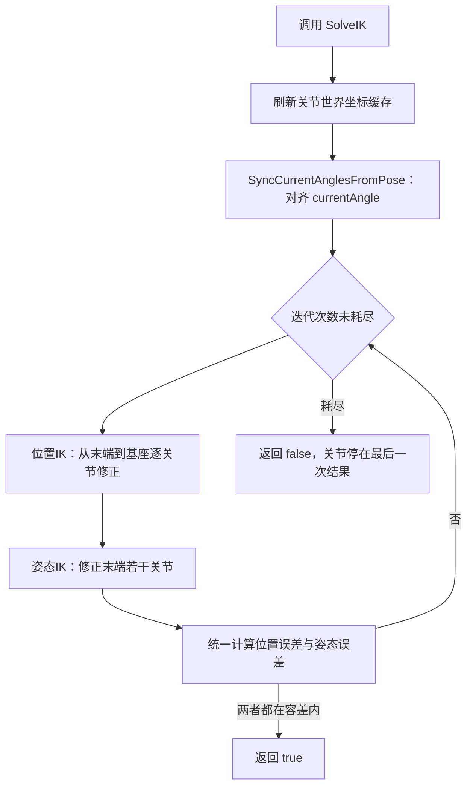

# RobotCCDIK — 串联机械臂 CCD 逆运动学

一组用于**串联机械臂逆运动学（IK）**的 Unity 组件：把末端执行器（TCP）送到指定位置/姿态，每个关节只允许绕**单一局部轴**旋转，带关节限位、平滑插值，并支持在编辑器里录制/回放姿态。

- 依赖：**纯 Unity API**（无第三方补间插件、无外部 DLL）
- 位置：`Assets/Scripts/upanda-framework/Runtime/Game/RobotCCDIK/`
- 适用：工业机械臂、机器人手臂、任何"关节链 + 末端目标"的串联结构

---

## 1. 文件组成

| 文件 | 作用 |
| --- | --- |
| `CCDIKController.cs` | 核心：CCD 迭代求解、关节角度读写、平滑插值、复位、调试绘制 |
| `RobotAngleRecoder.cs` | 编辑器辅助：实时拖拽 Target 驱动 IK、姿态录制/回放（`[RequireComponent(typeof(CCDIKController))]`） |
| `Sample/Sample.unity` | 示例场景：已搭好 6 轴机械臂与 Target，可直接进入 Play 体验 |
| `Material/J1 ~ J6.mat` | 示例场景使用的 6 个关节材质 |
| `README.md` | 本文档 |

---

## 2. 快速上手

### 2.1 场景层级

关节必须是**父子串联**（旋转父节点会带动所有子节点）：

```text
Robot                      ← 空物体，挂 CCDIKController（+ RobotAngleRecoder）
└─ Base                    ← joints[0]
   └─ Arm1                 ← joints[1]
      └─ Arm2              ← joints[2]
         └─ Arm3           ← joints[3]
            └─ Wrist       ← joints[4]
               └─ Tool     ← joints[5]
                  └─ TCP   ← endEffector（末端执行器/工具中心点）
```

- 索引约定：`joints[0]` 是**最靠近基座**的关节，最后一个元素最靠近末端。
- `endEffector` 是"被求解的点"，通常是末端关节的子物体；也可以直接指向末端关节自身。

### 2.2 Inspector 配置

1. `joints`：数组长度设为实际关节数（默认 6），逐个绑定：

   | 字段 | 含义 |
   | --- | --- |
   | `joint` | 该关节的 `Transform` |
   | `rotationAxis` | 该关节**实际旋转所绕的局部轴**（X / Y / Z） |
   | `minAngle` / `maxAngle` | 相对**复位姿态**的行程范围（度） |

2. `endEffector`：绑定末端 `Transform`。
3. IK 参数先用默认值（见第 5 节）。

> **重点**：`minAngle` / `maxAngle` 是相对复位姿态的**增量**，不是绝对欧拉角。
> 例：某关节装配时已有 90° 基准角，写 `[-45, 45]` 表示"在现有姿态基础上左右各 45°"。

### 2.3 最小代码示例

```csharp
public CCDIKController ccdik;

void Update()
{
    // 1) 实时求解：每帧把末端拉到目标
    ccdik.SolveIK(target.position, target.rotation);

    // 2) 平滑移动：1 秒内让末端逼近目标后精确求解
    ccdik.MoveTo(target.position, target.rotation, 1f);

    // 3) 平滑改变关节角（增量角，单位：度）
    ccdik.AngleLerp(new float[] { 0, 30, -20, 0, 45, 0 }, 1f, () => Debug.Log("到位"));

    // 4) 回放录制的绝对姿态
    ccdik.AngleLerp(recordedLocalEulerAngles, 1f);

    // 5) 复位到 Awake 时的姿态
    ccdik.ResetAngle();
}
```

若使用 `RobotAngleRecoder`，日常操作在它的 Inspector 面板完成，无需自己调用（见第 8 节）。

### 2.4 示例场景 `Sample/Sample.unity`

仓库自带的示例已经按上表搭好，可直接进入 Play 体验。其关节配置为：

| 序号 | 关节 | 旋转轴 | 限位（度） |
| --- | --- | --- | --- |
| `joints[0]` | J1（基座回转） | Z | ±360（运行时等效 ±180，见第 7 节） |
| `joints[1]` | J2 | Y | ±180 |
| `joints[2]` | J3 | Y | ±180 |
| `joints[3]` | J4 | X | ±180 |
| `joints[4]` | J5 | Y | ±180 |
| `joints[5]` | J6（腕部回转） | Z | ±360（运行时等效 ±180，见第 7 节） |

---

## 3. 实现原理

### 3.1 CCD 是什么

CCD（Cyclic Coordinate Descent，循环坐标下降）是一类**迭代式 IK**：

1. 从**末端往基座**遍历每个关节；
2. 每一步只调**一个**关节，使末端到目标更近（其他关节冻结）；
3. 反复扫描整条链，直到误差进入容差或迭代次数耗尽。

优点：不需要雅可比矩阵/伪逆，实现简单、数值稳定、天然支持关节限位。
缺点：只能收敛到**局部最优**，且不做可达性/奇异性分析。

### 3.2 单关节位置修正（几何推导）

设关节世界坐标 $P$、末端世界坐标 $E$、目标 $T$、关节在世界空间的旋转轴 $a$：

$$
\vec{v}_E = E - P,\qquad \vec{v}_T = T - P
$$

把两个向量投影到垂直于 $a$ 的平面：

$$
\vec{p}_E = \operatorname{proj}_{\perp a}\vec{v}_E,\qquad \vec{p}_T = \operatorname{proj}_{\perp a}\vec{v}_T
$$

需要转过的**有符号角**（从 $\vec{p}_E$ 转到 $\vec{p}_T$）：

$$
\theta = \operatorname{SignedAngle}(\vec{p}_E,\ \vec{p}_T,\ a)
$$

步长限制（`useAdaptiveStep` 时按误差自适应，否则直接用上限）：

$$
c = \begin{cases}\min(|\theta|,\ \text{maxStepAngle}) & \text{useAdaptiveStep}\\[2pt] \text{maxStepAngle} & \text{otherwise}\end{cases}
\qquad
\theta' = \operatorname{clamp}(\theta,\ -c,\ c)\times \text{stepFactor}
$$

角度累加并限位后施加旋转：

$$
q_{new} = \operatorname{clamp}(q_{cur} + \theta',\ q_{min},\ q_{max})
\qquad
R_{local} \mathrel{*}= \operatorname{AxisAngle}(q_{new}-q_{cur},\ e_{axis})
$$

其中 $e_{axis}$ 是 `rotationAxis` 对应的单位向量，右乘等价于**绕关节自身世界轴**旋转。

跳过该关节的三种情况：末端/目标与关节重合；$\vec{p}$ 长度趋近 0（方向几乎落在关节轴上，该关节对该方向无控制力）；限位已到边界。

### 3.3 姿态修正

只对末端 `orientationJointCount` 个关节做姿态修正。末端姿态误差为

$$
\Delta q = q_{target} \cdot q_{end}^{-1}
$$

用 `ToAngleAxis` 取出轴角 $(\alpha, \hat{u})$ 后，取 $\hat u$ 在关节轴 $a_{joint}$ 上的投影决定方向与有效量：

$$
d = \hat{u}\cdot a_{joint},\qquad \text{有效量} = \alpha \cdot \operatorname{sign}(d)\quad(\lvert d\rvert \lt 0.1 \Rightarrow \text{跳过})
$$

关节轴与所需旋转轴越接近垂直，贡献越小。这是**近似**处理（真实姿态 IK 需要解 3×3 角速度约束），换来的是无需矩阵运算、与位置修正共用同一套步长/限位逻辑。

### 3.4 双阶段与收敛判定

每轮迭代：

1. **位置阶段**：整条链从末端到基座逐关节修正；
2. **姿态阶段**：末端 `orientationJointCount` 个关节修正姿态；
3. **两阶段都结束后**再计算位置误差 $\lVert E-T\rVert$ 与姿态误差 `Quaternion.Angle`，两者同时进入容差才返回 `true`。



> 注意判定位置：必须在姿态阶段**之后**判定，否则会出现"用修正前的误差误报收敛"。

### 3.5 角度语义与 `currentAngle`

整套代码只有一种角度约定：

> **关节角 = 相对复位姿态（`Awake` 时记录的姿态）、绕 `rotationAxis` 的增量角。**

- `jointResetPose[]`：`Awake` 时记录每个关节的 `localPosition` / `localRotation`，它就是"零位"。
- `currentAngle`：该增量角（度）。`minAngle` / `maxAngle` 限定的也是它。
- `SyncCurrentAnglesFromPose()`：由 $q_{base}^{-1} \cdot q_{local}$ 反解当前真实姿态对应的增量角，并用旋转轴上的有符号投影归一化到 $[-180, 180]$。

`SolveIK` 每次进入都会先刷新缓存并对齐一次，因此**外部改动关节旋转（动画、Inspector 拖拽、直接写 `localRotation`）不需要手动修正**，下一次求解会自动同步。

### 3.6 插值实现（无第三方依赖）

`AngleLerp` 的两个重载由**协程**实现，不使用任何补间插件：

| 重载 | 目标语义 | 插值方式 | 结束后 |
| --- | --- | --- | --- |
| `AngleLerp(float[], float, Action)` | 增量角（与 `currentAngle` 一致） | `Mathf.Lerp` 逐帧 | 刷新缓存 |
| `AngleLerp(Vector3[], float, Action)` | 绝对局部欧拉角（录制回放） | `Quaternion.Slerp`（最短路径） | `SyncCurrentAnglesFromPose` + 刷新缓存 |

共同行为：

- **起止值在调用瞬间快照**，插值过程中被外部改动不影响本次插值；
- **收尾强制取目标值**（`t >= 1f` 直接赋值），消除累计误差；
- 被新的 `AngleLerp` / `SetJointAngles` / `ResetAngle` / 组件销毁打断时，**不触发回调**；
- `time <= 0`：下一帧直接到位（避免回调在调用栈内同步触发）；
- `gameObject` 未激活时协程无法启动，退化为**瞬时到位**并立即回调。

---

## 4. API 参考

### 4.1 求解与移动

| 方法 | 说明 |
| --- | --- |
| `bool SolveIK(Vector3 targetPosition, Quaternion targetRotation)` | 迭代求解；返回是否在容差内收敛。返回 `false` 表示迭代耗尽，关节停在最后一次迭代结果（不是失败回滚） |
| `void MoveTo(Vector3 targetPosition, Quaternion targetRotation, float duration = 1f)` | 在 `duration` 秒内对**目标点做线性插值、目标姿态做球面插值**，每帧调用 `SolveIK`；结束时精确求解一次 |

### 4.2 关节角度

| 方法 | 说明 |
| --- | --- |
| `void SetJointAngles(float[] angles)` | 立即设置（会打断正在进行的插值）。数组长度必须等于 `joints.Length`，值会被钳位到各关节限位 |
| `void AngleLerp(float[] targetAngles, float time, Action callback = null)` | 平滑插值增量角；所有关节同时起止，整体耗时 `time` 秒 |
| `void AngleLerp(Vector3[] targetAngles, float time, Action callback = null)` | 平滑插值到绝对局部欧拉角，用于回放录制姿态 |
| `float[] GetJointAngles()` | 取当前增量角（相对零位，度） |
| `Vector3[] GetJointEulerAngles()` | 取当前各关节局部欧拉角（绝对姿态，录制用） |
| `void SyncCurrentAnglesFromPose()` | 由真实姿态重算 `currentAngle`；仅在自写代码绕过本组件直接旋转关节后需要 |
| `void ResetAngle()` | 所有关节回到复位姿态（`localPosition` + `localRotation`），`currentAngle` 归零 |

> 两个 `AngleLerp` 重载签名相同、语义不同：**`float[]` 是增量角，`Vector3[]` 是绝对欧拉角**。混用会导致姿态错误，注意区分。

---

## 5. 参数与调参建议

| 参数 | 默认 | 含义 | 建议 |
| --- | --- | --- | --- |
| `maxIterations` | 30 | 单次求解最大迭代次数 | 实时模式建议 10~20；精度优先可加大 |
| `positionTolerance` | 0.001 | 位置容差（米） | 这是**很严格**的值；长链/远目标可能永远达不到，按场景尺度放宽到 0.01 更实际 |
| `rotationTolerance` | 0.1 | 姿态容差（度） | 一般保持 |
| `stepFactor` | 0.5 | 单次旋转折减系数（0~1） | **抖动时优先调小它**（更稳但更慢） |
| `useAdaptiveStep` | true | 误差小时自动缩短步长 | 保持开启，收敛更平滑 |
| `maxStepAngle` | 5 | 单次旋转上限**基数**，实际上限 = `maxStepAngle × stepFactor` | 调大可加速，但有超调/震荡风险 |
| `orientationJointCount` | 3 | 参与姿态修正的末端关节数量 | 只要位置就设 `0`（此时忽略 `targetRotation`） |
| `drawDebugLines` | true | 在 Scene 视图画出关节链与末端连线 | 排查问题时保持开启 |
| `debugColor` | green | 关节链连线颜色 | — |

---

## 6. 常见问题

| 现象 | 可能原因 | 处理 |
| --- | --- | --- |
| 末端始终够不到目标，`SolveIK` 返回 `false` | 目标超出工作空间 / 关节限位锁死 / 目标点位于某关节轴延长线上 | 检查限位；放宽 `positionTolerance`；确认场景尺度 |
| 末端抖动、来回震荡 | 步长过大或容差过小 | 降低 `stepFactor`、`maxStepAngle`，或放宽 `positionTolerance` |
| 某个关节完全不动 | `rotationAxis` 选错、已到限位边界、投影为 0（末端几乎落在该关节轴上）、`joint` 未赋值 | 打开 debug 线观察；查看 Console 的配置报错 |
| 位置对了但姿态不达标 | 姿态只由末端 N 个关节修正，且是投影近似 | 调大 `orientationJointCount`，或放宽 `rotationTolerance` |
| 角度值和预期不一致 | `minAngle` / `maxAngle` 是相对零位而非绝对欧拉角 | 按"相对行程"重新设置 |
| Console 报 `关节 i 未赋值` | Inspector 未绑定 `joint` | 按报错补齐绑定 |
| 回放录制姿态后 `GetJointAngles()` 数值异常 | 绝对欧拉角会绕过 `currentAngle` | 内置回放流程已自动同步；自写代码请调用 `SyncCurrentAnglesFromPose()` |

---

## 7. 已知限制

- 每个关节**只支持单一轴**旋转，不支持万向节、球铰、多轴复合旋转。
- 姿态修正为**投影近似**，在奇异位形/超定约束下精度有限。
- CCD 只能收敛到**局部最优**，且不返回"目标不可达"的原因，只返回是否收敛。
- 不做**碰撞检测**：末端可能穿越障碍物。
- 计算开销与 `maxIterations × joints.Length` 成正比，且是同步阻塞的；实时模式下请控制迭代次数。
- `currentAngle` 每次 `SolveIK` 开头都由四元数反解，因此**跨帧累计的角度会被折算到 `[-180, 180]`**：即使限位写 ±360°，实际可用行程仍只到 ±180°（`Sample/Sample.unity` 首/末关节的 ±360 即属此类，运行时等效为 ±180）。若确需多圈连续旋转，需要把 `SyncCurrentAnglesFromPose()` 改为"取与上一帧最接近的等价角"。

---

## 8. 与 `RobotAngleRecoder` 配合（编辑器工作流）

`RobotAngleRecoder` 提供一套运行时录制/回放面板（Play 模式下生效）：

| 步骤 | 操作 | 说明 |
| --- | --- | --- |
| 1 | 进入 Play | 面板才显示控制按钮 |
| 2 | `控制模式 = RealTime` | 拖动场景中的 `RobotAim`（Target）实时驱动 IK |
| 3 | 点 **获取轴数据** | 把当前 6 轴角度/欧拉角抓入 `currentPos` |
| 4 | 填 `description` → 点 **轴数据添加到AnglePos** | 存为一条姿态记录 |
| 5 | `控制模式 = Click` | 用 **上一个 / 下一个 AnglePos** 回放（内部 `AngleLerp(Vector3[])`，1 秒），**姿态移动到Target** 用 `MoveTo` |
| 6 | `控制模式 = None` | 复位机器人并停止求解 |

- 记录结构 `RobotAngleInfo` 同时保存 `angles`（增量角，用于观察）与 `localEulerAngle`（绝对欧拉角，用于回放）。
- 回放走的是**绝对欧拉角**通道，因此不受增量角限位影响；回放结束后组件会自动对齐 `currentAngle`。

---

## 9. 变更记录（2026-09）

- **正确性修复**：角度语义统一为"相对复位姿态的增量角"；收敛判定移到位置/姿态两阶段之后；补齐 `joints` 空元素与未绑定 `joint` 的空引用防护；缓存数组随 `joints` 长度自适应。
- **移除 DOTween 依赖**：`AngleLerp` 两处重载改为协程自实现（线性插值 / 四元数 Slerp），打断语义与回调时机保持一致。
- **结构整理**：按 `#region` 分组（配置 / 状态 / 生命周期 / 外部接口 / 内部实现 / 调试）；合并冗余的缓存刷新方法为 `RefreshJointPositions(int startIndex = 0)`；新增 `HasJoint(int)` 统一空引用判断。
