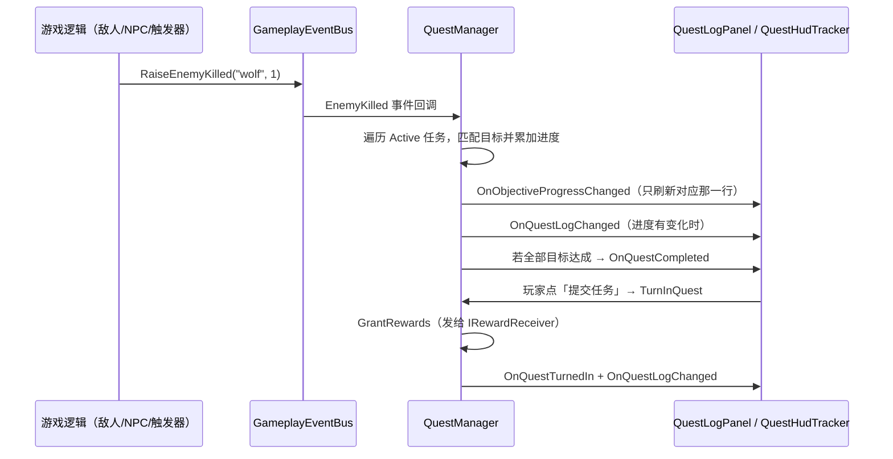

# 任务系统（TaskSystem / Quest System）

一套**事件驱动 + ScriptableObject 配置 + JSON 存档**的通用任务系统，运行在内置管线与 URP 均可，
只依赖 Unity 自带功能（UGUI / JsonUtility），**不需要任何第三方插件**。

- 任务模板：`QuestDefinition`（ScriptableObject，放 `Resources/Quests` 下自动加载）
- 运行实例：`QuestInstance`（进度 / 状态，运行时对象，不写回模板）
- 统一入口：`QuestManager`（单例）
- 玩法 → 任务：`GameplayEventBus`（静态事件总线，接入只需一行）
- 任务 → UI：`QuestManager` 的 C# 事件（无 Update 轮询）
- UI：`QuestLogPanel`（任务日志）+ `QuestHudTracker`（HUD，默认追踪 3 个）

---

## 一、目录结构

```
Runtime/Game/TaskSystem/
├── Core/
│   ├── QuestTypes.cs           枚举（QuestType / QuestStatus / ObjectiveType）+ ItemStack + QuestReward + QuestText
│   ├── QuestObjective.cs       目标定义 QuestObjective + 目标进度 QuestObjectiveProgress
│   ├── QuestDefinition.cs      ★ 任务模板（ScriptableObject）
│   ├── QuestInstance.cs        ★ 运行时实例（状态 + 进度 + 存档转换）
│   └── QuestSaveData.cs        JSON 存档数据模型
├── Events/
│   └── GameplayEventBus.cs     事件总线：击杀 / 拾取 / 到达 / 对话
├── Manager/
│   └── QuestManager.cs         ★ 单例：加载模板、状态机、进度路由、发奖励、存档
├── Rewards/
│   ├── IRewardReceiver.cs      奖励接收接口（可接到自己的背包/属性系统）
│   └── PlayerRewardService.cs  默认实现：金币 / 经验 / 物品（演示用）
├── UI/
│   ├── QuestUiFactory.cs       UGUI 构建工具（含中文字体处理；可运行时自动生成 UI）
│   ├── QuestLogEntryView.cs    任务日志列表项（挂在自己的预制体上）
│   ├── QuestHudEntryView.cs    HUD 追踪条目（挂在自己的预制体上）
│   ├── QuestLogPanel.cs        ★ 任务日志面板（列表 + 详情 + 追踪/提交按钮）
│   └── QuestHudTracker.cs      ★ HUD 追踪条
├── Demo/
│   ├── QuestDemoDriver.cs      键盘演示：1/2/3/4 模拟四类事件，S/L 存读档，R 重置
│   ├── DemoEnemy.cs            示例敌人（死亡时一行上报击杀）
│   ├── DemoCollectible.cs      示例可拾取物（进入触发器上报拾取）
│   ├── DemoLocationTrigger.cs  示例到达区域（进入一次上报到达）
│   ├── DemoNpc.cs              示例 NPC（点击 / Interact 上报对话）
│   └── DemoPlayerController.cs 极简 WASD 玩家（CharacterController）
└── Resources/Quests/           任务资产存放处（由编辑器菜单生成）
```


编辑器一键搭建（`Assets/Scripts/upanda-framework/Editor/CustomInspector/TaskSystem/QuestDemoInstaller.cs`）：

| 菜单 | 作用 |
| --- | --- |
| `UPandaGF/Runtime/任务系统/一键搭建（任务资产 + UI + 演示场景）` | 下面三步全做 |
| `UPandaGF/Runtime/任务系统/1. 生成示例任务资产` | 生成 4 个示例任务（主线 / 支线 ×2 / 日常） |
| `UPandaGF/Runtime/任务系统/2. 搭建任务 UI（任务日志 + HUD）` | 建 Canvas、面板、HUD、EventSystem 并接好引用 |
| `UPandaGF/Runtime/任务系统/3. 搭建 3D 演示内容` | 地面 / 玩家 / 5 只狼 / 3 个草药 / NPC / 到达区 / 驱动 |

---

## 二、5 分钟上手

1. 打开 `Runtime/Game/TaskSystem/Demo/Demo.unity`（空场景即可）。
2. 菜单执行 **`UPandaGF/Runtime/任务系统/一键搭建（任务资产 + UI + 演示场景）`**。
3. 按 **Play**：
   * ⚠️ **任务必须是 `Active` 才会累计进度**：默认 `QuestDemoDriver` 会自动接受所有“可接受”的任务（关掉该开关则用 `A` 键或面板里的「接受任务」按钮）
   * `1` 击杀野狼 ×1，`K` 击杀 ×5 → 「野狼威胁」完成 → 按 `N` 或点面板「提交任务」
   * `2` 拾取草药、`4` 与长老对话 → 完成「给药师采药」（它是 `autoStart`，前置完成后会自动接受）
   * `3` 到达村口 → 「探查村口」
   * `J` 开关任务日志面板，`A` 接受任务，`S`/`L` 存档/读档，`R` 重置
   * WASD 移动玩家、点击方块杀狼/对话，也可以真实地跑进村口区域触发到达目标

不想用一键搭建也可以：自己建一个空物体挂 `QuestManager`（或者直接调用 `QuestManager.Instance`，它会自动创建），
再给对象挂 `QuestLogPanel` / `QuestHudTracker`（所有 UI 引用都可以留空，会自动生成一个能看的界面）。

---

## 三、核心概念

### 3.1 状态机

```
Locked ──(前置任务满足)──► Available ──(接受)──► Active
                                                   │
                                        (全部目标达成)
                                                   ▼
                            Available ◄──(可重复)── Completed ──(提交)──► TurnedIn
                                (提交后立刻回到可接受)      (发奖励)
```

| 状态 | 含义 | 面板显示 |
| --- | --- | --- |
| `Locked` | 前置任务未满足 | 默认不显示（`showLocked` 可开） |
| `Available` | 可接受（`autoStart` 的任务会自动接受） | 蓝色底 |
| `Active` | 进行中，进度累计中 | 默认底 |
| `Completed` | 目标全部达成，等玩家提交领奖 | 绿色底 |
| `TurnedIn` | 已提交，奖励已发 | 默认隐藏（`showTurnedIn` 可开） |

前置判定：前置任务的状态是 `Completed` **或** `TurnedIn` 即算满足（改 `QuestManager.ArePrerequisitesMet` 可调整）。

### 3.2 目标类型

| 类型 | `targetId` 含义 | 上报入口 |
| --- | --- | --- |
| `Kill` | 敌人 ID（如 `wolf`） | `GameplayEventBus.RaiseEnemyKilled("wolf", 1)` |
| `Collect` | 物品 ID（如 `herb`） | `GameplayEventBus.RaiseItemCollected("herb", 1)` |
| `ReachLocation` | 地点 ID（如 `village_gate`） | `GameplayEventBus.RaiseLocationReached("village_gate")` |
| `TalkToNPC` | NPC ID（如 `elder`） | `GameplayEventBus.RaiseNpcTalked("elder")` |

* `targetId` 填 `*` 或不填 = 匹配任意目标（如「击杀任意敌人 10 个」）。
* 一个任务可以有多个目标，**全部达成**才算完成。
* 目标进度由 `QuestInstance.ApplyProgress` 累加，超过需求会自动夹紧到 `requiredAmount`。

### 3.3 奖励

`QuestReward` = `experience` + `gold` + `List<ItemStack>`（`itemId` + `amount`）。
提交时由 `QuestManager.GrantRewards` 交给 `IRewardReceiver`：

```csharp
// 默认发给 PlayerRewardService（演示钱包）；接自己的系统只需实现接口：
public class MyInventory : MonoBehaviour, IRewardReceiver
{
    public void GrantExperience(int amount) { /* 角色属性 */ }
    public void GrantGold(int amount)       { /* 货币系统 */ }
    public void GrantItem(string itemId, int amount) { /* 背包系统 */ }
}
// 然后：QuestManager.Instance.RewardReceiver = myInventory;
```

---

## 四、接入方式（事件驱动，不用轮询）



### 敌人死亡时加一行（最典型的例子）

```csharp
public class Enemy : MonoBehaviour
{
    public string enemyId = "wolf";

    private void Die()
    {
        GameplayEventBus.RaiseEnemyKilled(enemyId, 1);   // ← 接入任务系统就这一行
        Destroy(gameObject);
    }
}
```

对手里有 `QuestManager` 引用的场合，也可以直接调（事件总线的四个方法内部就是调它们）：

```csharp
QuestManager.Instance.ReportKill("wolf", 1);
QuestManager.Instance.Report(ObjectiveType.Collect, "herb", 3);
```

任务侧的自定义逻辑（接日常刷新、加点特效等）：

```csharp
QuestManager manager = QuestManager.Instance;
manager.OnQuestCompleted += quest => Debug.Log("任务完成：" + quest.Title);
manager.OnQuestTurnedIn  += quest => Debug.Log("已提交：" + quest.Title + "，完成次数 " + quest.completionCount);
```

---

## 五、存档 / 读档

* 格式：`JsonUtility` 序列化 `QuestSaveData`（普通字段 + List，没有 Dictionary，天然 JSON 友好）。
* 位置：`Application.persistentDataPath/quests.json`（`GetSaveFilePath()` 可取完整路径）。
* 读档会**先把所有任务归零再套用存档**，保证"读档后进度 == 存档内容"；目标的 `objectiveId` 变了会退化为按下标对齐。

```csharp
QuestManager.Instance.SaveToFile();          // 写档
QuestManager.Instance.LoadFromFile();        // 读档
string json = QuestManager.Instance.SaveToJson();     // 自己接云存档 / PlayerPrefs
QuestManager.Instance.LoadFromJson(json);
QuestManager.Instance.DeleteSaveFile();
```

> ⚠️ WebGL 等平台没有本地文件写入，请改用 `SaveToJson` + 平台存储（IndexedDB / 后端接口）。

存档片段示例：

```json
{
  "version": 1,
  "savedAt": "2026-09-17 10:30:00",
  "quests": [
    {
      "questId": "Quest_KillWolves",
      "status": 2,
      "isTracked": true,
      "acceptedOrder": 1,
      "completionCount": 0,
      "objectives": [ { "objectiveId": "Kill_wolf", "currentAmount": 3 } ]
    }
  ]
}
```

（`status` 用枚举的整数值：0 Locked / 1 Available / 2 Active / 3 Completed / 4 TurnedIn）

---

## 六、UI

### QuestLogPanel（任务日志）

* 列表只显示 `Active / Available / Completed`（`showLocked` / `showTurnedIn` 可放开）。
* 点击列表项 → 右侧显示描述、每个目标的勾选与进度、奖励，并按状态激活按钮：
  **「接受任务」**（`Available` 时可点）/ 「追踪」（`Active`）/ 「提交任务」（`Completed`）。
* ⚠️ 进度**只对 `Active` 任务累计**：`Available` 的任务必须先接受，入口有三种 ——
  面板「接受任务」按钮、`QuestManager.Instance.AcceptQuest(id)`、或给 `QuestDefinition` 勾上 `autoStart`。
* 「接受任务」按钮没手动接线时，会在运行时复制「提交任务」按钮自动补一个，并把三个按钮重排成三等份（旧场景无需改动）。
* 刷新策略：`OnQuestLogChanged` → 整表重建；`OnObjectiveProgressChanged` → 只刷新对应那一行；
  `Update` 里只做快捷键检测（**不查任何任务数据**）。
* 所有引用（panelRoot / listContent / entryPrefab / 文本 / 按钮）都可以留空：
  留空时 `QuestUiFactory` 会在运行时生成一套能用的界面。
* ⚠️ `panelRoot` 请指向**子物体**（真正显示的面板本体）。若指向脚本自身所在物体，面板隐藏后 `Update` 不再运行，快捷键就打不开它了；
  留空时会自动改用 `CanvasGroup` 控制可见性（脚本保持激活，安全）。

### QuestHudTracker（HUD）

* 显示被追踪的活跃任务，默认最多 3 个（`maxEntries`）。
* 新接受的任务会自动被追踪（未满 3 个时），面板上可手动取消/开启追踪。
* `showOnlyTracked = false` 时显示所有活跃任务。

### 中文字体

* **运行期**：`QuestUiFactory.GetDefaultFont()` 优先用系统动态字体
  （`Microsoft YaHei` → `SimHei` → `PingFang SC` → `Noto Sans CJK SC` …），所以游戏里中文正常显示；
  `EnsureReadableFonts` 还会把已有 Text 上的内置字体一并替换掉。
* **编辑器（未运行）**：退回 Unity 内置字体资产（可序列化进场景，但不含中文字形，中文会显示成方框 —— 这是正常的）。
* ⚠️ 内置字体名**随 Unity 版本变化**：`≤ 2021.3` 是 `Arial.ttf`，`2022.1+` 才是 `LegacyRuntime.ttf`。
  名字不对时 `Resources.GetBuiltinResource<Font>()` 会**直接打一条 error**（`Failed to find LegacyRuntime.ttf`），
  所以这里按 `Application.unityVersion` 主版本号选择，而不是两个名字轮流试。
* 字体逻辑已抽到全工程公用的 **`Runtime/Manager/UIMgr/UnityBuiltinFont.cs`**：
  `UnityBuiltinFont.Get()`（编辑器期，返回可序列化的内置字体资产）、`GetDefault()`（运行期优先系统字体）、
  `ReplaceBuiltinFonts(root)`（批量替换）。`QuestUiFactory` 里的同名方法只是转发；
  想换成项目自己的字体资产，改 `UnityBuiltinFont` 这一个文件即可。

### 用自己的预制体

`QuestLogPanel.entryPrefab` / `QuestHudTracker.entryPrefab` 指向自己的预制体即可，
预制体上挂 `QuestLogEntryView` / `QuestHudEntryView`（两者已是独立脚本，可直接在 Inspector 里 Add Component），
再把内部 Text / Slider / Button 拖进去。

---

## 七、QuestDefinition 字段速查

| 字段 | 说明 |
| --- | --- |
| `questId` | 唯一 ID（留空自动用资产名）；**存档、代码引用都靠它，尽量不要改** |
| `title` / `description` | 面板显示 |
| `questType` | `Main` / `Side` / `Daily` |
| `autoStart` | 前置满足后自动接受（无需玩家点接受） |
| `isRepeatable` | 可重复任务：提交后回到 `Available`，进度清零，可再次接受 |
| `prerequisites` | 前置任务 ID 列表（任务链） |
| `objectives` | 目标列表（每个目标：`type` / `targetId` / `requiredAmount` / `description`） |
| `reward` | `experience` / `gold` / `items`（`itemId` + `amount`） |

---

## 八、常见问题

| 现象 | 原因 / 处理 |
| --- | --- |
| 游戏里任务一个都没有 | 任务资产必须放在某个 `Resources/Quests/` 目录下；控制台会打印「已加载任务模板 N 个」 |
| **任务“无法触发”、进度不涨** | **① 任务还没被接受**（还是 `Available`）—— 进度只对 `Active` 任务累计：点面板「接受任务」/ 按 `A` / 勾 `autoStart` / 调 `QuestManager.Instance.AcceptQuest(id)`；② `targetId` 与上报的 ID 不一致（比较时不区分大小写，但空格、下划线要一致）；③ 该目标已经达成（进度会夹紧在 `requiredAmount`，不会再涨） |
| 任务一直是 `Available`（或列表里看不到） | 前置任务没 `Completed`/`TurnedIn`（内置示例里 `Quest_CollectHerbs` / `Quest_ReachGate` 都挂在前置上），或前置 ID 拼错（控制台有警告） |
| 任务永远 Locked | `prerequisites` 里的前置任务没 `Completed`/`TurnedIn`，或前置 ID 拼错（控制台有警告） |
| 点提交没反应 | 只有 `Completed` 状态才能提交；按钮 `interactable` 会自动控制 |
| 按钮点不动 | 场景里没有 `EventSystem`（菜单搭建时会自动创建） |
| 面板打不开 | 见第六节 `panelRoot` 的说明 |
| 中文显示成方框 | 在编辑器里（未运行）是正常的 —— 运行时才会换成系统字体；也可给 `Text` 手动指定中文字体 |
| 控制台报 `Failed to find LegacyRuntime.ttf` | 已修（现按 Unity 版本选择内置字体名）。若你自己的代码里也写死了这个名字，请改成按版本判断或直接用项目字体资产（`≤2021.3` 是 `Arial.ttf`） |
| 收到重复进度 | 同一帧里多个来源重复上报；或关闭了「域重载」导致静态事件残留（`GameplayEventBus` 已在进入播放模式时自动清空） |
| 用了新版 Input System | 把 `EventSystem` 上的 `StandaloneInputModule` 换成 `InputSystemUIInputModule`；`QuestDemoDriver` / `DemoPlayerController` 里的 `Input.GetKeyDown` 也要换成新输入 API |

---

## 九、扩展点

| 想做的事 | 改哪里 |
| --- | --- |
| 日常任务按天刷新 | `QuestManager.TurnInQuest` 里 `isRepeatable` 分支改成"记下完成日期，次日再置 Available" |
| 收集类任务提交时扣除物品 | `GrantRewards` 前加一步 `IRewardReceiver` 的扣减校验 |
| 多条件"或"关系 / 可选目标 | `QuestObjective` 加 `isOptional` / `logicGroup` 字段，改 `QuestInstance.AreAllObjectivesCompleted` |
| 任务提示 / 飘字 | 订阅 `OnQuestCompleted` / `OnObjectiveProgressChanged` 自己弹 UI |
| 存档换成云存档 | 用 `SaveToJson()` 取字符串上传，`LoadFromJson()` 恢复 |
| 按玩家等级/职业过滤任务 | 在 `EvaluateAvailability` 里加条件 |
