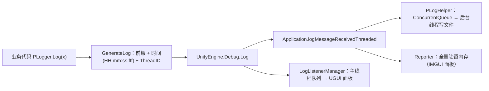

# DebugSystem — 日志系统（PLogger / 落盘 / 真机面板）

`UPandaGF` 框架的日志模块，位于 `Runtime/Manager/DebugSystem/`。三层能力：

1. **`PLogger`** —— 业务代码调用的日志门面（颜色变体、时间、线程号、格式校验、分级开关）；
2. **`PLogHelper`** —— 把日志**落盘**到本地文件（后台线程，不阻塞主线程）；
3. **真机面板** —— `Reporter`（IMGUI）与 `LogListenerManager`（UGUI）两套运行时日志面板。

---

## 1. 文件与职责

| 文件 | 职责 | 编码 |
| --- | --- | --- |
| `PLogger.cs` | 日志门面：`Log*/LogWarning*/LogError*/LogFormat*/LogException*` + `GenerateLog`（前缀 / 时间 / 线程号）+ 持有 `cfg` | **GBK** ⚠️ |
| `PLogHelper.cs` | 订阅 `Application.logMessageReceivedThreaded` → 无锁队列 → 后台线程写文件 | **GBK** ⚠️ |
| `Data/LogConfig.cs` | 配置（`[Serializable]`，对应 `LogConfig.json`）；含 `Equals/GetHashCode/==` | **GBK** ⚠️ |
| `DebugerInit.cs` | 从 `StreamingAssets/Data/LogConfig.json` 读配置 → `PLogger.InitLog`；FPS 角标 + 唤起 Reporter | **GBK** ⚠️ |
| `Reporter/*` | 第三方 **Reporter（LogView）** 面板：IMGUI，`logMessageReceivedThreaded` 收集，PlayerPrefs 记 UI 偏好 | UTF-8 |
| `UGUIDebug/LogListenerManager.cs` | **另一套** UGUI 日志面板（全局命名空间）：静态入口 + 可视面板 | **GBK** ⚠️ |
| `Editor/PLogger/ScriptingDefineSymbols.cs` | 增删 `OPEN_PLOG` 宏（Standalone / iOS / Android / WebGL 四个平台组） | UTF-8 |
| `Editor/PLogger/PLoggerEditor.cs` | 菜单：启动日志 / 剔除日志 | **GBK** ⚠️ |
| `Editor/PLogger/PLoggerDiagnosticsWindow.cs` | ★ 日志系统诊断窗口（开关状态 / 落盘状态 / 实时日志） | UTF-8 |
| `Editor/PLogger/PLoggerSelfCheck.cs` | ★ 日志系统自检（19 项断言，含 `RunSilent()` 自动化入口） | UTF-8 |

> ⚠️ 标 GBK 的文件必须按原编码读写（用 UTF-8 工具直改会把中文注释写成 `U+FFFD`）。

---

## 2. 两级开关：编译期剔除 + 运行期过滤

### 2.1 编译期（零成本）

所有 `PLogger` 公开 API 都带 `[Conditional("OPEN_PLOG")]`：

- **未定义宏时，调用点被编译器整体移除**，连实参表达式都不求值 —— 因此"关日志"是**真正零运行时开销**的（不是运行时 `if`）；
- 宏由菜单 `UPandaGF -> 日志系统 -> 启动日志 / 剔除日志` 增删，**四个平台组**（Standalone / iOS / Android / WebGL）一起改；
- 编辑器窗口与自检里可以用 `#if OPEN_PLOG` 判断当前是否启用。

### 2.2 运行期（`LogConfig`）

配置来自 `StreamingAssets/Data/LogConfig.json`，由 `DebugerInit` 读取后调用 `PLogger.InitLog(cfg)`：

| 字段 | 说明 |
| --- | --- |
| `openLog` | **总开关**：false 时 Warning / Error 也一起静默 |
| `openWarning` / `openError` | 分级开关（生产环境"只留 Error"= `openLog=true, openWarning=false, openError=true`） |
| `addHeadFix` / `logHeadFix` | 是否加前缀、前缀内容（默认 `###` → 输出 `<###>  ...`） |
| `openTime` / `showThreadID` | 是否输出时间（**`HH:mm:ss.fff`，24 小时制**）与 `ThreadID:` |
| `maxLogLength` | 单条最大长度，超出截断并追加 `...[已截断，原长 N]`（0 = 不限） |
| `logSave` / `saveOverwrite` / `logFileSavePath` | 是否落盘、是否覆盖写、相对 `persistentDataPath` 的子目录 |

- **`PLogger.cfg` 永远不为 null**：默认给了一个 `new LogConfig()` 实例。即使 `LogConfig.json` 缺失或解析失败，日志也只是"按默认配置走"，**不会整条链路静默失效**（`DebugerInit` 在读不到/解析失败时会打印明确告警）；
- 运行时改 `PLogger.cfg` 的开关**立即生效**（诊断窗口可直接改）；但**不会写回 json**。

---

## 3. 用法

```csharp
using UPandaGF;

PLogger.Log("普通日志");
PLogger.Log_yellow("黄色日志");                 // 另有 red / green / blue / white / cyan
PLogger.LogFormat("HP={0}/{1}", hp, maxHp);    // 先格式化再拼前缀
PLogger.LogWarning("警告");
PLogger.LogError("错误");
PLogger.LogException(ex);                      // Exception 对象（Unity 会附带堆栈）
PLogger.LogException("自定义异常文本");
```

行为约定（2026-09 起）：

- **null 安全**：`PLogger.Log(null)` 不会抛异常，输出 `null`；
- **格式化失败降级**：格式串与参数不匹配时输出原文 + 提示，**不抛异常**（日志系统不该打断业务）；
- **前缀不参与格式化**：`logHeadFix` 里含 `{ }` / `{0}` 也不会出问题；
- **超长截断**：超过 `maxLogLength` 的部分被裁掉。

---

## 4. 日志链路



> 注意：`PLogHelper` 与 `Reporter` 订阅的是 Unity 的日志事件，所以它们记录的是**所有 `Debug.Log` 家族的输出**，不只是 `PLogger` 发出的。三者同时启用时，每条日志会被处理 3 次，真机上有额外开销 —— **只开你需要的那一路**。

---

## 5. 文件落盘（`PLogHelper`）

- 由 `PLogger.InitLog` 在 `logSave = true` 时创建（挂在 `DontDestroyOnLoad` 的 `LogHelper` 节点上）；
- 输出位置：`Application.persistentDataPath/<logFileSavePath>/<productName> [yyyy-MM-dd HH-mm].log`（`saveOverwrite = true` 时为 `<productName>.log`）；
- 文件首行会写入 `=== 日志开始 <时间> 平台 <platform> 版本 <version> ===`；
- 写入机制：`ConcurrentQueue` 入队 → 后台线程 `DrainQueue()` **批量写 + 每批 Flush 一次**；
- 写文件时会**剥掉 `<color=…>` / `<b>` 等富文本标签**（控制台需要标签，纯文本文件里只是噪音），且**不会误删正文里的 `<` `>`**；
- 退出/销毁走 `StopSafely()`：唤醒写线程 → 等待收尾 → 写完剩余日志 → 关闭文件（原来的"直接 Close + 置 null"是竞态）；
- 写线程是 **`IsBackground = true`**，不会阻碍进程退出。

---

## 6. 两套真机日志面板

| 面板 | 类型 | 打开方式 | 上限 |
| --- | --- | --- | --- |
| **Reporter**（第三方 LogView） | IMGUI | `UPGameRoot.Config.EnableDebugModel = true` 时点左上角 FPS 角标，或代码 `UPGameRoot.Instance.reporter.ShowLogWindows()` | `maxSize = 20`(MB，超限整体清空) + `maxLogCount = 3000`(条，超限**按批丢弃最旧**) |
| **LogListenerManager** | UGUI | 默认 `Ctrl + F12`（可配 `toggleKey`/`ctrlRequired`）；静态入口 `LogListenerManager.Log(...)` | `maxLogLines = 1000`（显示 `maxDisplayLines = 500`） |

- 两者的 UI 偏好都存在 `PlayerPrefs`；
- `LogListenerManager` 找不到实例时会**自动创建空 GameObject**（Reference 没填时注意这一点）；
- 用 `Editor/PLogger/LogListenerUIPrefabCreator.cs` 可一键生成 UGUI 面板预制体。

---

## 7. 编辑器工具（菜单 `UPandaGF -> 日志系统`）

| 菜单 | 作用 |
| --- | --- |
| **启动日志** | 为 Standalone / iOS / Android / WebGL 添加 `OPEN_PLOG` |
| **剔除日志** | 移除 `OPEN_PLOG`（**不再顺手删除 `LogConfig.json`**，配置保持不变） |
| **日志系统诊断** | 窗口：`OPEN_PLOG` 宏状态、`PLogger.IsInitialized`、`cfg` 各开关（**可直接改，立即生效**）、`PLogHelper` 是否存活 / 待写条数、日志目录与文件大小、一键发测试日志、实时看窗口收到的最近 100 条日志、打开日志目录 |
| **日志自检** | **19 项断言**，用 `Application.logMessageReceived` 抓真实产出的日志来验证链路（见下） |

**自动化 / CI 用法**（弹窗会阻塞编辑器，自动化走这个入口）：

```csharp
string report = UPandaGF.EditorTools.PLoggerSelfCheck.RunSilent();
```

自检覆盖：`cfg` 默认实例、链路连通、前缀、**24 小时制时间**、线程号、`Log(null)` 安全、`LogFormat` 参数替换、
前缀含 `{}` 不抛、格式串错误降级、`openWarning` / `openLog` 分级、`maxLogLength` 截断、`LogException`、
富文本剥离（含"正文 `< >` 不被误删"）、`LogConfig` 的 `Equals`/`GetHashCode` 契约。
未定义 `OPEN_PLOG` 时链路断言会自动**跳过**（配置类断言仍然执行）。

---

## 8. FAQ

**Q1：打包后一条日志都没有？**
按顺序查：① `UPandaGF -> 日志系统 -> 启动日志`（宏没开 → 调用点已被编译期移除）；② 打开「日志系统诊断」看 `PLogger.IsInitialized` 与 `cfg.openLog`；③ 看 Console 有没有 `[PLogger] 未读到日志配置 …`（`LogConfig.json` 缺失/格式错，此时走默认配置）；④ 确认没有外部代码把 `PLogger.cfg` 置空。

**Q2：日志文件写在哪？**
`Application.persistentDataPath/<cfg.logFileSavePath>/<cfg.LogFileName>`，诊断窗口会显示完整路径并提供「打开日志目录」（Windows 下是 `%userprofile%\AppData\LocalLow\<公司>\<产品>\`）。

**Q3：为什么时间戳是 `13:05:07.123` 而不是 `01:05:07`？**
原实现用 `hh`（12 小时制且无 AM/PM），13 点会显示成 `01:05`，排查跨半天的时间线必然出错；已改为 24 小时制 `HH:mm:ss.fff`。

**Q4：生产环境只想留 Error？**
设 `openLog = true`、`openWarning = false`、`openError = true`（诊断窗口可直接改；要持久化就改 `StreamingAssets/Data/LogConfig.json`）。

**Q5：日志文件里为什么没有 `<color=red>` 了？**
落盘时会剥离富文本标签（控制台仍保留颜色）。正文里的 `<` `>` 不受影响。

**Q6：日志刷屏 / 单条太大？**
用 `maxLogLength` 截断；或在调用处先判断再拼字符串（`[Conditional]` 已保证实参不会在关闭时被求值，但**开启时**字符串拼接本身仍有成本）。

**Q7：高频日志会不会卡？**
`GenerateLog` 用 `[ThreadStatic]` 复用 `StringBuilder`、落盘走后台线程，主线程只剩 `Debug.Log` 本身的开销；但 `Debug.Log` 会触发所有订阅者（含面板收集与 stacktrace 生成），高频路径仍建议按需输出。

**Q8：关掉日志对性能有影响吗？**
没有。宏未定义时调用点被编译器整体删除，连实参都不求值。

**Q9：`LogFormat` 的参数和格式串对不上会怎样？**
输出原文 + `[PLogger] 格式化失败：格式串与参数不匹配`，不抛异常。

---

## 9. 已知限制

1. **没有日志级别 / 频道体系**：只有总开关 + Warning/Error 分级，没有 `[Network]`、`[UI]` 这类模块标签（想区分只能在消息里自己拼前缀），也没有"按关键字屏蔽"；
2. 颜色变体固定 7 种（red / green / blue / yellow / white / cyan / 无色），不支持自定义色值；
3. `PLogger.Log(object)` 入参是 `object`，**值类型会装箱**；
4. **两套面板并存**（Reporter + LogListenerManager），没有统一入口；同时开启会重复处理每条日志；
5. 落盘依赖 Unity 的 `logMessageReceivedThreaded`，拿不到绕过 `Debug` 家族的输出；
6. 运行时改 `PLogger.cfg` **不会**写回 `LogConfig.json`；
7. 落盘是"批次 Drain 后 Flush"，硬崩溃最多丢最后一批日志；
8. **日志文件不轮转**：不会自动清理旧文件，长期运行请自行清理（诊断窗口可打开目录处理）；
9. `Reporter` 的 `collapsedLogs` / `logsDic` 仍随唯一日志种类增长（`logs` 本体已有条数上限）；
10. 部分源文件是 **GBK** 编码，批量改写需按原编码处理。

---

## 10. 变更记录（2026-09 加固）

| 级别 | 内容 |
| --- | --- |
| A | ① **`PLogger.cfg` 默认给实例** —— 原实现 `cfg == null` 时所有 API 静默 return，配置读不到就"整个游戏一条日志都没有"且无任何提示；现在 `DebugerInit` 读不到/解析失败会告警并走默认配置；② 时间戳 `hh` → **`HH:mm:ss.fff`**（12 小时制会让 13 点显示成 01 点）；③ 所有 API 加 **null 安全**；④ **`LogFormat` 先格式化再拼前缀**（原实现把前缀拼进格式串，前缀含 `{` / `{0}` 会抛 `FormatException` 或被参数替换）；⑤ `Reporter` 增加 **条数上限 `maxLogCount`**（原实现只在总内存超过 `maxSize` 时整体清空，会一下子丢掉全部历史） |
| B | ⑥ 写线程 **`IsBackground = true`** + `WaitOne(200ms)` 超时唤醒 + `StopSafely()` 正确收尾（原实现退出时只 `Reset()`，线程永远醒不来，还直接 `Close` + 置 null，存在竞态）；⑦ `InitLogFileModule` 与写线程都加 **try/catch**（原来目录不可写/文件被占会中断整个日志初始化）；⑧ `LogConfig.GetHashCode()` 与 `Equals` **对齐**（原实现用引用哈希，放进 `Dictionary/HashSet` 会失效）；⑨ `DebugerInit` 的 `UPGameRoot.Instance` **空引用保护** + 去掉死代码 + 除零保护 |
| C | ⑩ 新增 `openWarning` / `openError` **分级开关**；⑪ 新增 **`LogException`**；⑫ 落盘时**剥离富文本标签**（正文 `< >` 不误删）；⑬ 新增 **`maxLogLength`** 单条截断；⑭ `GenerateLog` 用 `[ThreadStatic]` **复用 StringBuilder**；⑮ 「剔除日志」**不再删除配置文件**；⑯ 新增 **日志系统诊断窗口** 与 **19 项日志自检**（含 `RunSilent()` 自动化入口） |

**兼容性**：`PLogger` 的所有既有 API 签名与语义保持不变（`Log/Log_*/LogFormat/LogWarning*/LogError*`），新增的只是分级开关与 `LogException`；
`LogConfig` 只新增字段（`openWarning` / `openError` / `maxLogLength`），旧 json 缺字段时用默认值。
