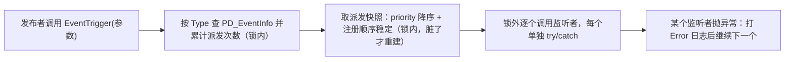

# EventCenterModule — 事件系统（EventCenter / EventBus）

`UPandaGF` 框架的事件模块，位于 `Runtime/Manager/EventCenterModule/`，提供**两套互不相通**的事件实现：

- **`EventCenter`** —— 委托式**全局事件中心**（单例），参数为 `EventArgBase` 子类（class），随处可用；
- **`EventBus`** —— 接口式**事件总线**（可 `new` 多个实例），消息为 `struct`（零 GC），内部弱引用防泄漏。

---

## 1. 该选哪个

| 场景 | 选择 | 原因 |
| --- | --- | --- |
| 跨模块 / 全局通知（框架事件、任务提示、加载进度） | `EventCenter` | 单例、随处可用；参数是 class，可携带任意对象引用 |
| 帧内高频（每秒几十次以上）、在意 GC | `EventBus` | 消息是 `struct`，零堆分配（`EventCenter` 每次派发都要 `new` 一次参数） |
| 需要多套互不干扰的上下文（多个学员 / 多场景并行） | `EventBus` | 可 `new` 多个实例；`EventCenter` 是单例 |
| 订阅者生命周期不确定（可能先于发布者被销毁） | `EventBus`（弱引用）或 `EventCenter` + owner 重载 | 两者都能避免「已销毁对象仍被回调」 |
| 需要「只收一次」/ 指定接收顺序 | `EventCenter` | 提供 `AddEventListenerOnce` 与 `priority`；`EventBus` 没有这两项 |

> **同一业务不要两套混用**：它们没有互操作，混用后"事件发了没人收"会非常难查（用第 6 节的事件调试窗口）。

---

## 2. 文件与职责

| 文件 | 内容 | 编码 |
| --- | --- | --- |
| `EventCenter.cs` | `EventArgBase`、`PD_EventInfo<T>`（单事件类型的监听容器）、`EventCenter`（单例）、`EventListenerInfo` / `EventTypeDebugInfo`（调试数据） | **GBK（无 BOM）** ⚠️ |
| `EventBus.cs` | `IEventListener<T>`、`EventBus`、`EventBusSubscriptionInfo`（调试数据） | UTF-8（带 BOM） |
| （编辑器工具）`Editor/CustomInspector/EventCenterModule/` | `EventCenterDebugWindow.cs`、`EventCenterSelfCheck.cs` | UTF-8（带 BOM） |

命名空间：运行时两个类都在 `UPandaGF`；编辑器工具在 `UPandaGF.EditorTools`。
基类 `LazySingletonBase<T>` 位于**全局命名空间**（`Runtime/Manager/Singleton/`）。

> ⚠️ **改 `EventCenter.cs` 必须按 GBK 读写**：用 UTF-8 工具直接改会把中文注释写成 `U+FFFD`。批量替换请"按原编码读取 → 替换 → 按原编码写回"。

---

## 3. EventCenter — 委托式全局事件中心

### 3.1 内部结构

```
EventCenter（单例）
└── Dictionary<Type, object> eventDic         // 键 = typeof(T)，值 = PD_EventInfo<T>
    └── PD_EventInfo<T>                       // 一个事件类型一个容器
        ├── List<Listener>                    // Listener { action, owner(WeakReference<Object>), priority, seq }
        ├── UnityAction<T>[] snapshot         // 派发快照（惰性重建，派发零分配）
        └── lockObj                           // 只保护容器本身
```

设计要点：

1. **键用 `Type`**，不用 `GetHashCode()` —— 后者一旦哈希碰撞，注册会被丢掉、派发会没反应，且没有任何日志（静默失效）。
2. **去重比较委托本身**（`Delegate ==`：同一方法 + 同一目标对象）。`null` 目标 = 静态方法。
3. **owner 用弱引用保存**，派发前 / 统计时清理已 `Destroy` 的 owner。
4. **派发用快照**：`priority` 降序、同优先级按注册顺序（用 `seq` 稳定排序）。

### 3.2 API

| 成员 | 说明 |
| --- | --- |
| `AddEventListener<T>(UnityAction<T> action)` | 注册 |
| `AddEventListener<T>(UnityAction<T> action, int priority)` | 注册并指定优先级（**数字大的先收到**） |
| `AddEventListener<T>(UnityEngine.Object owner, UnityAction<T> action, int priority = 0)` | 注册并绑定 owner，**owner 被销毁后自动失效** |
| `AddEventListenerOnce<T>(UnityAction<T> action)` | 只收一次（收到后自动注销） |
| `RemoveEventListener<T>(UnityAction<T> action)` | 注销（同一个「方法 + 目标对象」一次移除一个） |
| `EventTrigger<T>(T arg)` | 派发 |
| `Clear()` | 清空所有监听与统计 |
| `warnOnMissingListener` | `true` 时"派发却没有任何监听者"会打印提示（排查用，默认关） |
| `ListenerTypeCount` / `GetListenerCount<T>()` / `HasListener<T>()` | 监听者数量 |
| `GetDispatchCount<T>()` / `ResetDispatchCounts()` | 派发次数统计 / 清零 |
| `GetDebugSnapshot()` | 全部事件类型的调试快照（调试窗口用） |

约束：`T : EventArgBase`（`EventArgBase` 是抽象类，事件参数写成它的子类）。

### 3.3 用法

```csharp
using UPandaGF;

// 1) 声明事件对象
public class TaskTipsInfoEvent : EventArgBase
{
    public string info { get; private set; }
    public TaskTipsInfoEvent(string info) { this.info = info; }
}

// 2) 注册（推荐：带 owner，省略 OnDestroy 里的注销）
private void OnEnable()
{
    EventCenter.Instance.AddEventListener<TaskTipsInfoEvent>(this, OnTips);
    EventCenter.Instance.AddEventListener<TaskTipsInfoEvent>(OnTipsHighPriority, 10);   // 先收到
    EventCenter.Instance.AddEventListenerOnce<TaskTipsInfoEvent>(OnTipsOnce);           // 只收一次
}

// 3) 触发
EventCenter.Instance.EventTrigger(new TaskTipsInfoEvent("操作错误!!!"));

// 4) 不带 owner 的注册，必须在销毁前手动注销，否则会泄漏：
private void OnDestroy() => EventCenter.Instance.RemoveEventListener<TaskTipsInfoEvent>(OnTips);
```

### 3.4 执行语义



- **派发顺序**：`priority` 大的先收到，同优先级保持注册顺序。
- **快照语义**：派发过程中「新增的监听」不会收到本次事件；「移除的监听」本次仍会收到（因为它在快照里），但不会重复派发。
- **异常隔离**：任一监听者抛异常会被 `try/catch` 拦住并打印 `PLogger.LogError`，**其余监听者照常执行**。
- **锁**：只在"查表 / 取快照 / 改容器"时加锁，**用户回调一律在锁外执行** —— 慢或卡住的监听者不会堵住其它调用方。
- **线程**：容器访问是加锁的，但回调在**调用方线程**上执行。Unity API 只能在主线程调用，所以请**只在主线程派发**；本模块不提供跨线程投递队列。
- **重复注册**：同一个「方法 + 目标对象」重复注册会被忽略并打一条 `LogWarning`（不会收到两次）。

### 3.5 性能

| 项 | 开销 |
| --- | --- |
| 注册 / 注销 | 一次 `Dictionary<Type, object>` 查表 + 线性遍历（监听者数量级为个位数，可忽略）；注销后若无人监听会移除空壳 |
| 派发 | 一次查表 + 锁；快照**只在变更后重建**，命中缓存时派发过程**零分配** |
| 事件参数 | ⚠️ 每次派发都要 `new` 一个 `EventArgBase` 子类 → 高频场景会有 GC 压力，请改用 `EventBus` |

---

## 4. EventBus — 接口式事件总线

### 4.1 内部结构

```
EventBus（可 new 多个实例）
├── Dictionary<Type, object> _subscriptions      // 键 = typeof(T)，值 = SubscriptionList<T>
│   └── SubscriptionList<T>
│       ├── List<WeakReference<IEventListener<T>>>   // 弱引用，不阻止监听者被 GC
│       ├── WeakReference<IEventListener<T>>[] _snapshot  // 派发快照（只存弱引用！）
│       └── _lock
└── static List<WeakReference<EventBus>> _instances   // 实例登记，仅供调试窗口枚举
```

> 快照里**只存弱引用**是刻意的：如果快照存强引用，等于把弱引用机制废掉（监听者永远回收不了）。

### 4.2 API

| 成员 | 说明 |
| --- | --- |
| `Subscribe<T>(IEventListener<T> listener)` | 订阅（**允许重复订阅**，订阅两次就收两次） |
| `Unsubscribe<T>(IEventListener<T> listener)` | 退订（按 `ReferenceEquals` 比较，一次移除一个） |
| `Dispatch<T>(T message)` | 派发 |
| `Clear()` | 清空所有订阅 |
| `GetSubscriptionCount<T>()` / `HasSubscriber<T>()` / `GetSubscriberNames<T>()` | 调试 / 测试 |
| `GetDebugSnapshot()` | 本实例的调试快照（消息类型 → 订阅者数量 / 名称） |
| `GetAliveInstances()`（static） | 当前存活的实例（调试窗口用） |

约束：消息 `T : struct`；监听者 `IEventListener<T>`，**实现者必须是 class**。

### 4.3 用法

```csharp
public struct DamageMsg { public int value; }

public class DamageView : IEventListener<DamageMsg>
{
    private readonly EventBus bus;

    public DamageView(EventBus bus)
    {
        this.bus = bus;
        bus.Subscribe<DamageMsg>(this);
    }

    public void OnEvent(DamageMsg message) => PLogger.Log($"掉血 {message.value}");

    public void Dispose() => bus.Unsubscribe<DamageMsg>(this);
}

var bus = new EventBus();          // 每个上下文一个实例（例如每个学员 / 每个场景）
var view = new DamageView(bus);
bus.Dispatch(new DamageMsg { value = 3 });
```

### 4.4 执行语义

- **弱引用**：只有总线持有监听者时，监听者可以被 GC 回收（不会因为忘记退订而泄漏）；回收后订阅项会在下次增删/查询时自动清理。
- **快照语义**：派发中退订 → 本次仍收到（快照里），下次不再收到；派发中订阅 → 本次不收到，下次生效。**不会重复派发，也不会漏派发**。
- **顺序**：按**订阅顺序**。
- **异常隔离**：每个订阅者单独 `try/catch`，一个抛异常不影响其余。
- **锁**：字典锁 + 每列表自己的锁；**用户回调在锁外执行**。
- **`struct` 监听器会被拒绝**：值类型实现接口会被装箱，装箱对象随时可能被 GC 回收 → 订阅"静默失效"。`Subscribe` 检测到 `IsValueType` 会直接 `Debug.LogError` 并拒绝（**必须用 class 实现**）。
- **重复订阅是允许的**（`EventBus` 语义与 `EventCenter` 的去重相反）：需要去重请自行判断。

### 4.5 性能

| 项 | 开销 |
| --- | --- |
| 订阅 / 退订 | 一次查表 + 建弱引用；退订为线性查找 |
| 派发 | 一次查表 + 取快照缓存（零分配）；每个订阅者一次 `TryGetTarget` + 一次接口调用 |
| 消息 | `struct`，**零 GC**（这正是它相对 `EventCenter` 的最大优势） |

---

## 5. 两者共同的语义保证

| 语义 | EventCenter | EventBus |
| --- | --- | --- |
| 监听者抛异常不中断其它监听者 | ✅ | ✅ |
| 派发中增删监听不重复 / 不漏派发 | ✅（快照） | ✅（快照） |
| 用户回调在锁外执行 | ✅ | ✅ |
| 已销毁对象不再被回调 | ✅（owner 弱引用） | ✅（监听者弱引用） |
| 派发过程零分配 | ✅ | ✅ |
| 允许重复订阅 | ❌（同方法+同目标会被去重） | ✅ |
| 支持优先级 / 一次性 | ✅ | ❌ |
| 可多实例（上下文隔离） | ❌（单例） | ✅ |
| 参数零 GC | ❌（class 参数） | ✅（struct 消息） |

---

## 6. 编辑器工具与验证

菜单都在 `UPandaGF -> Runtime -> 事件系统` 下：

| 菜单 | 说明 |
| --- | --- |
| **事件调试窗口** | 查看每个事件类型的监听者数量 / 累计派发次数，展开看明细（方法名、目标类型、优先级、是否带 owner）；查看 `EventBus` 存活实例及其订阅者；可开关「无监听者时告警」、清零派发统计、清空 EventCenter（带确认） |
| **事件模块自检** | **28 项断言**，覆盖去重 / 优先级 / Once / 异常隔离 / owner 清理 / 派发中增删订阅 / 弱引用回收 / struct 拒绝 / 空壳清理 / 统计 等全部关键语义；跑完弹窗给结果 |

**自动化 / CI 用法**：自检提供无弹窗入口（弹窗会阻塞编辑器）：

```csharp
string report = UPandaGF.EditorTools.EventCenterSelfCheck.RunSilent();   // 返回报告字符串，同时写 Console
```

自检用 `new EventCenter()` / `new EventBus()` 的**独立实例**执行，不会污染运行时全局的 `EventCenter.Instance`。
自检过程会**故意**产生 4 条日志（1 条重复注册警告 + 3 条异常/拒绝错误），属预期结果。
其中"监听者被 GC 回收后订阅自动清理"一项，若被编辑器/调试器持有引用导致回收不掉，会自动标记为**跳过**而不是失败。

---

## 7. FAQ

**Q1：事件发了，但没人收到？**
三步排查：① 打开 `事件调试窗口` 看该事件类型是否存在、监听者数量是否为 0；② 把 `EventCenter.Instance.warnOnMissingListener = true`（窗口里也能切），派发时会打印提示；③ 确认监听者注册的是不是**另一个** `EventCenter` 实例（本模块的 `EventCenter` 是单例，但 `EventBus` 是多实例，各实例互不相通）。

**Q2：忘记注销会不会泄漏？**
`EventBus` 不会（弱引用）；`EventCenter` 用带 owner 的重载也不会（owner 销毁后自动清理）。裸 `AddEventListener` 必须手动 `RemoveEventListener`，否则委托会强引用目标对象。

**Q3：一个监听者抛异常，会不会影响别人？**
不会。每个监听者单独 `try/catch`，异常只打日志，其余监听者照常执行。

**Q4：在回调里注册 / 注销监听，可靠吗？**
可靠（两边都是快照派发）：本次派发按"取快照那一刻"的列表执行；新增的监听从下一次开始生效，注销的监听本次不再补发、下次不再收到。

**Q5：可以在子线程派发吗？**
不建议。容器访问有锁保护，但**回调在调用线程上执行**，而 Unity API 只能主线程调用。需要跨线程时，请在子线程把消息塞进自己的队列，主线程 `Update` 里再 `EventTrigger`。

**Q6：为什么 `EventBus` 不能用 struct 实现 `IEventListener<T>`？**
值类型实现接口会装箱，装箱对象没有任何强引用 → 随时被 GC 回收 → 订阅"静默失效"。所以 `Subscribe` 直接报错拒绝。消息（`T`）用 struct，监听者用 class。

**Q7：同一个方法注册两次会收到两次吗？**
`EventCenter` 不会（同一个「方法 + 目标对象」会被去重，并打印一条 warning）；`EventBus` 会（允许重复订阅）。

**Q8：高频事件怎么避免 GC？**
用 `EventBus` + `struct` 消息。`EventCenter` 每次派发都要 `new` 一个 `EventArgBase` 子类，这是它的固有成本（换来的是能携带任意对象引用、随处可用的单例）。

**Q9：`EventCenter.Instance` 在编辑器里能直接用吗？**
能（懒加载单例，首次访问即创建），所以调试窗口在非 Play 模式下也能打开，只是没有运行时数据。

---

## 8. 已知限制

1. 两套实现**没有任何互操作**（不能把 `EventBus` 的消息转发给 `EventCenter`）；
2. `EventBus` 没有优先级、没有一次性订阅、没有派发次数统计（只有订阅数量）；
3. `EventCenter` 的事件参数是 class，高频派发有 GC；
4. **不支持跨线程投递**（没有主线程队列），跨线程需要业务自己排队；
5. 没有事件"录制 / 回放"能力（如果需要，参考 `InteractiveTaskScoringSystem` 的 `Core/ReplayLog.cs` 做法）；
6. 事件靠代码注册，没有"数据驱动的事件表"；
7. 派发是**同步**的：某一个监听者耗时（例如同步加载资源）会拖慢整个 `EventTrigger` 返回，异步化需要业务自行处理；
8. `EventBus` 的实例登记表（`_instances`）只服务调试窗口，业务侧不要依赖它做生命周期管理。

---

## 9. 变更记录（2026-09 重构）

本次按 A（静默失效 / 逻辑错误）→ B（健壮性）→ C（能力 / 一致性）三级清单重构：

| 级别 | 内容 |
| --- | --- |
| A | ①事件键 `typeof(T).GetHashCode()` → `Dictionary<Type, object>`（原哈希碰撞会让注册/派发**静默失效**）；②去重 `HashSet<int>`（存的委托哈希）→ 比较委托本身；③`RemoveEventListener` 补锁（原先唯一没加锁的方法）；④`EventBus` 倒序派发 → **弱引用快照 + 锁外调用**（原实现在派发中移除"更靠前"的订阅者会让**当前**监听者被重复派发）；⑤`Subscribe` 拒绝 struct 监听器 |
| B | ⑥每个监听者单独 try/catch；⑦`AddEventListener(owner, action)` 自动清理已销毁 owner；⑧退订比较改 `ReferenceEquals`；⑨`Count` 先清理死引用；⑩用户回调一律锁外执行 + 快照缓存（派发零分配） |
| C | ⑪`AddEventListenerOnce`；⑫`priority` 优先级；⑬监听清空时删除空壳容器；⑭调试 API（`GetDebugSnapshot` 等）；⑮事件调试窗口 + 事件模块自检（28 项）；⑯框架 README 补选型指南 |

**兼容性**：`EventCenter` 的公共 API **只增不改**，既有调用点（`GFLoadedEvent`、`TaskTipsInfoEvent`、`SceneMgr_SceneAsynLoadProgress`、`ABLoadProgressEvent` 等）无需改动。
**唯一行为变化**：`EventBus` 的派发顺序由"倒序"改为"订阅顺序"（改造前 `EventBus` 在项目里没有任何调用点）。
