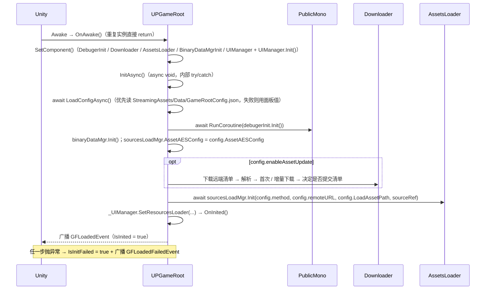
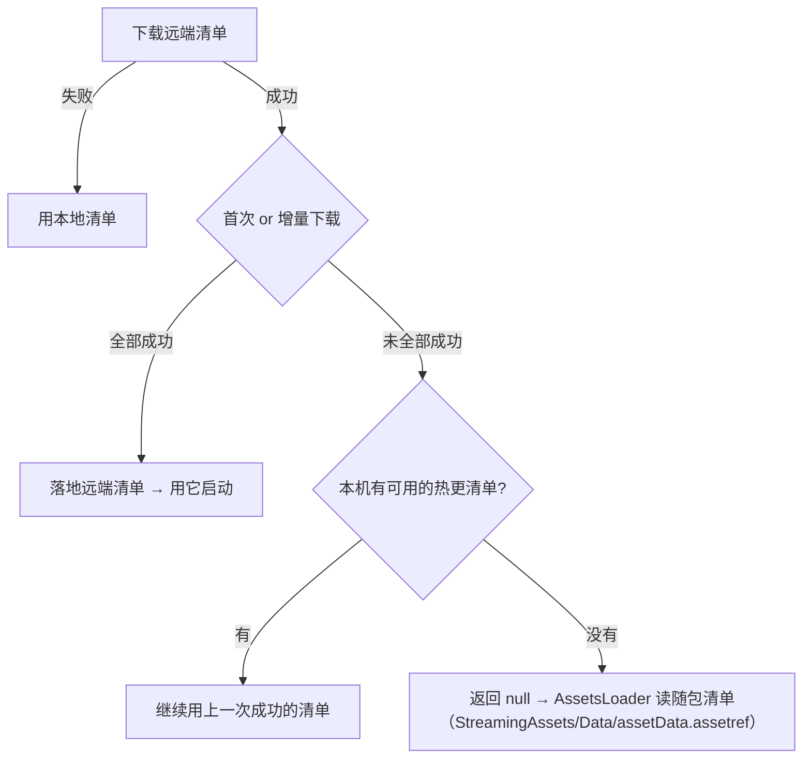
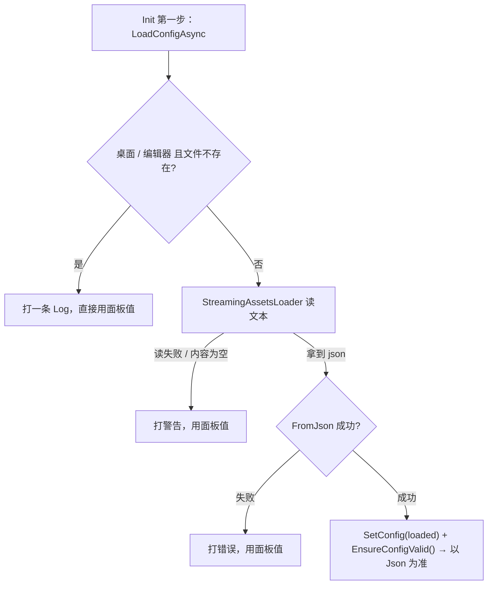

# GameRoot — 启动入口（UPGameRoot / GameLaunchExample）

`Runtime/Manager/GameRoot/`：框架的启动根节点与示例启动流程。

## 1. 文件组成

| 文件 / 目录 | 说明 |
|---|---|
| `UPGameRoot.cs` | 启动根节点（`[AddComponentMenu("UPandaGF/GameRoot")]`，`EagerMonoSingletonBase<UPGameRoot>`，缺失时自动创建并 `DontDestroyOnLoad`）；含 `AssetLoaddingMethod` 枚举与 `GFLoadedEvent` / `GFLoadedFailedEvent` |
| `UPGameRootConfig.cs` | **配置对象**（`[Serializable] UPGameRootConfig`）+ 配置文件读写（`UPGameRootConfigFile`：路径常量 / `ToJson` / `FromJson`）。Inspector 面板与 `StreamingAssets/Data/GameRootConfig.json` 共用这一个对象 |
| `GameLaunchExample.cs` | 示例入口：订阅框架事件 → 开加载界面 → 热更程序集 → 加载首场景 |
| `PublicEnum.cs` | 本目录用到的公共枚举 |
| `SourcesLoadMgr/` | 资源加载抽象层（`IAssetsLoader` / `AssetsLoader` / `EditorSourcesMgr` / `ABSourcesRelated`） |

## 2. 启动时序

`GameLaunchExample` 在 `Awake` 里订阅两个事件，收到 `GFLoadedEvent` 后才去取 `GetAssetsLoader()`、热更程序集、加载首场景；收到 `GFLoadedFailedEvent` 则给出提示（不会静默卡在加载界面）。

> `UPGameRoot` 标了 `[DefaultExecutionOrder(-100)]`：保证它比业务脚本先 `Awake`（业务脚本通常在 `Awake` 里订阅事件）。真正的完成时机由异步初始化决定（至少跨一帧）。

## 3. 热更语义

**下载什么由每个包的 `loadPath`（`ABLoadPath`）决定**，与运行时加载位置一致：

| `loadPath` | 行为 |
|---|---|
| `StreamingAssetsPath` | 随包发布，**不下载** |
| `PersistentDataPath` | 下载到 `persistentDataPath/<LoadAssetPath>/`，运行期从这里加载 |
| `RemotePath` | 直接从 `<remoteURL>/<LoadAssetPath>/<包名>` 加载，**不下载** |

- **主包同理**：只有它的 `loadPath` 为 `PersistentDataPath` 时才会被下载（否则下载到本地也不会用）。
- **首次全量 / 增量**：没有本地清单 → 全量下载所有 `PersistentDataPath` 包；有本地清单 → 按 `md5` 比对只下变更的，并删除"远端已删、本地还在"的包文件。
- **清单的路径约定**：远端清单固定 `{remoteURL}/AssetBundles/assetData.assetref`（与平台无关）；包在 `{remoteURL}/{LoadAssetPath}/<包名>`。
- **清单提交时机（重要）**：只有**全部下载成功**才会把远端清单落地覆盖本地清单。未全部成功时**不提交**，并按以下顺序降级：

这样避免"清单里声称存在、实际没下载下来的包"在运行时变成零散的"该资源不存在"。

- **下载完整性**：单文件由 `Downloader` 校验（落盘大小 vs 预期 / `Content-Length`，不一致视为失败并重试）；清单里的 `md5` 只用于"是否需要下载"的比较，**不做下载后校验**。

## 4. 事件与就绪状态

| 成员 | 说明 |
|---|---|
| `GFLoadedEvent` | 初始化完成（资源系统已就绪），用法：在 `Awake` 里 `AddEventListener`，回调里再做后续启动 |
| `GFLoadedFailedEvent.message` | 初始化失败（此时 `GFLoadedEvent` 不会再来），带上异常信息 |
| `IsInited` | 是否已完成初始化（等价于"`GFLoadedEvent` 是否已广播"） |
| `IsInitFailed` | 是否失败（失败后 `IsInited` 始终为 false） |
| `SourceRef` | 本次实际使用的资源清单（未开热更 / 清单缺失时为 null） |
| `GetAssetsLoader()` | 取 `IAssetsLoader`；⚠ `IsInited == false` 时它尚未真正初始化（加载方式还是默认值、清单还是 null），请在收到 `GFLoadedEvent` 之后再取（提前调用会打一条警告） |
| `Downloader` | 取下载器（外部系统想复用同一队列时用） |

## 5. 配置项

配置集中在一个可序列化对象里：`[SerializeField] private UPGameRootConfig config`，对外只读访问 `UPGameRoot.Config`，整体替换用 `SetConfig(UPGameRootConfig)`。

| 字段（`UPGameRoot.Config.`） | 说明 |
|---|---|
| `method` | `AssetLoaddingMethod.Editor`（直读资源，编辑器调试）/ `Assetbundles`（走 AB）。注意它与 `AssetLoadMethod`（单次加载级别：Resources / AssetBundle）是两码事 |
| `enableAssetUpdate` | 是否启用资源热更（关掉就直接用随包清单） |
| `LoadAssetPath` | 资源相对路径，默认 `AssetBundles/StandaloneWindows/`（同时决定远端 URL 与本地 `persistentDataPath` 下的子目录） |
| `remoteURL` | 远端根地址，默认 `http://127.0.0.1:80/` |
| `downloadBatchTimeout` | 等待一批下载完成的超时（秒，默认 300，`<= 0` 不超时） |
| `AssetAESConfig` | 清单 AES 配置（`AssetBundleClassificationWindowConfig`）。**默认 `enable = false`**：随包清单是明文，误开会让清单解密失败、AB 模式整体不可用 |
| `EnableDebugModel` | 启用运行时日志窗口（Reporter，由 `DebugerInit` 读取） |
| `reporter` | **不在配置对象里**：Reporter 组件引用仍直接挂在 `UPGameRoot` 上（由 `UPGameRootEditor` 自动填空） |

### 5.1 Json 配置文件（启动时优先读取）

| 项 | 值 |
|---|---|
| 工程内路径 | `Assets/StreamingAssets/Data/GameRootConfig.json`（`UPGameRootConfigFile.AssetPath`） |
| 运行时相对路径 | `/Data/GameRootConfig.json`（`UPGameRootConfigFile.RelativePath`，经 `StreamingAssetsLoader.LoadTextFileAsync` 异步读，兼容 Android / WebGL） |
| 序列化 | `JsonUtility`（带缩进、不带 BOM），`UPGameRootConfigFile.ToJson / FromJson` |

> 📌 **本工程当前这份 Json（2026-09-16 快照）**：`method: 1`（Assetbundles）、`enableAssetUpdate: true`、`remoteURL: http://127.0.0.1:8090/`、AES 关闭 —— 启动时它会**覆盖**面板上的值，所以想在编辑器里用 Editor 模式直读资源调试时，需先把这个 Json 删掉或把 `method` 改成 `0`。

**优先级：Json > 面板 / 代码里的值。** `Init()` 的第一步就是 `await LoadConfigAsync()`：

- 任何一步失败都只降级，**不会中断启动链**（保证最后一定会广播 `GFLoadedEvent` / `GFLoadedFailedEvent`）。
- `EnsureConfigValid()` 负责兜底：`config` / `config.AssetAESConfig` 为 null 时新建，`LoadAssetPath` 为空时回默认值（手改 Json 漏字段也安全）。

### 5.2 面板上的操作（`UPGameRootEditor`）

Inspector 顶部是「UPGameRoot」，底部是配置文件的路径提示 + 三个按钮：

| 按钮 | 行为 |
|---|---|
| 保存到 Json | 把当前 `Config` 写成 `Assets/StreamingAssets/Data/GameRootConfig.json`（UTF-8 无 BOM + 缩进），然后 `AssetDatabase.Refresh()` |
| 从 Json 读取 | 读回 Json 覆盖面板上的值（带 `Undo.RecordObject`，可撤销） |
| 定位文件 | 在资源管理器里选中该 Json |

> 改动面板后**必须点「保存到 Json」**才会影响下次启动（否则启动时被 Json 里的旧值覆盖）。

## 6. 注意事项与已知限制

- **重复实例**：场景里出现第二个 `UPGameRoot` 时，基类会销毁它并给出警告；`OnAwake()` 里加了 `if (Instance != this) return;`，避免被销毁的那个也跑完整套初始化并**再广播一次** `GFLoadedEvent`（否则加载流程会走两遍）。
- **AES 必须两侧一致**：`AssetAESConfig.enable` 要和打包端（AB 工具窗口「使用加密」）一致。运行端开启但清单是明文 → 解密失败 → AB 模式整体不可用（启动时会打警告）。
- **AES 有两条来源，别改错**：AB 工具窗口自己的 `Assets/Editor/EditorConfig/AssetBundleBuildConfig.json`（打包端）与 `GameRootConfig.json` 里的 `AssetAESConfig`（运行端）。启动时**以 `GameRootConfig.json` 为准**；`UPGameRootEditor.OnEnable` 会把 AB 窗口那份同步进面板。
- **配置文件只有一个真源**：Json 存在时，面板上的值在启动时会被覆盖。只改面板不点「保存到 Json」= 改动无效；想删掉 Json 恢复“面板说了算”，直接删除那个文件即可（启动会打一条 Log）。
- **旧场景数据不再被读取**：配置字段从 `UPGameRoot` 搬到 `config` 对象后，旧场景 / Prefab 里遗留的 `reomoteURL` / `EnableDebugModel: 1` 等键就失效了，需要在面板上重设一次并保存到 Json。
- **Json 字段名敏感**：`JsonUtility` 按字段名匹配，手改 Json 时字段名写错会被静默忽略（保留默认值，不会报错）；新增配置字段时记得同步 `GameRootConfig.json`。
- **下载器的事件是全局的**：`OnAllDownloadsFinished` 与 `FailedItems` 属于整个 `Downloader`，别的批次会影响它们。所以本流程的成功与否**按本批次自己的 `DownloadItem.state` 判定**，并且等待带超时（下载器要求"无排队 / 无下载中 / 无暂停"才算结束，一旦有任务被暂停，完成事件永远不会来）。
- **超时后不会取消下载**：只是不再阻塞启动链（下载器可能仍在后台继续），此时按"热更未完成"处理（不提交清单）。
- **同步 IO**：清单的读写（几 KB）在主线程完成，可接受。
- **`Reset()` 的编辑器副作用**：编辑器里给物体加 `UPGameRoot` 或点 Inspector 的 Reset 会在场景中生成 `DebugerInit / Downloader / AssetsLoader / BinaryDataMgrInit / UIManager` 五个子物体，并执行 `UIManager.Init()`（建 UICamera / Canvas / EventSystem）——会脏场景、可能堆出重复子节点，做 Prefab 时注意。
- **没做过 md5 校验**：清单 `md5` 只用于差异比较，下载后的文件内容不做哈希校验（只有大小校验）。
- **`DeleteLocalAsset` 只清当前 `LoadAssetPath`**：历史版本换过 `LoadAssetPath` 时旧文件会残留。
- 命名遗留：`AssetLoaddingMethod`（少一个 n）、`EnableDebugModel`（PascalCase 与其他配置字段不一致）—— 都属于序列化/公共 API，改动需要 `[FormerlySerializedAs]` 或同步改多处，暂未动。

## 7. 与框架的关系

- `UPGameRoot` 是**唯一**持有资源系统生命周期的地方：`AssetsLoader` / `ABLoadMgr` 的初始化与 `UIManager.SetResourcesLoader` 都由它驱动。
- 帧更新与协程通过 `PublicMono` 驱动（见 `Manager/PublicMono/README.md`）；下载走 `Manager/DownloadMgr`；日志走 `PLogger`（本工程 csproj 定义了 `OPEN_PLOG`，日志不会被编译期剔除）。
- 其它模块（`ObjPool` / `AudioMgr` / `GameObjectPoolMgr`）需要 `IAssetsLoader` 时，都通过 `UPGameRoot.Instance.GetAssetsLoader()` 惰性获取 —— 因此**要在 `GFLoadedEvent` 之后**才可用。

## 8. 维护提示

- 改动 `UpdateAssets` 时，务必保留三条不变量：① 清单只在"全部下载成功"时提交；② 任何失败都要走降级（本地清单 → 随包清单），不能把异常抛给 `InitAsync`；③ 日志描述必须与真实行为一致。
- 改动 `DownloadBatchAndWait` 时，不要把"成功判定"改回只看下载器的全局事件/失败列表（会被其它批次污染），也不要去掉超时（暂停任务会让完成事件永不触发，启动链会永久挂起）。
- 新增"初始化阶段"的子系统时，接入 `Init()` 并且失败要能被 `InitAsync` 捕获（保证一定会广播完成或失败事件）。
- 改动后请用工程外的真实编译校验（`get_errors` 在 Unity 工程里可能是假阴性）：用 `.csproj` 的 `<HintPath>` 作 `/r:`、`<DefineConstants>` 作 `/define:`，`dotnet <sdk>\Roslyn\bincore\csc.dll @"rsp"`。**编辑器程序集要引用刚编译出的 Runtime 程序集**，不能用 `Library/ScriptAssemblies/` 里的旧产物（否则改名/新增成员会报假的 CS1061）。
- 新增 / 改名配置字段时，要同步三处：① `UPGameRootConfig` 字段；② `UPGameRootEditor` 里的 `ShowArg("config.xxx", …)` 字符串（写错会在面板上报“字段不存在”而不是抛异常，很容易漏）；③ `Assets/StreamingAssets/Data/GameRootConfig.json` 默认值。
