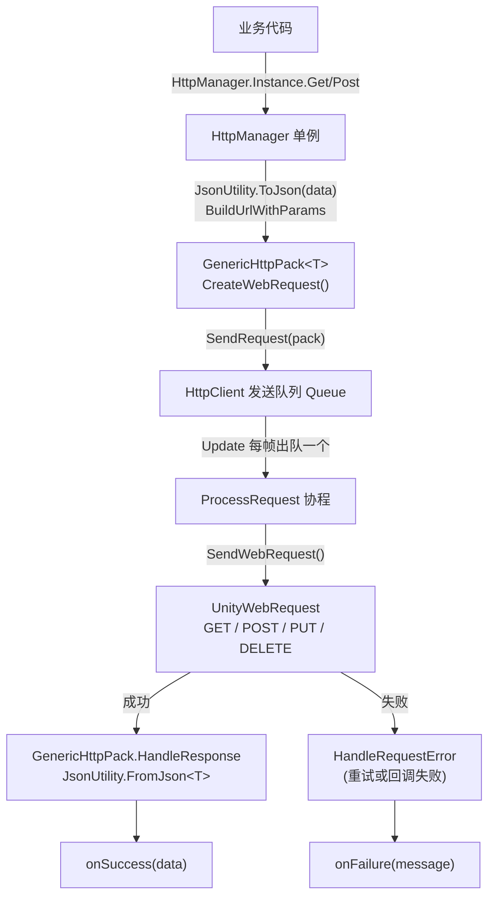
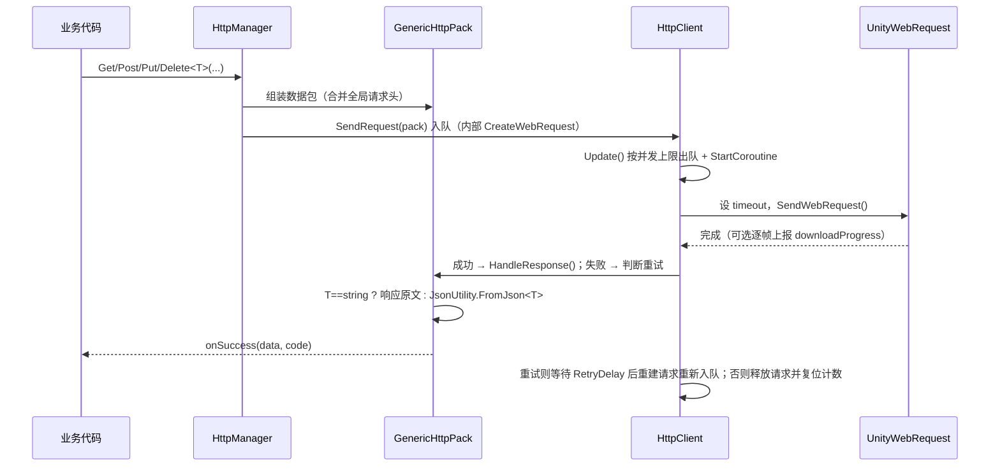

# HTTPTool — 基于 UnityWebRequest 的 HTTP 请求模块

一个轻量的 HTTP 封装：**单例门面 + 泛型数据包 + 单线程请求队列**，用 `UnityWebRequest` 发请求，用 `JsonUtility` 做 JSON 序列化 / 反序列化。

- 路径：`Assets/Scripts/upanda-framework/Runtime/Manager/HTTPTool/`
- 依赖：仅 Unity 内置 API（`UnityEngine.Networking`），无第三方库
- 编码：源码为 **GBK/ANSI**（与框架其它源码一致），如需修改请用 GBK 读写

> **当前状态**：功能已完整可用（2026-09 修复并加固，见第 6 节），但项目内**暂无调用点** —— 首个接入方直接按第 5 节示例使用即可。
> 源码为 **GBK** 编码，修改时请按 GBK 读写；本文件为 UTF-8。

---

## 1. 文件组成

| 文件 | 类型 | 职责 |
|---|---|---|
| `HttpManager.cs` | `LazyMonoSingletonBase<HttpManager>` 单例 | 对外 API：`Get / Post / Put / Delete`（各含"带状态码"重载）、全局请求头、高级入口 `CreateRequest / Send`、`CancelAll`；内部持有 `HttpClient` |
| `HttpClient.cs` | `MonoBehaviour` | 队列执行器：按并发上限出队 → 协程发送 → 进度上报 → 成功/失败分流 → 重试（等待 + 重建请求）→ 释放并复位计数 |
| `HttpPack.cs` | 抽象类 + 枚举 + `GenericHttpPack<T>` | 请求模型（见 4.2）与响应解析；`GenericHttpPack<T>` 原先定义在 `HttpManager.cs`，已归位到本文件 |

---

## 2. 架构与调用链



要点：

- **单例是懒加载的**：第一次访问 `HttpManager.Instance` 时才创建 `HttpManager_LazySingleton` 物体并 `DontDestroyOnLoad`（基类 `LazyMonoSingletonBase` 行为）。
- **`HttpClient` 挂在同一个物体上**，所以它同样跨场景常驻，其 `Update` 持续驱动队列。
- **默认串行、并发可调**：`HttpClient.MaxConcurrentRequests` 默认 1（按入队顺序逐个发送），设为 N 可同时发送 N 个请求。
- **队列不会停摆**：并发计数在任何分支（成功 / 失败 / 取消 / 回调抛异常 / 发起失败）都会被复位；配合"重试前重建请求"，彻底修掉了原来 `WebRequest` 被置空后重试抛空引用、导致所有后续请求卡死的缺陷。

---

## 3. 请求生命周期



各步骤细节：

| 步骤 | 位置 | 说明 |
|---|---|---|
| 拼 URL 与查询串 | `HttpManager.BuildUrlWithParams` | 键值都过 `UnityWebRequest.EscapeURL` 编码；URL 已带 `?` 时用 `&` 追加（不再多拼一个 `?`），`#` 片段保留到最末尾 |
| 构造请求体 | `HttpManager.BuildBody` | `string` 视为已写好的 JSON 原文；`null` 表示无请求体；其它类型走 `JsonUtility.ToJson` |
| 合并请求头 | `HttpManager.SendInternal` | 优先级（后者覆盖前者）：全局请求头 &lt; 请求级参数 &lt; 数据包自身 `Headers` |
| 创建请求 | `HttpPack.CreateWebRequest` | `new UnityWebRequest(url, verb)` + UTF-8 `UploadHandlerRaw` + `DownloadHandlerBuffer`；仅在有请求体且未显式指定时才补默认 `Content-Type`；**首次发送与每次重试都会调用** |
| 入队 | `HttpClient.SendRequest` | 已取消的包直接丢弃；未创建的请求先创建 |
| 出队 | `HttpClient.Update` | 在飞请求数 &lt; `MaxConcurrentRequests` 时逐个出队 |
| 发起 | `HttpClient.TryStartRequest` | 普通方法内设置 `timeout` 并 `SendWebRequest()`，异常在此捕获并转入失败分支（不会跳过收尾） |
| 进度 | `HttpClient.ProcessRequest` | 仅当设置了 `OnProgress` 时才逐帧轮询 `downloadProgress`；回调内抛异常不影响请求流程 |
| 成功判定 | `HttpClient.IsRequestSuccess` | 2020.3+ 用 `Result.Success`；旧版本用 `!isHttpError && !isNetworkError` |
| 解析响应 | `GenericHttpPack<T>.HandleResponse` | `T == string` 返回响应原文；响应体为空、JSON 解析失败都会走 `OnFailure`（不向调用方抛异常） |
| 失败处理 | `HttpClient.TryScheduleRetry` | 错误信息含 URL / 状态码 / `error` / 截断后的响应体；若还有重试次数则回调 `OnRetry` 并返回 `true`，用尽则**只回调一次** `OnFailure` |
| 收尾 | `HttpClient.FinishRequest` | `try/catch/finally`：重试则重建请求并重新入队，否则 `Dispose`；被取消的请求静默结束（不触发任何回调）；最后复位并发计数 |

---

## 4. API 参考

### 4.1 `HttpManager`（对外）

```csharp
// 单例：首次访问时创建 HttpManager_LazySingleton 物体并 DontDestroyOnLoad
public static HttpManager Instance { get; }

// 并发与取消
public HttpClient Client { get; }                    // 内部客户端（高级操作入口）
public int MaxConcurrentRequests { get; set; }       // 默认 1 = 串行
public void CancelAll();                             // 取消全部请求（不触发任何回调）

// 全局请求头（会自动合并进之后发出的每个请求）
public void SetGlobalHeader(string key, string value);
public bool RemoveGlobalHeader(string key);
public void ClearGlobalHeaders();
public IReadOnlyDictionary<string, string> GlobalHeaders { get; }

// 便捷接口：每个方法都有 Action<T> 与 Action<T,int>（带状态码）两种重载
public GenericHttpPack<T> Get<T>(string url, Dictionary<string, string> parameters,
                                 Action<T> onSuccess, Action<string> onFailure = null) where T : class;
public GenericHttpPack<T> Post<T>(string url, object data, ...);
public GenericHttpPack<T> Put<T>(string url, object data, ...);
public GenericHttpPack<T> Delete<T>(string url, Dictionary<string, string> parameters = null, ...);

// 高级用法：先创建（可自由配置 Headers / Timeout / RetryCount / RetryDelay / OnProgress / OnRetry）
public GenericHttpPack<T> CreateRequest<T>(HttpRequestType type, string url, string body = null) where T : class;
public bool Send<T>(GenericHttpPack<T> pack) where T : class;
```

说明：

- `Get / Post / Put / Delete` **返回数据包**（可用于 `Cancel()` 或查询 `AttemptCount` 等）；不需要时忽略返回值即可，与旧版 `void` 调用方式完全兼容。
- `onSuccess` 只写一个 `null` 会触发重载歧义（CS0121）；需要"无成功回调"的场景请改用 `Send(CreateRequest(...))`。
- 只需位置参数：`Get(url, null, data => ..., err => ...)`；只需状态码：`Get(url, null, (data, code) => ..., err => ...)`。

### 4.2 `HttpPack` / `GenericHttpPack<T>`

| 成员 | 默认值 | 说明 |
|---|---|---|
| `Url` | — | 请求地址（GET / DELETE 的查询串通常由 `BuildUrlWithParams` 生成） |
| `Type` | `Get` | `Get / Post / Put / Delete` |
| `Parameters` | — | 请求体字符串（JSON）；GET 时忽略 |
| `BodyRaw` | — | 请求体原始字节，设置后优先于 `Parameters`（上传二进制用） |
| `Headers` | 空字典 | 本次请求头；发送时与全局头合并（同名的以本次为准） |
| `RetryCount` | `3` | 失败后的重试次数（不含首次，即最多请求 4 次） |
| `RetryDelay` | `0.5` | 每次重试前的等待秒数；`0` = 立即重试 |
| `Timeout` | `15` | 超时时间（秒） |
| `AttemptCount` | `0` | 已发起的尝试次数（由 `HttpClient` 维护，可在 `OnRetry` 中读取） |
| `IsCanceled` | `false` | 是否已取消 |
| `WebRequest` | — | 底层 `UnityWebRequest`（重试时会重建） |
| `OnSuccess`（在 `GenericHttpPack<T>` 上） | — | `Action<T, int>`：反序列化结果 + HTTP 状态码 |
| `OnFailure` | — | `Action<string>`：**仅在重试耗尽后触发一次** |
| `OnRetry` | — | `Action<int, string>`：（剩余重试次数, 上一次的错误信息） |
| `OnProgress` | — | `Action<float>`：下载进度 0~1，**只有设置了才会逐帧轮询** |
| `CreateWebRequest()` | 虚方法 | 创建 / 重建底层请求（首次发送与每次重试都会调用） |
| `DisposeWebRequest()` | 虚方法 | 释放底层请求（连同上传 / 下载句柄） |
| `Cancel()` | 方法 | 取消请求：进行中的 `Abort`，排队中的丢弃；取消后不触发任何回调 |
| `HandleResponse()` | 抽象 | 由 `GenericHttpPack<T>` 实现：解析响应并回调 |

### 4.3 `HttpClient`（内部，可经 `HttpManager.Instance.Client` 访问）

| 成员 | 说明 |
|---|---|
| `MaxConcurrentRequests` | 并发上限，默认 1（串行） |
| `SendRequest(HttpPack)` | 入队（必要时先 `CreateWebRequest`） |
| `ClearQueue()` | 清空等待队列（不影响进行中的请求） |
| `CancelAll()` | 清空队列并中断所有进行中的请求 |
| `Update()` | 队列驱动：在飞数 &lt; 并发上限时逐个出队 |
| `ProcessRequest(HttpPack)` | 协程：重试等待 → 发起 → 等待并上报进度 → 收尾 |
| `TryStartRequest(...)` | 设置超时并 `SendWebRequest()`，异常在此捕获后转入失败分支 |
| `FinishRequest(HttpPack)` | 收尾：成功/失败分流、重试重建、释放请求、复位计数（`try/catch/finally` 保证不泄漏） |
| `IsRequestSuccess(...)` | 跨 Unity 版本的成功判定 |
| `TryScheduleRetry(...)` | 重试决策（含错误信息组装） |

---

## 5. 使用示例

### 5.1 定义响应模型

```csharp
using System;
using System.Collections.Generic;
using UnityEngine;

// 必须可被 JsonUtility 序列化：类 + public 字段（或 [SerializeField] 私有字段）
[Serializable]
public class LoginResponse
{
    public int code;
    public string token;
    public UserInfo user;
}

[Serializable]
public class UserInfo
{
    public string name;
    public int level;
}
```

### 5.2 全局 Token（设置一次，后续请求自动携带）

```csharp
HttpManager.Instance.SetGlobalHeader("Authorization", "Bearer xxxxx");
HttpManager.Instance.SetGlobalHeader("X-Client", "unity-1.0");
```

### 5.3 基本请求

```csharp
// GET（带查询参数，只要数据）
HttpManager.Instance.Get<LoginResponse>(
    "https://api.example.com/login",
    new Dictionary<string, string> { { "account", "abc" }, { "pwd", "123" } },
    data => Debug.Log($"登录成功 code={data.code} token={data.token}"),
    err => Debug.LogError($"登录失败：{err}"));

// GET（同时拿到 HTTP 状态码）
HttpManager.Instance.Get<LoginResponse>("https://api.example.com/profile", null,
    (data, code) => Debug.Log($"HTTP {code}，等级={data.user.level}"),
    err => Debug.LogError(err));

// POST（模型自动转 JSON）
HttpManager.Instance.Post<LoginResponse>("https://api.example.com/save",
    new UserInfo { name = "abc", level = 1 },
    data => Debug.Log("保存成功"), err => Debug.LogError(err));

// POST（提交手写 JSON：传 string 即视为原文）
HttpManager.Instance.Post<LoginResponse>("https://api.example.com/raw",
    "{\"name\":\"abc\",\"level\":2}",
    data => Debug.Log("提交成功"), err => Debug.LogError(err));

// PUT / DELETE
HttpManager.Instance.Put<LoginResponse>("https://api.example.com/item/1",
    new UserInfo { level = 3 }, data => Debug.Log("已更新"));
HttpManager.Instance.Delete<LoginResponse>("https://api.example.com/item/1", null,
    data => Debug.Log("已删除"));

// 只要响应原文（T = string 时不做 JSON 解析）
HttpManager.Instance.Get<string>("https://api.example.com/ping", null,
    text => Debug.Log($"原始响应：{text}"), err => Debug.LogError(err));
```

### 5.4 取消

```csharp
// 取消单个：便捷接口会返回数据包
var pack = HttpManager.Instance.Get<LoginResponse>(url, null, data => Debug.Log(data.code));
pack.Cancel();                  // 取消后不会触发任何回调

// 取消全部（切场景 / 退出登录等时机）
HttpManager.Instance.CancelAll();
```

### 5.5 高级用法：自定义请求头、超时、进度与重试回调

```csharp
var pack = HttpManager.Instance.CreateRequest<LoginResponse>(
    HttpRequestType.Post, "https://api.example.com/upload", json);

pack.Headers["X-Trace-Id"] = Guid.NewGuid().ToString("N");   // 单次请求头
pack.Timeout = 30;          // 超时 30 秒
pack.RetryCount = 5;        // 最多重试 5 次
pack.RetryDelay = 1f;       // 每次重试前等 1 秒（0 = 立即重试）
pack.OnProgress = p => Debug.Log($"下载进度 {p:P0}");
pack.OnRetry = (remain, err) => Debug.LogWarning($"准备重试（剩余 {remain} 次）：{err}");
pack.OnSuccess = (data, code) => Debug.Log($"HTTP {code} 请求完成");
pack.OnFailure = err => Debug.LogError(err);

HttpManager.Instance.Send(pack);
```

### 5.6 并发

```csharp
// 默认 1 = 串行（按入队顺序逐个发送）；设为 3 表示最多同时发送 3 个请求
HttpManager.Instance.MaxConcurrentRequests = 3;
```

---

## 6. 修复与优化记录（2026-09）

原本的「已知问题」清单已全部处理完毕：

| 原问题 | 处理方式 |
|---|---|
| 🔴 A. 重试抛空引用导致**整个队列死锁** | 发送流程重构为「等待 → 发起 → `FinishRequest` 统一收尾」；重试路径**重建请求**（`CreateWebRequest` 改为可重复调用），并发计数在 `try/catch/finally` 中必定复位；`SendWebRequest()` 的异常在普通方法 `TryStartRequest` 内捕获，绝不跳过收尾 |
| 🔴 B. `SetGlobalHeader` 无效 | `HttpPack` 新增 `Headers` 字典，`HttpManager.SendInternal` 把全局头合并进每个请求，`HttpPack.CreateWebRequest` 统一写入 `SetRequestHeader` |
| 🟡 C. 失败回调时机 / 次数不对 | `OnFailure` **只在重试耗尽后回调一次**；重试过程新增 `OnRetry(剩余次数, 错误)` 回调与 `PLogger` 警告日志 |
| 🟡 C. 4xx / 5xx 响应体被丢弃 | 错误信息中附带响应体（截断至 512 字符），便于定位服务端返回的错误码 |
| 🟡 D. 死代码 | 删除空的 `_pendingRequests`（改为真正使用的 `_runningRequests`）、无效的三元表达式与残留注释；`OnProgress` 从"声明未用"变成**真正实现**（设置后逐帧上报 `downloadProgress`） |
| 🟡 D. `new` 隐藏基类 `OnSuccess` | 基类不再声明成功回调，成功回调只存在于 `GenericHttpPack<T>`（`Action<T,int>`），消除隐藏陷阱 |
| 🟡 E. API 覆盖不全 | 补齐 `Put<T>` / `Delete<T>`、单个 `Cancel()` 与 `CancelAll()`、请求级 `Headers`、`MaxConcurrentRequests` 并发控制、`OnProgress` 进度、`CreateRequest / Send` 高级入口 |
| 🟢 F. URL 重复拼 `?` | `BuildUrlWithParams` 区分是否已有查询串（已有则用 `&` 追加），并保留 `#` 片段；所有参数键为空时不产生多余符号 |
| 🟢 F. HTTP 状态码被丢弃 | 每个便捷方法都提供 `Action<T,int>` 重载；`T = string` 时返回响应原文并带状态码 |
| 🟢 F. 固定 `Content-Type` | 仅在"有请求体且未显式指定"时才补默认 JSON 头，GET / DELETE 不再无谓携带 |
| 🟢 F. 字符串分配 | 改用 `UnityWebRequest.kHttpVerbGET / POST / PUT / DELETE` 常量 |
| 优化 | 重试前可配置等待 `RetryDelay`（默认 0.5 秒，0 = 立即重试），避免网络异常时瞬间反复重试 |
| 优化 | `HttpClient` 全程用 `PLogger` 记录重试与最终失败，便于排查 |
| 整理 | `GenericHttpPack<T>` 从 `HttpManager.cs` 移到 `HttpPack.cs`；三个文件补齐中文注释与用法说明 |

### 仍然存在的限制

- **只支持文本 / JSON 响应**：`GenericHttpPack<T>` 走 `JsonUtility`；二进制见第 9 节的扩展方式。
- **4xx / 5xx 一律按失败处理**：不会调用 `OnSuccess` 去解析其响应体（错误体只出现在错误信息中）。
- **重试为固定间隔、无指数退避**：需要退避可基于 `AttemptCount` 自行调整 `RetryDelay`。
- **未做请求去重 / 缓存**：同一 URL 的重复请求会各自发出。
- 协程 + `Update` 驱动，**必须在主线程调用** `HttpManager.Instance.*`。

---

## 7. `JsonUtility` 的使用约束（重要）

因为序列化 / 反序列化用的是 `JsonUtility`（而不是 Newtonsoft.Json），有以下硬性限制：

- 响应类型必须是 **类或结构体**，且字段可序列化（`public` 字段，或带 `[SerializeField]` 的私有字段）；
- **不支持 `Dictionary<,>`**、**不支持顶层数组 / List**（`FromJson<List<T>>` 会失败，需要包一层 `{ "items": [...] }` 的类）；
- 不支持多态、`null` 与默认值区分等高级特性；
- 需要"原样返回字符串"时用 `Get<string>(...)`（`T == string` 会跳过 JSON 解析，直接返回响应原文）；
- `Post<T> / Put<T>` 的请求体：传 `string` 视为**已写好的 JSON 原文**，传 `null` 表示无请求体，其它类型走 `JsonUtility.ToJson`。

---

## 8. 与框架的关系

- `HttpManager` **不在** `UPGameRoot` 初始化的五个子系统里（日志 / 下载 / 资源 / 存储 / UI），它是按需**懒加载**的单例，只有第一次访问 `Instance` 时才会创建并常驻。
- 与 `Manager/DownloadMgr` 的分工：`Downloader` 面向**大文件 / 资源热更**（断点续传、并发、落盘），`HttpManager` 面向**小型 JSON 接口**（一进一出、队列化、并发可选）。
- 框架根 README 的「网络请求」一节即指本模块。

---

## 9. 维护提示

- 本目录源码为 **GBK**，修改时请以 GBK 读写（否则中文注释会损坏）；本 README 为 UTF-8。
- **新增请求方法**：在 `HttpManager` 里构造 `GenericHttpPack<T>` 并走 `SendInternal`，即可自动获得全局请求头 / 重试 / 取消 / 进度等全部能力。
- **扩展二进制传输**：上传用 `HttpPack.BodyRaw`；下载则继承 `HttpPack` 并重写 `HandleResponse()`，读取 `WebRequest.downloadHandler.data`。
- **排查问题**：`HttpClient` 会在重试与最终失败时输出 `PLogger` 日志，错误信息里含 URL、状态码、`error` 与响应体片段。
