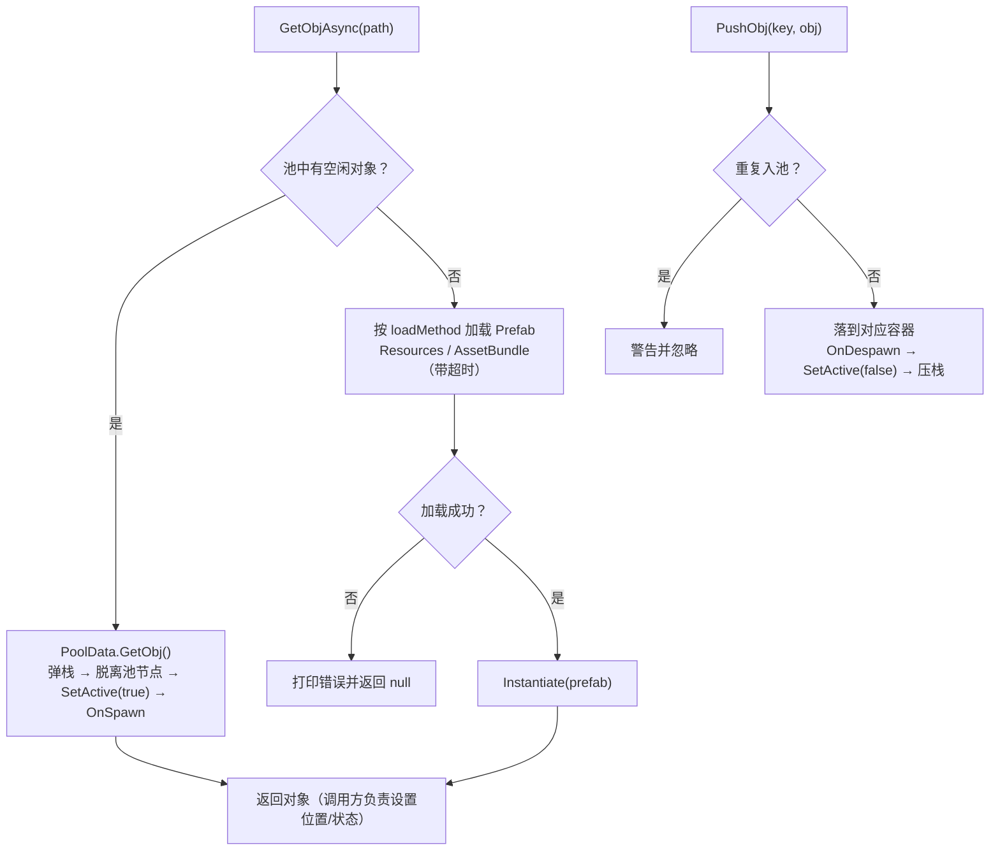

# ObjPool — GameObject 对象池

按**资源路径**分容器缓存 GameObject：池中有货时零加载零分配，池空时自动加载并实例化；对象复用前可通过 `IPoolable` 回调复位状态。

- 路径：`Assets/Scripts/upanda-framework/Runtime/Manager/ObjPool/`
- 依赖：仅 Unity 内置 API + 框架内的 `ResourcesLoader` / `IAssetsLoader`
- 编码：源码为 **GBK**（与框架其它源码一致），修改时请用 GBK 读写；本文件为 UTF-8
- 单例形态：`GameObjectPoolMgr : LazySingletonBase<GameObjectPoolMgr>`（**纯 C# 懒加载单例**，首次访问 `Instance` 时创建，不占用 GameObject）

---

## 1. 文件组成

| 文件 | 类型 | 职责 |
|---|---|---|
| `GameObjectPoolMgr.cs` | 单例 + `PoolData` | 池管理器（对外 API）与容器实现 `PoolData`（每个 key 一个容器，内部 LIFO 栈） |
| `IPoolable.cs` | 接口 | 出池 / 回池回调，用于复用对象时复位状态（挂在对象**根节点**即可） |
| `Example/TestPoolMgr.cs` | 示例 | OnGUI 按钮：取对象（两种异步形式）、回收、预热、池内数量统计 |
| `Example/PoolUseScene.unity`、`Resources/Obj1.prefab`、`Resources/Obj2.prefab` | 示例资源 | 配合示例场景使用 |

---

## 2. 核心概念

| 概念 | 说明 |
|---|---|
| **key** | 池的分组键，一般直接用资源路径。取对象与回收必须使用**同一个 key** |
| **容器 `PoolData`** | 每个 key 一个容器，内部是 `Stack<GameObject>`（**LIFO**：最近归还的最先被复用） |
| **池根节点 `Pool`** | 开启层级收纳时创建，作为所有收纳节点的父物体 |
| **收纳节点 `<key>_F`** | 每个容器一个，开启层级收纳时把空闲对象挂在其下，便于在 Hierarchy 中查看 |
| **在池对象** | 已回收、处于 `SetActive(false)` 且被池持有的对象 |
| **使用中对象** | 已出池的对象，由业务代码持有；池不再管理它（`Clear()` 也不会销毁它） |

---

## 3. 数据流



---

## 4. API 参考

### 4.1 取对象

```csharp
// 推荐：Task 形式
public Task<GameObject> GetObjAsync(string path, AssetLoadMethod loadMethod = AssetLoadMethod.Resources);

// 回调形式
public void GetObjAsync(string path, UnityAction<GameObject> callback,
                        AssetLoadMethod loadMethod = AssetLoadMethod.Resources);

// 同步（仅 Resources 模式；AssetBundle 会失败返回 null）
[Obsolete("使用AssetBundle时不支持该方法，请改用 GetObjAsync")]
public GameObject GetObj(string path, AssetLoadMethod loadMethod = AssetLoadMethod.Resources);
```

- 池中有空闲对象时**不会**加载资源，直接复用。
- 加载失败或超时统一返回 / 回调 `null`（**调用方必须判空**）。
- `path` 规则：Resources 路径不带后缀；AssetBundle 路径需要后缀。

### 4.2 回收与预热

```csharp
public void PushObj(string name, GameObject obj);                                  // name = 取对象时的同一个 key
public Task Prewarm(string path, int count, AssetLoadMethod loadMethod = ...);     // 预热：提前实例化若干对象入池
```

- 同一个对象**重复入池会被忽略并给出警告**（避免两次出池拿到同一个实例）。
- 对象被外部销毁过（`== null`）时入池会被拒绝并报错。

### 4.3 查询与清空

```csharp
public int TotalPooledCount { get; }        // 所有容器空闲对象总数
public int PooledCount(string path);        // 指定容器的空闲对象数量
public bool Contains(string path);          // 是否已存在该 key 的容器
public void Clear();                        // 销毁池内全部空闲对象、收纳节点与 Pool 根节点
public void Dispose();                      // 等价 Clear()，供 LazySingletonBase.Release() 调用
```

### 4.4 配置项

| 成员 | 默认值 | 说明 |
|---|---|---|
| `GameObjectPoolMgr.isOpenLayout`（static） | `true` | 是否在 Hierarchy 中按层级收纳（开发期便于查看；打包时可设 `false` 省一点开销）。运行期切换是安全的：出池时按"对象当前父节点是否为本容器节点"判断 |
| `maxCountPerKey` | `0` | 单个容器允许缓存的空闲对象上限，`0` = 不限；超出的对象会被直接销毁（**每次入池实时读取**） |
| `loadTimeout` | `15` | Resources 异步加载超时（秒），超时按失败处理 |

### 4.5 `IPoolable`（可选）

```csharp
public interface IPoolable
{
    void OnSpawn();      // 出池、激活之后
    void OnDespawn();    // 回池、失活之前（此时对象仍激活）
}
```

挂在对象**根节点**即可（池只查根节点，不递归子物体）。典型用途：清零刚体速度、停止粒子/动画、复位计时器。

---

## 5. 使用示例

### 5.1 基本取用与回收

```csharp
using UnityEngine;
using UPandaGF;

public class Foo : MonoBehaviour
{
    private const string CubePath = "Obj1";     // Resources 路径（不带后缀）

    private async void Spawn()
    {
        GameObject go = await GameObjectPoolMgr.Instance.GetObjAsync(CubePath);
        if (go == null) return;                 // 失败/超时返回 null，必须判空

        go.transform.position = Random.insideUnitSphere * 5f;
    }

    private void Recycle(GameObject go)
    {
        GameObjectPoolMgr.Instance.PushObj(CubePath, go);   // key 必须与取对象时一致
    }
}
```

### 5.2 用 `IPoolable` 复位状态（推荐）

```csharp
using UnityEngine;
using UPandaGF;

// 挂在预制体根节点上
public class CubePoolItem : MonoBehaviour, IPoolable
{
    private Rigidbody body;

    private void Awake() { body = GetComponent<Rigidbody>(); }

    public void OnSpawn()
    {
        // 出池后的初始化：复位状态、播放出现动画等
        transform.localScale = Vector3.one;
    }

    public void OnDespawn()
    {
        // 回池前的清理：停速度、停粒子、停协程等
        if (body != null)
        {
            body.velocity = Vector3.zero;
            body.angularVelocity = Vector3.zero;
        }
    }
}
```

### 5.3 预热与容量上限（避免加载尖峰 / 防止池膨胀）

```csharp
var pool = GameObjectPoolMgr.Instance;

pool.maxCountPerKey = 64;                       // 每个 key 最多缓存 64 个空闲对象
await pool.Prewarm("Obj1", 20);                 // 开场先造 20 个放进池里
```

### 5.4 场景切换时清空

```csharp
// 销毁池内所有空闲对象；已经在使用中的对象请由业务自己销毁
GameObjectPoolMgr.Instance.Clear();
```


## 6. 注意事项与已知限制

- **key 必须成对使用**：`PushObj(name, obj)` 的 `name` 必须是当初取对象时的 `path`，否则对象会进错容器（池不校验对象来源）。若想规避这类错误，可让业务层封装一个"取/还"配对的方法。
- **池不重置 Transform 与组件状态**：出池对象的父物体为 `null`（若原本挂在池节点下），位置/旋转/缩放保持回收前的值；速度、粒子、动画等状态需自行复位（推荐用 `IPoolable`）。
- **不判空的代价**：`GetObjAsync` 失败/超时返回 `null`，直接使用会 NRE。
- **`Clear()` 只销毁池内空闲对象**：正在使用中的对象仍归业务所有，需自行销毁；也不处理 `ResourcesLoader` 中已加载资源的卸载（如需卸载请配合 `ResourcesLoader.UnLoadAsset` / `ClearDic`）。
- **AssetBundle 模式必须用异步接口**：同步 `GetObj` 在该模式下直接失败返回 `null`。
- **无自动收缩**：空闲对象会一直留在池里直到 `Clear()` 或超过 `maxCountPerKey`；不同 key 越多占用越多，建议在主要玩法切换点调用 `Clear()`。
- **无并发去重**：同一路径同时发起多次 `GetObjAsync` 会各自加载并实例化（池不预占位）。
- 全部在主线程使用；`Task.Yield` 的续体回到 Unity 主线程，回调也在主线程触发。

---

## 7. 与框架的关系

- 池管理器**不在** `UPGameRoot` 初始化的子系统列表中，是纯 C# 懒加载单例 —— 不创建 GameObject，也不依赖场景。
- 资源加载统一走框架的 `ResourcesLoader`（Resources 模式）或 `IAssetsLoader`（AssetBundle 模式），因此**缓存与引用计数与框架保持一致**。
- 与 `Runtime/Manager/HTTPTool` 无直接关系；对象池只负责"实例复用"，不负责网络与数据。

---

## 8. 维护提示

- 本目录源码为 **GBK**，修改时请以 GBK 读写（否则中文注释会损坏）；本 README 为 UTF-8。
- 新增取对象能力时，**统一走 `LoadObjAsync` + `CreateInstance`**，这样可以自动获得"失败返回 null / 超时保护 / 不污染资源名"这些保障。
- 需要"对象复用前自动复位"时，优先给预制体根节点挂 `IPoolable` 实现，而不是在每处取用代码里重复写复位逻辑。
