# 一、先了解Unity Shader

我现在突然问你什么是**Shader**？你绝对脑袋宕机然后不清楚，所以我先简单描述一下：

模型放到场景中，经过一系列处理步骤，最终输出到屏幕上呈现为二维图像，这个过程就是**渲染流程**。

在整个渲染流程中，**Shader**就是一种专门的图形编程语言，它可以在一些渲染阶段修改表现效果，决定模型最终在屏幕上的视觉效果。

**Shader**其实有很多种，举例：**CG**（C for Graphics）、**HLSL** （High-Level Shading Language）

这两种就是Unity主要采用的渲染语言。其他的我就不举例子了。

CG是Unity早期主要的Shader语言，现在Unity主要用**HLSL**（语法和CG 95%相似），CG ≈ HLSL的"表兄弟"，学过其中一个就能看懂另一个。

更准确地说，内置（Built-in）渲染管线的 Shader 用 CGPROGRAM 代码块包裹（内部本质也会编译成 HLSL），URP/HDRP 渲染管线则用 HLSLPROGRAM 代码块包裹；

Unity Shader对Shader进行封装，提供了一种叫做ShaderLab的语言，可以更轻松的编写和管理着色器。（你会不会不清楚什么叫封装？封装也就是包装，在别人原有的东西基础上添加上自己的东西，有更多的功能，更方便，更适配）

说白了，ShaderLab其实就是Unity自定义的一种语法规则，是用于在Untiy中编写和管理着色器的专门的语言。

然后后面我主要和你讲的就是ShaderLab脚本的基本结构，基础语法，常用函数，这些清楚了以后，我会在文档里加上一些基本的案例，你照着代码敲，多写几次熟悉了就好，后面有想实现的效果你也可以尝试自己弄，没有思路就问AI，有时候AI写出来的会有语法错误，学完基础你就能自己处理。

我后面再提到Shader，指的就是ShaderLab。

代码一定要敲，看不懂也要照着敲。

多看看我送你那本书。我这个文档算是辅助学习。

每个章节第一遍你不一定就懂，肯定还是要反复学习，将来会在不断学习的过程中“顿悟”。


# 二、在Unity中创建一个Shader脚本

从创建项目开始，创建项目你选3D(Build-In Render Pipline) 就是标准渲染管线，

你选Universal 3D 就是URP渲染管线，URP也叫 “通用渲染管线”。（图中红色框的都是标准渲染管线；蓝色框的是URP，3D Sample Scene (URP)这个模板带一个示例场景）；

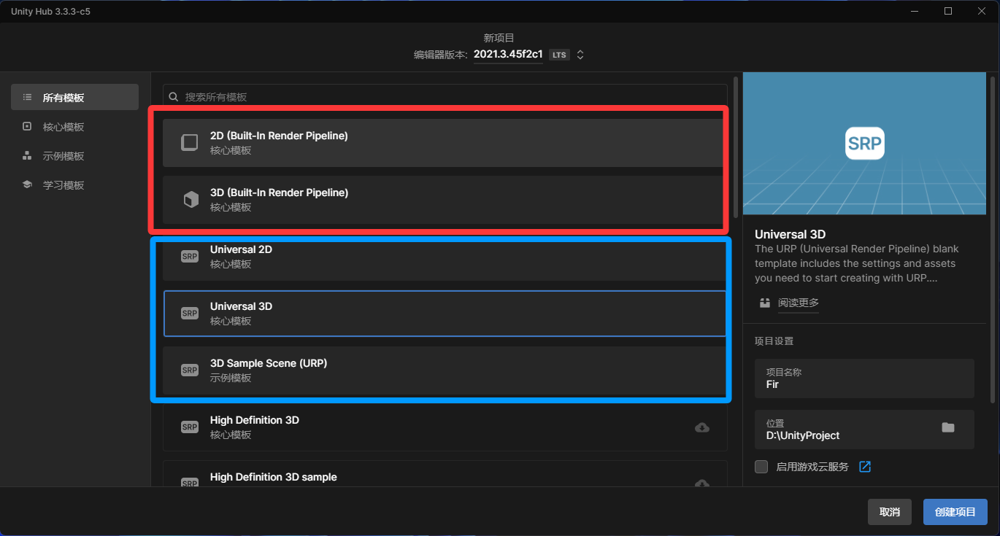

进入Unity中，你在资源目录这里右键->Create->Shader。然后你就可以看到有好多可以创建的：

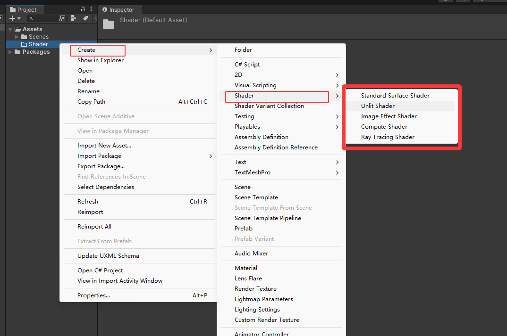


和你讲一下其这些选项都是啥：

- **Unlit Shader：** 顶点/片元着色器模板，不受光的着色器，物体自己发光，不参与场景光照计算，

- **Standard Surface Shader**：表面着色器模板，受光的着色器，会与场景灯光互动，产生明暗变化。

- **Image Effect Shader** : 后处理效果着色器

- **Compute Shader** ： 通用计算着色器 ,程序想用GPU算东西会用这个，就是纯计算用的

- **Ray Tracing Shader**：  光影计算着色器

我们写Shader主要就是选**Unlit Shader**和**Standard Surface Shader**，其他的你就了解一下就好，用不到。(Standard Surface Shader也基本不用其实)

**用Unlit Shader的情况**：

1. **UI元素**：按钮、图标、血条
2. **特效**：魔法、粒子、火焰
3. **全息投影**：科幻界面
4. **发光体**：灯泡、萤火虫
5. **性能关键**：低端手机、大量实例
6. **风格化渲染**：卡通、像素风

**用Standard Surface Shader的情况**：

1. **真实感材质**：金属、木材、塑料
2. **物理渲染**：PBR材质
3. **受光物体**：角色、建筑、道具
4. **需要反射**：镜子、水面、金属
5. **需要阴影**：接收/投射阴影的物体
6. **写实游戏**：3A、仿真游戏


Ok，现在你选择**Unlit Shader**创建了一个Shader，命名你可以自己取，但是不要用中文。双击进入，开始认识Shader。

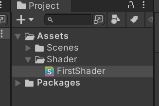

打开后你看到的代码是这样的：

```hlsl
Shader "Unlit/FirstShader"
{
    Properties
    {
        _MainTex ("Texture", 2D) = "white" {}
    }
    SubShader
    {
        Tags { "RenderType"="Opaque" }
        LOD 100

        Pass
        {
            CGPROGRAM
            #pragma vertex vert
            #pragma fragment frag
            // make fog work
            #pragma multi_compile_fog

            #include "UnityCG.cginc"

            struct appdata
            {
                float4 vertex : POSITION;
                float2 uv : TEXCOORD0;
            };

            struct v2f
            {
                float2 uv : TEXCOORD0;
                UNITY_FOG_COORDS(1)
                float4 vertex : SV_POSITION;
            };

            sampler2D _MainTex;
            float4 _MainTex_ST;

            v2f vert (appdata v)
            {
                v2f o;
                o.vertex = UnityObjectToClipPos(v.vertex);
                o.uv = TRANSFORM_TEX(v.uv, _MainTex);
                UNITY_TRANSFER_FOG(o,o.vertex);
                return o;
            }

            fixed4 frag (v2f i) : SV_Target
            {
                // sample the texture
                fixed4 col = tex2D(_MainTex, i.uv);
                // apply fog
                UNITY_APPLY_FOG(i.fogCoord, col);
                return col;
            }
            ENDCG
        }
    }
}
```

这就是Unlit Shader的模板代码啦。**一个单独的Shader没有任何作用，它必须和Unity的材质结合起来使用。**

每行代码我后面都会和你讲，但是首先，我要先和你讲写好的Shader怎么用。


# 三、创建一个材质使用这个Shader

上面Shader代码的第一行：

```hlsl
Shader "Unlit/FirstShader"
```

**FirstShader** 就是这个Shader的命名，你创建Shader的时候取得名字就会自动应用到这里。路径末尾这里的名字建议和你的Shader文件的名字保持一致（不一致时 Unity 会给出警告提示，但不影响运行）。

那么**FirstShader**前面的 *Unlit/* 是什么？这个你也可以随便取名，这个主要就是让你的材质可以根据这个路径来选择使用这个Shader。

你可以把这个路径改为：

```hlsl
Shader "LiDan/Study/FirstShader"
```


你先在Unity中创建好专门放材质的文件夹 Material，然后创建一个材质。

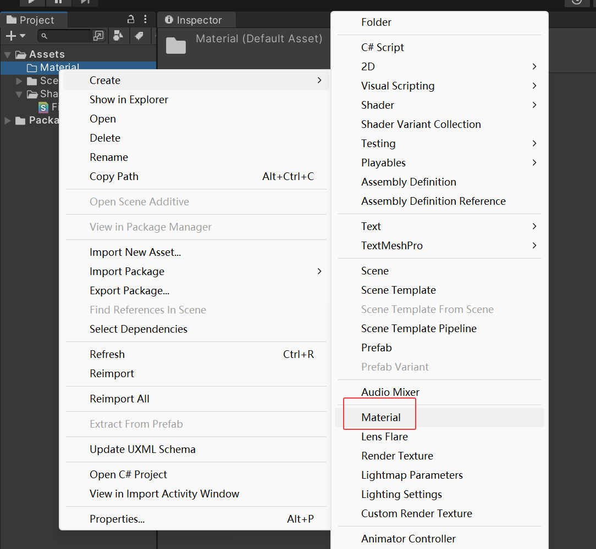


点击材质看“Inspector”面板，“Shader”后面有个下拉选项

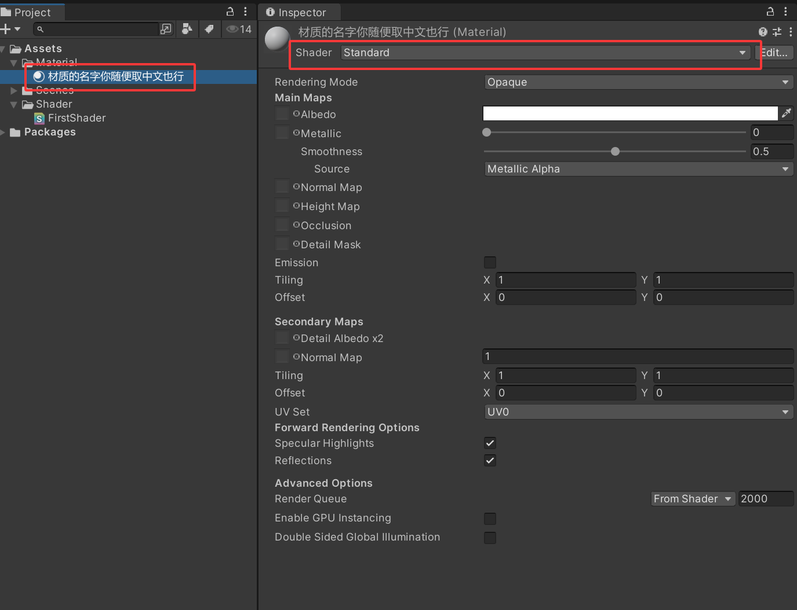

在这里你依次点击LiDan->Study->FirstShader，这个材质就成功的使用上你创建的Shader了。

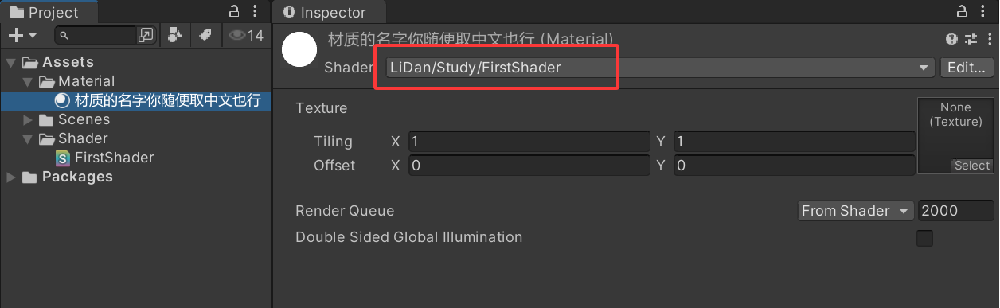

我之前教过你一个更简单的方法，你在Shader文件上右键->Create->Material。创建的材质直接就和这个Shader关联。


把这个材质给模型用上，你就可以在场景中观察这个Shader的渲染效果了。

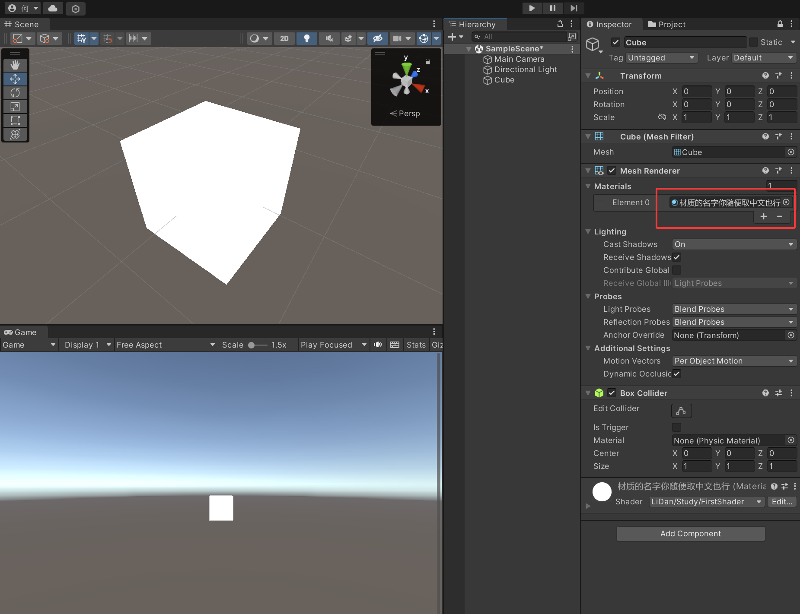


# 四、开始了解ShaderLab代码的结构

## 1.给代码加上注释

代码中写两个斜杆 就是单行注释，这一行在斜杠后面的内容就成为了注释。注释的内容不会对代码有影响。

多行注释就是用 /* 和  */  组合起来使用， 中间的所有行的内容都是注释

```hlsl
// 这样就是单行注释

/*
	这个就是多行注释
	中间的所有行的内容都是注释
*/

```

写注释也就是 在代码中添加说明，来告诉别人代码写的都是啥。

现在我把上面创建的Shader都加上注释说明：

```hlsl
// 定义Shader的显示路径和名称
// 在材质面板中显示为：LiDan/Study/FirstShader
Shader "LiDan/Study/FirstShader"
{
    // Properties块：定义在材质面板中可调节的属性
    Properties
    {
        // 定义一个2D纹理属性
        // "Texture"：在Inspector中显示的名称
        // 2D：属性类型，表示2D纹理
        // "white" {}：默认值，白色纹理
        _MainTex ("Texture", 2D) = "white" {}
    }
    
    // SubShader块：定义渲染子着色器
    // Unity会从上到下尝试使用SubShader，使用第一个与当前硬件兼容的
    SubShader
    {
        // Tags标签：设置渲染队列和类型
        // "RenderType"="Opaque"：渲染类型为不透明物体
        // 这会影响摄像机的渲染顺序和后期处理
        Tags { "RenderType"="Opaque" }
        
        // LOD：细节级别
        // 当设备的Shader LOD值小于100时，会使用这个SubShader
        // 用于根据设备性能选择不同的渲染质量
        LOD 100

        // Pass块：定义一次渲染通道
        // 一个SubShader可以包含多个Pass，每个Pass会渲染一次物体
        Pass
        {
            // CGPROGRAM：开始CG/HLSL代码块
            // Unity实际使用HLSL语言，但历史原因仍叫CGPROGRAM
            CGPROGRAM
            
            // 预编译指令：声明顶点着色器函数名
            // 告诉Unity顶点着色器函数是vert
            #pragma vertex vert
            
            // 预编译指令：声明片元着色器函数名
            // 告诉Unity片元着色器函数是frag
            #pragma fragment frag
            
            // 预编译指令：启用雾效
            // 生成雾效相关的Shader变体
            // 确保雾效在这个Shader中正常工作
            #pragma multi_compile_fog

            // 包含Unity内置的CG/HLSL文件
            // UnityCG.cginc包含了许多有用的函数和宏定义
            // 比如UnityObjectToClipPos、TRANSFORM_TEX等
            #include "UnityCG.cginc"

            // 定义输入到顶点着色器的数据结构
            // 名字appdata是约定俗成，表示application data
            struct appdata
            {
                // POSITION语义：顶点位置（模型空间）
                // float4：四维向量（x,y,z,w）
                // 这是从网格数据中获取的
                float4 vertex : POSITION;
                
                // TEXCOORD0语义：第一套纹理坐标
                // float2：二维向量（u,v）
                // uv坐标用于纹理采样
                float2 uv : TEXCOORD0;
            };

            // 定义顶点着色器输出到片元着色器的数据结构
            // 名字v2f是约定俗成，表示vertex to fragment
            struct v2f
            {
                // 传递纹理坐标到片元着色器
                float2 uv : TEXCOORD0;
                
                // Unity雾效坐标宏
                // 自动声明一个雾效插值器
                // 括号内的1表示使用TEXCOORD1寄存器
                UNITY_FOG_COORDS(1)
                
                // SV_POSITION语义：裁剪空间中的顶点位置
                // 必须有的输出，告诉GPU顶点在屏幕上的位置
                float4 vertex : SV_POSITION;
            };

            // 声明纹理采样器
            // sampler2D是HLSL的纹理采样器类型
            // 对应Properties中的_MainTex
            sampler2D _MainTex;
            
            // 纹理的缩放和偏移参数
            // 这是一个四维向量：xy是缩放，zw是偏移
            // 在材质面板中设置纹理的Tiling和Offset时会自动填充
            float4 _MainTex_ST;

            // 顶点着色器函数
            // 输入：appdata结构体
            // 输出：v2f结构体
            // 作用：处理每个顶点
            v2f vert (appdata v)
            {
                // 声明输出结构体
                v2f o;
                
                // 将顶点从模型空间转换到裁剪空间
                // UnityObjectToClipPos是Unity内置函数
                // 等同于：mul(UNITY_MATRIX_MVP, v.vertex)
                o.vertex = UnityObjectToClipPos(v.vertex);
                
                // 应用纹理的缩放和偏移到UV坐标
                // TRANSFORM_TEX是Unity内置宏
                // 等同于：v.uv.xy * _MainTex_ST.xy + _MainTex_ST.zw
                o.uv = TRANSFORM_TEX(v.uv, _MainTex);
                
                // 传递雾效数据
                // 将雾效参数计算后存储到输出结构体中
                UNITY_TRANSFER_FOG(o, o.vertex);
                
                // 返回处理后的数据
                return o;
            }

            // 片元着色器函数
            // 输入：v2f结构体
            // 输出：SV_Target语义，表示渲染目标（帧缓冲区）
            // 作用：处理每个像素（片元）的颜色
            fixed4 frag (v2f i) : SV_Target
            {
                // 采样纹理
                // tex2D是HLSL内置函数，用于2D纹理采样
                // 参数1：纹理采样器_MainTex
                // 参数2：纹理坐标i.uv
                // 返回值：纹理在该坐标的颜色值（RGBA）
                fixed4 col = tex2D(_MainTex, i.uv);
                
                // 应用雾效
                // 根据雾效设置和距离，混合颜色
                // 如果开启了雾效，col会被修改
                UNITY_APPLY_FOG(i.fogCoord, col);
                
                // 返回最终颜色
                // 这个颜色将被输出到屏幕
                return col;
            }
            
            // ENDCG：结束CG/HLSL代码块
            ENDCG
        }
    }
}
```


我知道你没有代码基础，所以就算代码加上注释你也啥的看不懂对吧？

那么下面我带你一行一行的把所有内容写出来，你自己也在你电脑里跟着我下面的步骤一点一点的写。写的过程中我会把语法教给你。

## 2.Shader代码的基本结构
这个就是Unity Shader的基础结构：
```hlsl
Shader "LiDan/Study/FirstShader"
{
    Properties
    {
       
    }
    
    SubShader
    {
        
        Pass
        {
            CGPROGRAM
            
            
            ENDCG
        }
    }
}
```

>**记住：** 
所有的“{}”都是成对出现的，就像左右括号配对。
Properties{} 和 SubShader{}必须写在“Shader”的大括号里面
Pass{}必须写在SubShader的大括号里面


为了让代码不报错，并且在Unity看到改动效果，你跟着我把代码改成这样：
```hlsl
Shader "LiDan/Study/FirstShader" {
    Properties { }

    SubShader {
        Tags { "RenderType" = "Opaque" }
        LOD 100

        Pass {
            CGPROGRAM
            #pragma vertex vert
            #pragma fragment frag
            #include "UnityCG.cginc"

            float4 vert(float4 v : POSITION) : SV_POSITION {
                float4 o = UnityObjectToClipPos(v);
                return o;
            }

            fixed4 frag() : SV_Target {
                fixed4 c = fixed4(1, 1, 1, 1);
                return c;
            }
            ENDCG
        }
    }
}
```
代码改成上面那样后，你可以看到Unity里还是模型还是完全白色的效果，然后他的属性面板是这样的：
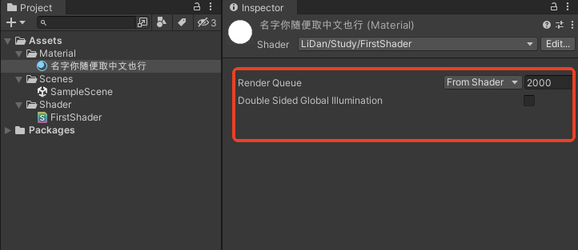


我开始介绍每个模块的语法规则。
### 2.1 Shader 名称（第一行）
Shader "LiDan/Study/FirstShader"
- Shader是关键字，告诉 Unity 这是一个 Shader 文件。
- "LiDan/Study/FirstShader"是路径和名称，在材质球的下拉菜单里会显示为 LiDan → Study → FirstShader
- 斜杠 /表示文件夹分层，方便管理。

### 2.2 Properties（属性块）
这里定义在材质面板里可以调节的参数，
```hlsl
Properties
{
    _Color ("MainColor", Color) = (1,1,1,1)
    _MainTex ("MainTex", 2D) = "white" {}
    _Glossiness ("Glossiness", Range(0,1)) = 0.5
}
```
你把这3行代码写完返回Untiy,看属性面板就变成这样了：
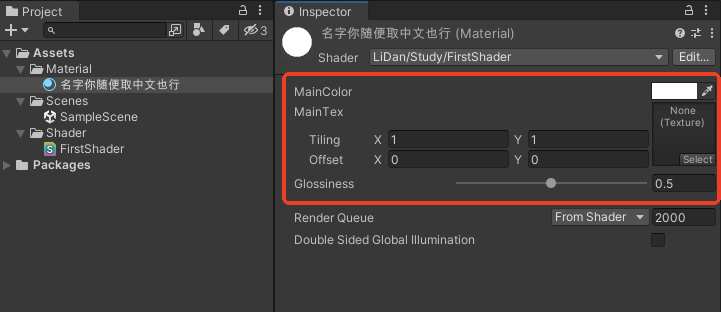

#### 语法
我用第一个属性为例子为你介绍一下语法：

```hlsl
_Color ("MainColor", Color) = (1,1,1,1)
```

这是一个颜色变量，可以在Inspector面板显示一个颜色选择的属性。

一个属性要写4个部分，下面是这4个部分的详细解释

| 代码部分 | 含义 |
|:-----|:-----|
|_Color|变量名；这个是在代码里用的名字,你可以自己取名，但是**必须**要用下划线开头。这个绝对！不能用中文！|
|“MainColor”| 这个名称只会显示在材质Inspector面板上，用于给使用者做说明，这个名字也可以随便取，而且一定要用双引号包裹，规范一点的一般是变量名把下划线去掉就可以，（我这里取名叫“MainColor”就不规范）。建议是不要用中文哦。后面我会讲原因。 |
|Color|变量类型，颜色类型就是Color，其他的常用变量类型在下面表格里|
|=(1,1,1,1)|这个是默认值，白色|


常用属性变量类型：
| 类型 | 说明 | 默认值示例 |
|:-----|:-----|:-----|
|Color|颜色（RGBA四个数）|(1,1,1,1)   //白色|
|2D|2D纹理图片|"white" {}   //白色纹理|
|Range(min,max)|滑动条数值|0.5|
|Float|小数|0.5|
|Vector|四维向量|(1,0,0,0)|

这些属性都写出来就是下面这样：

```hlsl
   Properties
    {
        _Color ("MainColor", Color) = (1,1,1,1)
        _MainTex ("MainTex", 2D) = "white" {}
        _Glossiness ("Glossiness", Range(0,1)) = 0.5
        _Decimal ("Decimal", Float) = 0.5
        _VectorValue ("VectorValue",Vector) = (1,0,0,0)
    }
```


#### 属性块可以用中文吗？

答案是可以， 就比如你可以把代码改成：

```hlsl
   Properties
    {
        _Color ("主颜色", Color) = (1,1,1,1)
        _MainTex ("主贴图", 2D) = "white" {}
        _Glossiness ("光泽度", Range(0,1)) = 0.5
        _Decimal ("浮点类型的属性", Float) = 0.5
        _VectorValue ("向量类型的属性",Vector) = (1,0,0,0)
    }
```

这样的话你的Inspector面板会显示成乱码：

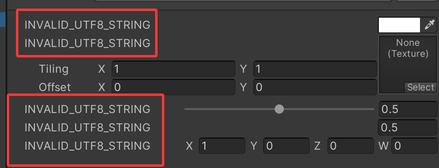

只需要将你的Shader代码文件保存为**UTF-8编码**，重新导入Unity即可正常显示。（不会操作就上班的时候过来问我）

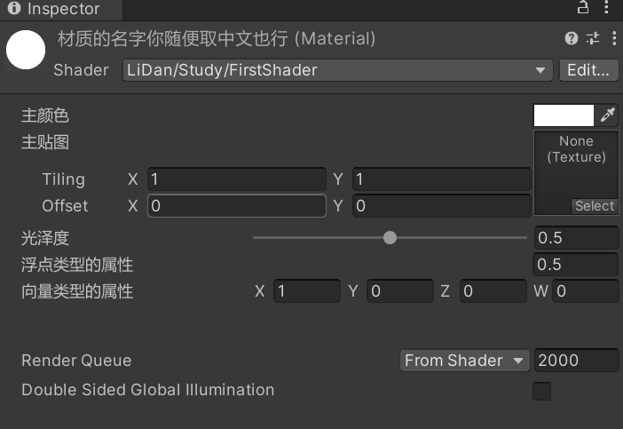

虽然支持中文，但项目中还是建议使用英文作为显示名称，保证跨平台/不同版本Unity的兼容性哦。


### 2.3 SubShader（子着色器）

每一个Shader中都会包含至少一个SubShader
当Unity想要渲染一个物体的时候
就会在Shader文件中去检测这些SubShader语句块
然后选择第一个能够在当前显卡运行的SubShader进行执行
因此在一个Shader当中实现一些高级效果时
为了避免在在某些设备上无法执行
可能会存在多个SubShader语句块，用于适配这些低端设备
SubShader当中包含最终的渲染相关代码，决定了最终的渲染效果。


```hlsl
SubShader
{
    Tags { "RenderType"="Opaque" }   // 标签：告诉引擎怎么处理
    LOD 100                          // 细节级别：越低越简单
    Pass { ... }                     // 渲染通道
}
```

#### Tags（标签）​ 
Tags标签 是给 Unity 看的提示。
通过标签来确定什么时候以及如何对物体进行渲染，用于控制整个SubShader的渲染行为。

 渲染标签的语法结构:
 ``` C
Tags{ "标签名1" = "标签值1" "标签名2" = "标签值2" "标签名3" = "标签值3" .......}
 ```
渲染标签其实都是以键值对的形式出现的配置，键和值都是字符串类型，需要用双引号包裹
并且没有数量限制，可以使用任意多个标签

**常用标签：**
```hlsl
Tags{"RenderType"="Opaque" "Queue"="Geometry"}
```
你可以把标签都写成一行，每个标签用空格分开，也可以写成多行，像下面这样：
```hlsl
Tags
{
 "RenderType"="Opaque" //不透明物体
 "Queue"="Geometry"//渲染顺序（一般默认Geometry）
}
```

有的标签必须放在SubShader块内。有的必须放在Pass(渲染通道)内。你先做个了解，后面具体效果使用到一些标签，你再逐一记住也行，或者你也可以直接问AI:"Unity Shader Tags汇总"。

#### LOD
LOD 代表细节级别。是一种性能优化机制，用来标记SubShader的“质量等级”。
你可以为同一个Shader编写多个的SubShader，引擎会根据当前设定的LOD值，自动选择最合适的那一个来渲染。
如果设备性能不够，会跳过 LOD 太高的 SubShader。LOD 值越小表示越简单，100 只是模板的默认值（并非最小值）。

#### Pass（渲染通道）
一个 SubShader 可以包含多个 Pass。
在SubShader中每定义一个渲染通道Pass，就会让物体执行一次渲染
n个Pass，就会有n次渲染，在实现一些复杂渲染效果时需要使用多个Pass进行组合实现
所以要尽量减少它的数量，更多的Pass会增加性能消耗，大多数情况下一个 Pass 就够了。

```hlsl
Pass
{
    // 这里放 CG 代码
    CGPROGRAM
    ...
    ENDCG
}
```
Pass 也可以有 Tags，比如 Tags { "LightMode"="ForwardBase" }表示这是前向渲染的主光照通道。(听不懂也没关系，先做个了解)

### 总结
1. 一个Shader文件包含Properties（属性块）、SubShader（子着色器）
2. 在SubShader里包含Pass（渲染通道）
3. Tags标签，有的要写在SubShader里，有的要写在Pass里。
4. 渲染代码写在Pass里


# 五、GPU 渲染管线（先了解，不用死记）

你现在已经把 Shader 的基本结构搞清楚了，但你有没有想过一个问题：你写的 `vert` 和 `frag` 这两个函数，到底是谁在调用？什么时候调用？调用了多少次？

要回答这个问题，就得先了解一下**渲染管线**。说白了，渲染管线就是"GPU 把模型变成屏幕上的像素"的一整套流水线工序，就像工厂的流水线一样，一道工序接着一道工序。

>**记住：** 流水线上一道工序的输出，就是下一道工序的输入。

整条流水线最核心的几道工序是：

| 工序 | 干什么的 | 对应你写的代码 |
|:-----|:-----|:-----|
| 顶点着色器（vertex shader） | 处理模型的每一个**顶点**，算出它在屏幕上的位置 | `vert` 函数 |
| 光栅化（rasterization） | 把顶点围成的三角形，拆成一个个**像素**（片元） | GPU 自动完成，不用你写 |
| 片元着色器（fragment shader） | 处理每一个**像素**，算出它最终的颜色 | `frag` 函数 |
| 输出合并 | 把颜色写到屏幕上，同时做深度测试、混合等 | 基本是 GPU 自动完成 |

你可能会有个疑问：一个模型顶多几万个顶点，但屏幕上可能上百万个像素，那 `frag` 函数岂不是要跑几百万次？

对，就是这样。所以 Shader 的写法非常讲究性能，`frag` 里多写一行耗时的计算，都会被放大几百万倍。这个观念你现在先有个印象，后面讲性能优化的时候我们再细说。

除了这两个最常见的，还有几个你可能听过的：

- **几何着色器（geometry shader）**：在顶点和片元之间，可以对图元（点、线、三角形）做增删，比如把一个三角形变成三个。Unity 很少用，了解一下就行。
- **计算着色器（compute shader）**：前面创建 Shader 菜单里那个 `Compute Shader`，它完全脱离渲染流程，就是拿 GPU 当"超多核 CPU"来做通用计算，比如模拟、物理、后处理。这个我后面再讲。

# 六、CG/HLSL 里的数据类型和语义

## 6.1 基本数据类型

前面写代码的时候，你已经见过了 `float4`、`float2`、`fixed4`、`sampler2D`，这些就是 Shader 里的数据类型。我把常用的都给你列出来：

| 类型 | 含义 | 例子 |
|:-----|:-----|:-----|
| `float` | 32 位高精度浮点数 | `float x = 1.5;` |
| `half` | 16 位中精度浮点数 | `half y = 0.5;` |
| `fixed` | 11 位低精度浮点数，范围约 [-2, 2] | `fixed c = 1;` |
| `float2/float3/float4` | 二维/三维/四维向量 | `float3 normal;` |
| `fixed4` | 低精度四维向量，颜色常用它 | `fixed4 col;` |
| `float2x2/3x3/4x4` | 矩阵（GLSL 里叫 `mat2/mat3/mat4`） | `float4x4 mvp;` |
| `sampler2D` | 2D 纹理采样器 | `sampler2D _MainTex;` |
| `bool` | 布尔 | `bool isOn = true;` |

>**记住：** 这三个精度等级（float > half > fixed），是 Shader 和普通 C# 最大的区别。精度越低越省性能，所以**颜色、0~1 之间的系数，能用 fixed 就用 fixed；位置、法线这种需要精度的，才用 float**。移动端对精度尤其敏感。

如果你以后接触 GLSL（OpenGL 那套），会发现它写的是 `vec2/vec3/vec4`、`mat3/mat4`，对应 HLSL 的 `float2/float3/float4`、`float3x3/float4x4`。写法不一样，意思是一样的，就像"土豆"和"马铃薯"。

## 6.2 向量怎么取值

向量里的分量，你可以像这样取：

```hlsl
float4 color = float4(1, 0.5, 0.2, 1);
float r = color.x;   // 取第一个分量，结果是 1
float g = color.y;   // 0.5
float b = color.z;   // 0.2
float a = color.w;   // 1
```

HLSL 还支持"打乱重排"（swizzle），非常常用：

```hlsl
float4 color = float4(1, 0.5, 0.2, 1);
float3 rgb = color.rgb;        // 取前三个
float2 only_xy = color.xy;     // 取前两个
float4 swizzled = color.bgra;  // 把 b 和 r 对调
```

这个 `rgb`、`bgra` 的写法，颜色向量特别常用，后面你会经常见到。

## 6.3 语义（semantics）

你在模板代码里一定见过这些冒号后面的东西：

```hlsl
float4 vertex : POSITION;   // POSITION 就是语义
float2 uv : TEXCOORD0;      // TEXCOORD0 就是语义
float4 vertex : SV_POSITION;// SV_POSITION 就是语义
```

**语义**说白了就是"告诉 GPU 这个数据是从哪来的、或者要送到哪去"。它就像快递单上的地址，GPU 靠这个地址把数据对号入座。

常用的语义给你列个表：

| 语义 | 含义 | 常用在 |
|:-----|:-----|:-----|
| `POSITION` | 顶点位置（模型空间） | 顶点着色器输入 |
| `NORMAL` | 顶点法线 | 顶点着色器输入 |
| `TEXCOORD0~7` | UV 纹理坐标（有多套） | 输入或传递数据 |
| `COLOR` | 顶点颜色 | 顶点着色器输入 |
| `SV_POSITION` | 裁剪空间位置（必须输出） | 顶点着色器输出 |
| `SV_Target` | 渲染目标（最终颜色） | 片元着色器输出 |

>**记住：** 顶点着色器**必须**输出一个带 `SV_POSITION` 语义的变量（告诉 GPU 顶点画在哪），片元着色器**必须**输出一个带 `SV_Target` 语义的颜色。`SV_` 开头的是系统语义，别乱改名。

# 七、坐标空间变换

你还记得模板里这句注释吗——"将顶点从模型空间转换到裁剪空间"。那这个"空间"到底是啥意思？

模型上的一个顶点，它的位置到底是多少，**取决于你站在哪个坐标系里看它**。就好比"我的工位在李丹左边"，和"我的工位在武汉"，描述的是同一个位置，但参考系不一样。

渲染过程中，一个顶点要经历好几个坐标系，按顺序是：

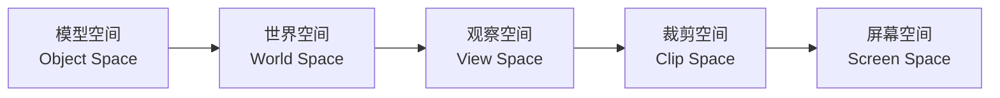

| 空间 | 通俗理解 | 谁负责转换 |
|:-----|:-----|:-----|
| 模型空间 | 以模型自己的原点为参考，建模软件里画出来的原始坐标 | 美术建模时定死的 |
| 世界空间 | 把模型摆到场景里后的坐标，参考原点是整个场景 | `unity_ObjectToWorld` 矩阵 |
| 观察空间 | 以摄像机为原点、摄像机看向前方为 Z 轴 | `UNITY_MATRIX_V` 矩阵 |
| 裁剪空间 | 摄像机视野范围内归一化的坐标 | `UNITY_MATRIX_P` 投影矩阵 |
| 屏幕空间 | 最终映射到屏幕像素的坐标 | GPU 自动完成 |

Unity 帮我们把这些矩阵都准备好了，常用的几个：

```hlsl
// 一步到位：模型空间 -> 裁剪空间（最常用！）
float4 clipPos = UnityObjectToClipPos(v.vertex);

// 模型空间 -> 世界空间
float4 worldPos = mul(unity_ObjectToWorld, v.vertex);

// 法线从模型空间转到世界空间（法线要用专门函数，不能直接乘上面的矩阵）
float3 worldNormal = UnityObjectToWorldNormal(v.normal);
```

>**记住：** 90% 的情况下，你只需要 `UnityObjectToClipPos`（顶点位置）和 `UnityObjectToWorldNormal`（法线）这两个函数就够了。剩下那几个矩阵，知道"存在、是这么个流程"就行，用到再查。

# 八、顶点着色器和片元着色器

前面是远远地看，现在咱们把 `vert` 和 `frag` 拉近了，仔仔细细看一遍。

## 8.1 顶点着色器（vertex shader）

顶点着色器**对每个顶点执行一次**，它的任务就是：把顶点从模型空间送到裁剪空间，顺便把后面要用的数据（法线、UV 等）打包传给片元着色器。

```hlsl
v2f vert (appdata v)
{
    v2f o;                                   // 声明一个输出结构体
    o.pos = UnityObjectToClipPos(v.vertex);  // 顶点：模型空间 -> 裁剪空间
    o.uv = TRANSFORM_TEX(v.uv, _MainTex);    // UV 应用平铺缩放
    o.worldNormal = UnityObjectToWorldNormal(v.normal); // 法线转世界空间
    return o;                                // 把打包好的数据传出去
}
```

注意看输入输出：输入是 `appdata`（模型数据），输出是 `v2f`（你自定义的传递结构体）。这个 `v2f` 就是顶点着色器和片元着色器之间的"快递箱"。

## 8.2 片元着色器（fragment shader）

片元着色器**对每个像素执行一次**，拿到顶点着色器传来的数据，算出这个像素最终显示成什么颜色。

```hlsl
fixed4 frag (v2f i) : SV_Target
{
    fixed4 col = tex2D(_MainTex, i.uv);  // 用 UV 采样纹理得到颜色
    return col;                          // 返回最终颜色
}
```

## 8.3 插值：GPU 免费帮你做的活

这里有个很关键的点：顶点只有几千个，像素有几百万个，那顶点之间的那些像素，数据从哪来？

答案就是**插值**。GPU 会自动把三角形三个顶点的数据（比如 UV、颜色）按距离加权平均，填给中间的每个像素。这就是为什么你在顶点着色器里只处理了几个顶点，片元着色器却能拿到连续的 UV 坐标。

```hlsl
// 顶点着色器输出
o.color = v.color;   // 每个顶点一个颜色

// 片元着色器接收
fixed4 col = i.color; // 这里 i.color 是三个顶点颜色插值出来的中间色
```

>**记住：** 顶点着色器算出来的东西会被插值，所以"按像素计算"的效果更精细，但更费性能。这个点我们到"逐顶点 vs 逐像素"那一节再展开。

# 九、光照模型

前面你用的都是 Unlit 模板——自己发光，不管灯光。但真实世界里，一个物体看起来是什么颜色，取决于**光**。这一节就讲讲 Shader 里怎么算光照。

>**记住：** 下面这些光照代码都要配合 `#include "Lighting.cginc"` 使用，因为平行光方向 `_WorldSpaceLightPos0`、灯光颜色 `_LightColor0` 都是这个文件里定义好的。

## 9.1 漫反射：Lambert 光照模型

漫反射是最基础、最常用的一种光照。它的核心思想就一句话：**表面和光线的夹角越大，接受到的光越少，看起来越暗**。

怎么算夹角？用**点乘**。两个向量点乘的结果，等于它们夹角的余弦值。所以：

```hlsl
// 法线和光线方向点乘，得到 [0,1] 的受光强度
float diffuse = saturate(dot(worldNormal, lightDir));
// saturate 就是把结果夹在 0 到 1 之间，负的直接变 0
```

完整代码给你（跟着敲一遍）：

```hlsl
Shader "LiDan/Study/Diffuse"
{
    Properties
    {
        _MainColor ("MainColor", Color) = (1,1,1,1)
    }
    SubShader
    {
        Tags { "RenderType"="Opaque" "Queue"="Geometry" }
        Pass
        {
            Tags { "LightMode"="ForwardBase" }  // 前向渲染的主光照通道
            CGPROGRAM
            #pragma vertex vert
            #pragma fragment frag
            #include "UnityCG.cginc"
            #include "Lighting.cginc"

            fixed4 _MainColor;

            struct appdata
            {
                float4 vertex : POSITION;
                float3 normal : NORMAL;
            };

            struct v2f
            {
                float4 pos : SV_POSITION;
                float3 worldNormal : TEXCOORD0;  // 把世界空间法线传给片元
            };

            v2f vert (appdata v)
            {
                v2f o;
                o.pos = UnityObjectToClipPos(v.vertex);
                o.worldNormal = UnityObjectToWorldNormal(v.normal);
                return o;
            }

            fixed4 frag (v2f i) : SV_Target
            {
                float3 worldLight = normalize(_WorldSpaceLightPos0.xyz); // 平行光方向
                float diffuse = saturate(dot(i.worldNormal, worldLight)); // 受光强度
                fixed4 col = _MainColor * diffuse * _LightColor0;         // 颜色 × 强度 × 光色
                return col;
            }
            ENDCG
        }
    }
}
```

把材质给模型用上，你会看到：正对光源的面是亮的，侧过去的面逐渐变暗，背光面全黑。

## 9.2 半兰伯特：让背光面不那么黑

Lambert 有个小毛病：背光面因为点乘结果是负数，被 `saturate` 压成 0，导致背光面**死黑一片**，细节全丢了。

半兰伯特（Half-Lambert）就是把它稍微"抬"一下：

```hlsl
// 原来：diffuse = saturate(dot(n, l));     范围是 [0, 1]
// 半兰伯特：范围变成 [0.5, 1]，背光面最黑也就 0.5
float diffuse = dot(n, l) * 0.5 + 0.5;
```

效果就是背光面不再是死黑，而是灰灰的，看起来更柔和。卡通、风格化渲染里很常用。

## 9.3 镜面高光：Phong 和 Blinn-Phong

只有漫反射的话，物体看起来是哑光的、粗糙的。真实物体上往往还有一块**亮斑**，那是镜面高光。

- **Phong**：拿反射方向和视线方向做点乘。
- **Blinn-Phong**：拿半程向量和法线做点乘。半程向量就是"光线方向和视线方向的中间方向"。

Blinn-Phong 比 Phong 算得快，效果也差不多，所以更常用：

```hlsl
float3 viewDir = normalize(_WorldSpaceCameraPos.xyz - worldPos);  // 视线方向
float3 halfDir = normalize(worldLight + viewDir);                  // 半程向量
float spec = pow(max(0, dot(worldNormal, halfDir)), _Gloss);       // 高光强度
```

`_Gloss`（光泽度）越大，高光越集中越亮，物体看起来越"亮面"。

## 9.4 环境光

现实里就算物体在阴影里，也不是完全黑的，因为有四面八方散射来的光，这就是**环境光**。

Unity 内置管线里，环境光可以直接用宏拿：

```hlsl
fixed3 ambient = UNITY_LIGHTMODEL_AMBIENT.rgb;  // 取场景的环境光
fixed3 finalColor = col.rgb * ambient;          // 乘上环境光
```

## 9.5 PBR 基础（先了解概念）

前面这些 Lambert、Phong 都是**经验模型**——是前人"看着像"总结出来的公式。而 PBR（Physically Based Rendering，基于物理的渲染）不一样，它严格遵循物理规律，核心有两个保证：

1. **能量守恒**：物体反射的光，永远不会比接受到的光多。
2. **基于物理的参数**：用 `Metallic`（金属度）和 `Smoothness`（光滑度）这种真实属性来描述材质，而不是乱调颜色。

Unity 内置管线的 **Standard Shader** 就是 PBR，URP 的 **Lit** 也是 PBR。

我估计PBR你会特别熟悉，你毕竟是美术嘛。

>**记住：** 你现阶段先把 Lambert、Blinn-Phong 搞懂、能默写，PBR 知道"它是什么、参数是金属度和光滑度"就足够了。自己从头写 PBR 是很后面的事了，真到那时候你也不会手写，都是调现成的。

# 十、纹理采样与映射

## 10.1 UV 坐标

纹理是一张二维图片，怎么把图片贴到模型上？靠的就是 **UV 坐标**。

UV 是二维坐标，范围是 0 到 1：

- `(0,0)` 是图片左下角
- `(1,1)` 是图片右上角

模型上每个顶点都存了一套 UV，告诉 GPU"我这个顶点应该显示图片的哪个位置"。这活一般是美术在建模软件里展好的。（这个你熟悉我不多说。）

## 10.2 Wrap Mode 和 Filter Mode

在材质面板点开纹理，你会看到两个关键设置：

**Wrap Mode（平铺方式）**：UV 超出 0~1 时怎么办？

| 模式 | 行为 |
|:-----|:-----|
| Repeat | 重复平铺（默认） |
| Clamp | 边缘颜色拉伸填满 |

**Filter Mode（过滤方式）**：纹理放大缩小的时候怎么采样？

| 模式 | 行为 | 代价 |
|:-----|:-----|:-----|
| Point | 取最近的一个像素，放大后全是马赛克 | 最省 |
| Bilinear | 取周围 4 个像素混合 | 中等 |
| Trilinear | Bilinear + Mipmap 之间也混合 | 最贵 |

## 10.3 法线贴图（normal map）

法线贴图是游戏里最常用的"假细节"技巧。它把物体表面的凹凸方向，存成一张**偏蓝紫色的图**（RGB 三个通道分别存了法线的 xyz）。

用法：

```hlsl
// Properties 里声明
_BumpMap ("NormalMap", 2D) = "bump" {}

// 采样法线贴图，得到切线空间法线
fixed3 normal = UnpackNormal(tex2D(_BumpMap, i.uv));
```

>**记住：** 法线贴图不改变模型的实际形状（所以从侧面看还是平的），只是骗过了光照计算，让表面"看起来"有凹凸。一张法线贴图能让几万面的模型，看起来像几百万面的模型。

## 10.4 高度贴图（height map）

高度贴图用一张灰度图记录表面的高度信息，越白越高、越黑越低。它通常配合**视差贴图（parallax mapping）**使用——根据视线角度偏移 UV 采样位置，产生更真实的深度错觉。这个在高级篇细讲。

## 10.5 立方体贴图（cubemap）

普通贴图是一张二维图，立方体贴图是**六张图拼成一个立方体**，用来表示"四面八方"的环境。最典型的用途：

1. **天空盒**：场景的背景天空。
2. **环境反射**：让金属、水面反射出周围环境。

```hlsl
// Properties 里声明
_Cubemap ("Cubemap", Cube) = "" {}

// 采样：texCUBE，参数是反射方向
fixed4 reflection = texCUBE(_Cubemap, reflectDir);
```

# 十一、透明度与混合

前面讲的都是不透明物体，但玻璃、火焰、特效这些是**半透明**的。半透明要处理两件事：怎么丢弃像素、怎么混合颜色。

## 11.1 Alpha Test（透明度测试）

Alpha Test 最"暴力"：要么完全显示，要么完全丢弃，没有中间值。适合叶子、栅栏这种"要么有要么没有"的镂空效果。

```hlsl
fixed4 frag (v2f i) : SV_Target
{
    fixed4 col = tex2D(_MainTex, i.uv);
    clip(col.a - _Cutoff);  // 透明度小于 _Cutoff 的像素直接丢弃
    return col;
}
```

`clip(x)` 的意思是：如果 `x < 0`，就把这个像素丢掉。

## 11.2 Alpha Blend（透明度混合）

Alpha Blend 是真正的"半透明"：把当前像素颜色和屏幕后面已经画好的颜色，按比例混合。

```hlsl
SubShader
{
    Tags { "RenderType"="Transparent" "Queue"="Transparent" }  // 放进透明队列
    Blend SrcAlpha OneMinusSrcAlpha  // 混合因子
    ZWrite Off                       // 透明物体不写深度
    Pass { ... }
}
```

`Blend SrcAlpha OneMinusSrcAlpha` 是最常用的混合公式，意思是：

```
最终颜色 = 当前像素颜色 × 自身Alpha + 背景颜色 × (1 - 自身Alpha)
```

## 11.3 渲染队列（Queue）

Unity 里物体是按**渲染队列**从早到晚画的，常用的几个队列：

| 队列 | 值 | 用途 |
|:-----|:-----|:-----|
| Background | 1000 | 背景（天空盒） |
| Geometry | 2000 | 不透明物体（默认） |
| AlphaTest | 2450 | 做了 Alpha Test 的物体 |
| Transparent | 3000 | 半透明物体（从后往前画） |
| Overlay | 4000 | 最后画（UI、镜头光晕） |

>**记住：** 透明物体**必须**放进 `Transparent` 队列并 `ZWrite Off`，否则渲染顺序会乱、出现"该透的地方不透"的诡异效果。这也是新手做透明材质最容易翻车的地方。

# 十二、深度测试与模板测试

## 12.1 深度测试（Depth Test）

屏幕上每个像素除了颜色，还存了一个**深度值**（离摄像机多远）。深度测试就是：画一个像素之前，先比一比深度，决定它该不该被画上去。

两个关键开关：

```hlsl
Pass
{
    ZWrite Off        // 要不要把这个像素的深度写进深度缓冲
    ZTest LEqual      // 怎么比较：LEqual 是"新像素更近或相等就画"
}
```

`ZTest` 常用的几个值：

| 值 | 含义 |
|:-----|:-----|
| LEqual | 新像素深度 <= 旧像素，就画（默认） |
| Less | 新像素更近才画 |
| Always | 永远画，无视深度 |
| Greater | 新像素更远才画 |

`ZTest Always` 有个经典用途——**透视墙（X-Ray）**：被墙挡住的物体，因为无视深度，会"穿"过墙显示出来。

## 12.2 模板测试（Stencil Test）

模板缓冲就像"给屏幕上某些像素贴标签"。你可以先在一个 Pass 里给某些像素打个标记，然后在另一个 Pass 里只对"有标记"或"没标记"的像素做处理。

最经典的两个应用：

1. **模型描边**：先用一个 Pass 把模型放大一圈并整体涂成黑色，再画正常模型，黑色部分就露出来当描边。
2. **镜子/遮罩**：只在模板标记的区域里渲染。

```hlsl
Stencil
{
    Ref 1              // 参考值，相当于"标签编号"
    Comp Always        // 比较方式：总是通过
    Pass Replace       // 通过后：把模板值写成 Ref
}
```

>**记住：** 深度和模板这两个缓冲，是理解"渲染顺序""遮挡""描边"这些高级效果的钥匙。你现在先知道"有这两个东西、各有什么开关"就行，具体效果用到时对着例子写。

# 十三、逐顶点 vs 逐像素

这个知识点特别重要，因为它直接决定你的光照效果"糊不糊"。

- **逐顶点光照（Gouraud 着色）**：在**顶点着色器**里算光照，片元着色器直接用插值结果。
- **逐像素光照（Phong 着色）**：在**片元着色器**里算光照，每个像素独立计算。

两者差别有多大？看一个例子你就懂：

```hlsl
// 逐顶点：光照在 vert 里算（省性能，但低模上高光是一块一块的）
v2f vert (appdata v)
{
    v2f o;
    o.pos = UnityObjectToClipPos(v.vertex);
    float3 worldNormal = UnityObjectToWorldNormal(v.normal);
    float3 worldLight = normalize(_WorldSpaceLightPos0.xyz);
    o.diffuse = saturate(dot(worldNormal, worldLight));  // 在这里算！
    return o;
}

// 逐像素：光照在 frag 里算（效果精细，但每个像素都要算一遍）
fixed4 frag (v2f i) : SV_Target
{
    float3 worldLight = normalize(_WorldSpaceLightPos0.xyz);
    float diffuse = saturate(dot(i.worldNormal, worldLight));  // 在这里算！
    return _MainColor * diffuse * _LightColor0;
}
```

>**记住：** 顶点数量远少于像素数量，所以**逐顶点省性能、逐像素效果好**。现代游戏基本都是逐像素（Phong 着色），逐顶点只用在性能极其紧张的场合，比如几十年前的 PS2 时代。

# 十四、高级效果

我说一下一些常见的高级效果是怎么来的。每个先给你思路和最小代码，你真要深入再单独研究。

## 14.1 边缘光 / 轮廓光（Rim Light / Fresnel）

观察一个玻璃球，你会发现它**边缘**比中间亮——这就是菲涅尔效应（Fresnel）。做法是拿视线方向和法线做点乘，越"侧对"视线，值越大：

```hlsl
float rim = 1.0 - saturate(dot(viewDir, worldNormal));  // 正面 0，边缘 1
fixed3 rimColor = _RimColor * pow(rim, _RimPower);      // pow 控制边缘光宽度
fixed3 finalColor = col.rgb + rimColor;                 // 叠加到最终颜色
```

轮廓光常用来做**科幻全息投影、角色受击闪烁、卡通描边**，很实用。

## 14.2 卡通渲染（Toon Shading）

卡通渲染的核心思想是**把连续的明暗，变成有限的几档**（色阶分离）。用 `step` 或 `smoothstep` 就能实现：

```hlsl
float diffuse = saturate(dot(worldNormal, worldLight));
diffuse = smoothstep(0.3, 0.32, diffuse);  // 把平滑过渡变成"一刀切"的明暗
// 想分更多档，就多套几个 step 加不同颜色
```

再加上一层黑色描边（用 12.2 讲的 Stencil 放大描边法），就是常见的卡通效果了。

## 14.3 后处理特效

后处理不是贴在某个模型上，而是渲染完整个画面后，对**整张屏幕图**再加工，比如泛光、色调映射、景深。

Unity 内置管线的后处理，核心是 `OnRenderImage` 这个函数 + `Graphics.Blit`：

```csharp
// 挂在摄像机上的 C# 脚本
void OnRenderImage(RenderTexture src, RenderTexture dst)
{
    Graphics.Blit(src, dst, myPostMaterial);  // 用我们的 Shader 处理整屏画面
}
```

配套的 Shader 里，片元着色器拿到的就是整张屏幕图，想怎么调色都行。这些后处理 Shader 里有个常用的黑科技 **GrabPass**，能把当前画面抓下来当纹理用，做扭曲、折射效果。

## 14.4 Compute Shader 入门

还记得创建菜单里的 Compute Shader 吗？它彻底脱离渲染管线，纯粹把 GPU 当计算器用。打开模板你会看到：

```hlsl
#pragma kernel CSMain          // 声明一个内核入口

RWTexture2D<float4> Result;    // 可读写的纹理（输出）

[numthreads(8,8,1)]            // 一个线程组里有 8×8×1 个线程
void CSMain (uint3 id : SV_DispatchThreadID)  // id 是当前线程的全局编号
{
    Result[id.xy] = float4(1,0,0,1);  // 每个线程往自己的位置写一个颜色
}
```

`[numthreads]` 决定一个线程组的大小，`SV_DispatchThreadID` 告诉你"我是第几个线程"。几万个线程同时跑，这就是 GPU 计算的基本形态。C# 端用 `ComputeShader.Dispatch` 来触发。

>**记住：** Compute Shader 入门先看懂这三样就够了：`#pragma kernel`、`[numthreads]`、`SV_DispatchThreadID`。它和渲染 Shader 是两套完全不同的东西，别混着学。

# 十五、性能优化技巧

Shader 是跑在 GPU 上的，写法直接决定帧率。几个最实用的优化习惯：

## 15.1 减少分支（if/else）

GPU 不喜欢 `if/else`，因为它会让一堆线程"排队等慢的那个"。能不用就不用，用数学函数替代：

```hlsl
// 不推荐：分支
fixed4 col;
if (diffuse > 0.5)
    col = _BrightColor;
else
    col = _DarkColor;

// 推荐：用 step 或 lerp 数学替代
fixed t = step(0.5, diffuse);              // 0.5 以上为 1，以下为 0
fixed4 col = lerp(_DarkColor, _BrightColor, t);  // 按 t 混合
```

## 15.2 精度控制

还记得 6.1 的精度表吗？移动端尤其要省着用：

```hlsl
fixed4 col;   // 颜色用 fixed，省
float3 pos;   // 位置必须用 float，不能省
```

能 `half` 就不 `float`，能 `fixed` 就不 `half`。移动端 GPU 上这个差别是真金白银的性能。

## 15.3 LOD

LOD 我们前面讲过（SubShader 的 `LOD` 值），思路就是"给低端设备准备更简单的版本"。同一个 Shader 写多个 SubShader，高质量版本 LOD 值高，低质量版本 LOD 值低，引擎按设备能力自动选。

## 15.4 变体管理

你可能在模板里见过 `#pragma multi_compile_fog`，它会给 Shader 生成多个**变体**（有雾/没雾）。变体一多，包体和内存都会爆炸，这叫"变体爆炸"。

两个关键点：

- `multi_compile`：生成**所有**变体组合。
- `shader_feature`：只生成**实际用到**的变体（更省）。

>**记住：** 能用 `shader_feature` 就别用 `multi_compile`，这是控制变体数量的头号手段。

## 15.5 移动端适配

给手机做 Shader，额外注意：

1. **少采样**：`tex2D` 一次就是一次显存读写，别在循环里疯狂采样。
2. **少实时阴影、少后处理**：这两样是移动端帧率杀手。
3. **避免依赖纹理读取**（dependent texture read）：用计算出来的 UV 去采样很费，尽量用顶点直接传来的 UV。
4. **优先 fixed/half 精度**：移动 GPU 对低精度有硬件加速。

---

到这里，Shader 的整个知识树你就过完一遍了。从最基础的 ShaderLab 结构，到顶点/片元着色器，再到光照、纹理、混合、深度，最后到性能优化。接下来你要做的，就是回到前面每一节的代码，**亲手敲一遍、改一改参数、看看效果**。我尽量在目录里放一些Shader案例，你也可以跟着敲一下试试，虽然有可能没时间搞了。