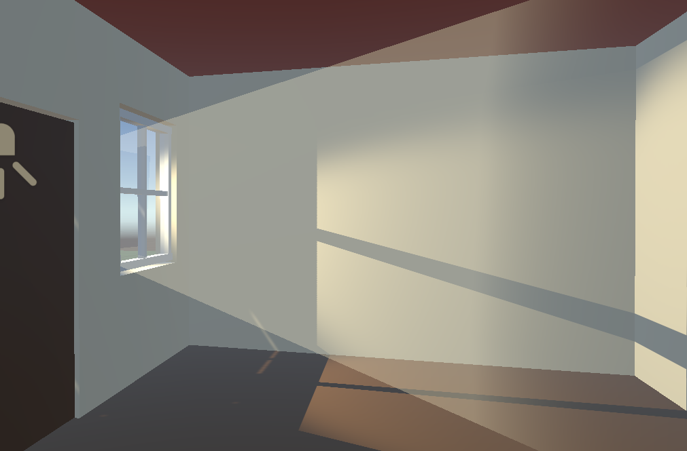
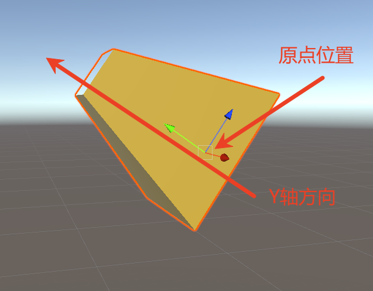
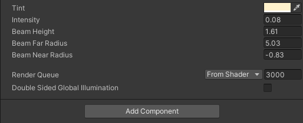

# 效果


# Shader
```hlsl
// ============================================================
// 简易体积光（丁达尔光束）着色器
// ------------------------------------------------------------
// 用途：在 Built-in（内置）渲染管线下，用「透明锥形网格 + 加法混合」
//       模拟窗户体积光 / 上帝之光（God Ray）效果。
//       本项目没有 URP/HDRP 的物理体积光，故采用这种常见的手动做法。
//
// 用法：配合一个"锥形"或"截锥形"网格使用。网格的局部坐标系要求：
//       · y = 0         —— 远端（离光源最远的一端，逐渐隐没）
//       · y = _Height   —— 近端（光源端，最亮）
//       网格朝任意方向摆放都行，本着色器只依赖局部 Y 轴做衰减，
//       因此在场景中可通过旋转物体来改变光束朝向。
// ============================================================
Shader "Custom/VolumetricBeam"
{
    // ----------------------------------------------------------
    // 材质面板可调参数（在 Inspector 中可见）
    // ----------------------------------------------------------
    Properties
    {
        _Color ("Tint", Color) = (1, 0.95, 0.8, 1)   // 光束颜色（带 Alpha，但透明度由片元计算覆盖）
        _Intensity ("Intensity", Float) = 1.0        // 光束整体亮度/强度
        _Height ("Beam Height", Float) = 3.0         // 光束长度：近端(y=_Height)到远端(y=0)的距离
        _Radius ("Beam Far Radius", Float) = 1.2     // 远端半径（预留，当前未使用，便于后续扩展径向衰减）
        _NearRadius ("Beam Near Radius", Float) = 0.4 // 近端半径（预留，当前未使用）
    }

    SubShader
    {
        // ----------------------------------------------------------
        // 渲染设置
        // ----------------------------------------------------------
        // 放入 Transparent 队列（在所有不透明物体之后渲染），并标记为透明渲染类型
        Tags { "Queue"="Transparent" "RenderType"="Transparent" "IgnoreProjector"="True" }

        // 加法混合：最终颜色 = 源颜色 * 源Alpha + 已有颜色
        // 多束光重叠时会自然叠加变亮，符合"光"的物理观感
        Blend SrcAlpha One

        // 不写入深度缓冲：光束是半透明的，不应遮挡其后的物体
        ZWrite Off

        // 关闭背面剔除：锥体从内外两侧看都可见（避免看到背面时光束消失）
        Cull Off

        // 关闭光照与雾效：体积光本身发光，不受场景灯光/雾影响
        Lighting Off
        Fog { Mode Off }

        Pass
        {
            // ----------------------------------------------------------
            // 顶点 / 片元着色器
            // ----------------------------------------------------------
            CGPROGRAM
            #pragma vertex vert          // 顶点着色器入口函数名
            #pragma fragment frag        // 片元着色器入口函数名
            #include "UnityCG.cginc"     // Unity 内置通用工具（含 UnityObjectToClipPos 等）

            // 顶点着色器输入：网格顶点数据
            struct appdata
            {
                float4 vertex : POSITION;  // 模型局部空间坐标
            };

            // 顶点着色器输出 -> 片元着色器输入（光栅化时逐像素插值）
            struct v2f
            {
                float4 vertex   : SV_POSITION; // 裁剪空间坐标（顶点着色器必须输出）
                float3 localPos : TEXCOORD0;   // 局部空间坐标（用于轴向衰减计算）
            };

            // 与 Properties 中同名同类型的变量，供着色器代码读取
            fixed4 _Color;
            float _Intensity;
            float _Height;
            float _Radius;
            float _NearRadius;

            // 顶点着色器：把局部坐标变换到裁剪空间，并透传局部坐标
            v2f vert (appdata v)
            {
                v2f o;
                o.vertex = UnityObjectToClipPos(v.vertex); // 局部空间 -> 裁剪空间
                o.localPos = v.vertex.xyz;                 // 保留局部坐标供片元使用
                return o;
            }

            // 片元着色器：按"轴向"计算透明度，实现近亮远暗的渐变
            fixed4 frag (v2f i) : SV_Target
            {
                // t：沿光束轴向的归一化位置（0=远端，1=近端/光源端）
                // max 防止 _Height 为 0 时除零
                //saturate作用是把一个数值限制（钳制）在 [0, 1] 区间内。
                float t = saturate(i.localPos.y / max(_Height, 0.0001));

                // 透明度 = t²：近端(t=1)完全不透明，远端(t=0)完全透明；
                // 平方让光束衰减更快、近端更集中、远端更柔和。
                // 注意：这里只做轴向衰减，锥体"侧面"全程可见，
                //       不做径向衰减（否则侧面表面 alpha 会恰好为 0，导致光柱隐形）。
                float alpha = t * t;

                // 输出：RGB 乘以强度与透明度；Alpha 通道供加法混合使用
                return fixed4(_Color.rgb * _Intensity * alpha, alpha);
            }
            ENDCG
        }
    }
}

```

# 使用说明：
需要配合体积光模型使用，模型参照：


# 参数说明：
_Color 光束颜色（带 Alpha，但透明度由片元计算覆盖）
_Intensity  光束整体亮度/强度
_Height  光束长度：近端(y=_Height)到远端(y=0)的距离

