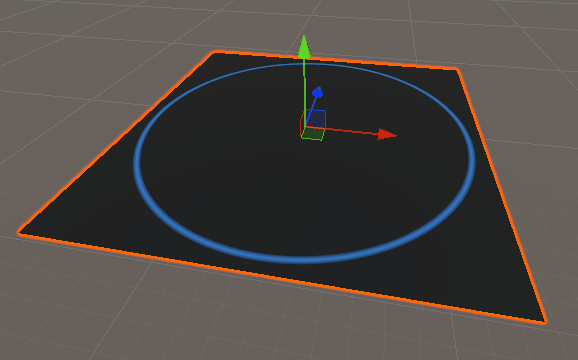

# 效果


# Shader
```hlsl
// ============================================================
// 地面脉冲（GroundPulse）着色器
// ------------------------------------------------------------
// 用途：在模型表面生成从中心向外扩散的环形脉冲光效，
//       常用于技能圈、冲击波、扫描等效果。
//
// 坐标系：脉冲中心 _PulseCenter 使用【模型（局部）坐标系】。
//         因此脉冲"绑定"在模型上：模型移动/旋转/缩放时，脉冲随之一起变换，
//         而不是固定在世界空间的某个点上。
// ============================================================
Shader "UpandaGF/Shader/GroundPulse" {
    Properties {
        // ---------- 基础外观 ----------
        _MainTex ("MainTex", 2D) = "white" { }     // 主贴图：模型基础纹理
        _Color ("BaseColor", Color) = (1, 1, 1, 1) // 基础颜色：与主贴图相乘，决定底色

        // ---------- 脉冲参数 ----------
        _PulseColor ("PulseColor", Color) = (0.2, 0.6, 1, 1)      // 脉冲颜色：环形光的颜色
        _PulseCenter ("PulseCenter", Vector) = (0, 0, 0, 0)       // 脉冲中心（模型局部坐标 xyz，w 未使用；0,0,0 为模型原点/中心）
        _PulseSpeed ("PulseSpeed", Float) = 2.0                   // 脉冲波前传播速度（模型单位/秒）
        _PulseWidth ("PulseWidth", Float) = 0.1                   // 脉冲环宽度（越大环越宽、过渡越柔和）
        _PulseIntensity ("PulseIntensity", Float) = 1.0           // 脉冲强度（整体亮度倍率）
        _PulseFrequency ("PulseFrequency", Float) = 1.0           // 脉冲频率：传播范围内同时存在的环数（1=单环，2=双环）
        _TimeOffset ("TimeOffset", Float) = 0.0                   // 时间/相位偏移：整体提前或延后脉冲
        _Distance ("Distance", Float) = 10                        // 传播距离：波前在该距离内循环重复
    }

    SubShader {
        Tags { "RenderType" = "Opaque" }
        LOD 200

        CGPROGRAM
        #pragma surface surf Standard fullforwardshadows
        #pragma target 3.0

        // 与 Properties 对应的变量声明
        sampler2D _MainTex;        // 主贴图采样器
        fixed4 _Color;             // 基础颜色
        fixed4 _PulseColor;        // 脉冲颜色
        float4 _PulseCenter;       // 脉冲中心（模型局部坐标，仅使用 xyz）
        float _PulseSpeed;         // 脉冲传播速度
        float _PulseWidth;         // 脉冲环宽度
        float _PulseIntensity;     // 脉冲强度
        float _PulseFrequency;     // 脉冲频率（环数）
        float _TimeOffset;         // 时间/相位偏移
        float _Distance;           // 传播距离

        struct Input {
            float2 uv_MainTex; // 主贴图 UV 坐标
            float3 worldPos;   // 片元世界坐标（用于换算回模型坐标）
        };

        /// <summary>计算模型局部坐标点上的脉冲亮度值（范围 0 ~ _PulseIntensity）</summary>
        /// <param name="localPos">模型局部坐标（object space）</param>
        /// <param name="time">当前游戏时间（_Time.y，单位秒）</param>
        float GetPulseValue(float3 localPos, float time) {
            // 1. 只取 XZ 平面的距离：脉冲沿地面水平方向扩散，忽略高度 Y
            float2 centerXZ = float2(_PulseCenter.x, _PulseCenter.z); // 脉冲中心（模型 XZ）
            float2 posXZ = float2(localPos.x, localPos.z);             // 当前片元（模型 XZ）
            float distance = length(posXZ - centerXZ);                 // 到中心的平面距离

            // 2. 每个脉冲环的传播距离：在 _Distance 内划分出 _PulseFrequency 个环
            //    max 防止 _PulseFrequency 为 0 时除零
            float cycleLength = _Distance / max(_PulseFrequency, 0.0001);

            // 3. 当前波前位置：随时间推进，并用 fmod 在 cycleLength 内循环（周期重复）
            //    _TimeOffset 用于整体平移相位（提前/延后脉冲）
            float waveFront = fmod((time + _TimeOffset) * _PulseSpeed, cycleLength);

            // 4. 环形脉冲：离波前越近越亮；_PulseWidth 控制亮 → 暗的过渡宽度
            float distFromWave = abs(distance - waveFront);
            float pulseValue = 1.0 - saturate(distFromWave / _PulseWidth);

            // 5. 距离指数衰减：离中心越远越暗（0.2 为衰减系数，可按需调整）
            pulseValue *= exp(-distance * 0.2);

            // 6. 乘以全局强度后返回
            return pulseValue * _PulseIntensity;
        }

        void surf(Input IN, inout SurfaceOutputStandard o) {
            // 基础颜色：主贴图 × 基础色
            fixed4 tex = tex2D(_MainTex, IN.uv_MainTex) * _Color;
            float time = _Time.y; // 游戏运行时间（秒）

            // 关键：把片元的世界坐标换算回【模型局部坐标】，
            //       使脉冲中心基于模型坐标系（unity_WorldToObject = 模型矩阵的逆）
            float3 localPos = mul(unity_WorldToObject, float4(IN.worldPos, 1.0)).xyz;

            float pulse = GetPulseValue(localPos, time); // 当前片元的脉冲值

            fixed4 finalColor = tex;
            if (pulse > 0.01) {
                // 脉冲颜色按脉冲值缩放
                fixed4 pulseCol = _PulseColor * pulse;
                // 直接叠加：把脉冲色加到基础色上
                finalColor.rgb += pulseCol.rgb;
                // 自发光：让脉冲自身发光，不依赖场景光照
                o.Emission = pulseCol.rgb * 0.5;
            }

            o.Albedo = finalColor.rgb;
            o.Alpha = tex.a;
            o.Metallic = 0.0;
            o.Smoothness = 0.1;
        }
        ENDCG
    }
    FallBack "Diffuse"
}
```
