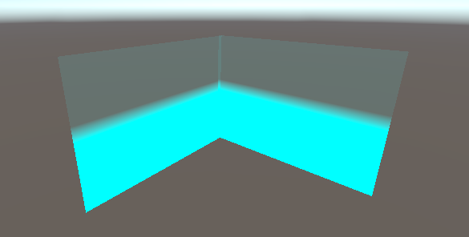

# LightWall 光墙

## 效果


## Shader
```hlsl
// ============================================================
// 光墙（LightWall）着色器
// ------------------------------------------------------------
// 用途：透明发光墙体 / 光幕效果。颜色自下而上逐渐变透明（底部最亮、顶部隐没），
//       并叠加一个随时间上下流动的脉冲（呼吸 / 流动光效）。
// ============================================================
Shader "Custom/LightWall"
{
    Properties
    {
        _MainColor ("MainColor", Color) = (0, 1, 1, 1)          // 主颜色：墙/光幕的颜色与基础透明度
        _GradientPower ("GradientPower", Range(0.1, 5)) = 2     // 渐变指数：控制透明度沿高度衰减的曲线（越大底部越实、顶部衰减越快）
        _PulseSpeed ("PulseSpeed", Range(0.1, 5)) = 1           // 脉冲速度：光效上下流动的快慢
        _PulseStrength ("PulseStrength", Range(0, 0.5)) = 0.1   // 脉冲强度：光效上下流动的幅度
    }

    SubShader
    {
        Tags
        {
            "Queue" = "Transparent"       // 透明队列：在不透明物体之后渲染
            "RenderType" = "Transparent"
            "IgnoreProjector" = "True"
        }

        LOD 100

        Blend SrcAlpha OneMinusSrcAlpha   // 标准 Alpha 混合
        ZWrite Off                        // 不写深度，避免遮挡其后的物体
        Cull Off                          // 关闭背面剔除，双面渲染

        Pass
        {
            CGPROGRAM
            #pragma vertex vert
            #pragma fragment frag

            #include "UnityCG.cginc"

            struct appdata
            {
                float4 vertex : POSITION;
                float2 uv : TEXCOORD0;
            };

            struct v2f
            {
                float4 vertex : SV_POSITION;
                float height : TEXCOORD0;  // 片元沿墙高的归一化位置（0=底部，1=顶部）
                float pulse : TEXCOORD1;   // 当前帧的脉冲偏移量（随时间上下摆动）
            };

            fixed4 _MainColor;
            float _GradientPower;
            float _PulseSpeed;
            float _PulseStrength;

            v2f vert (appdata v)
            {
                v2f o;
                o.vertex = UnityObjectToClipPos(v.vertex);

                // 顶点世界坐标的 Y 值
                float worldPosY = mul(unity_ObjectToWorld, v.vertex).y;
                // 物体原点(pivot)的世界 Y 坐标：_m13 是模型矩阵(物体到世界)的 Y 平移分量
                float objectWorldY = unity_ObjectToWorld._m13;
                // 物体沿本地 Y 轴的世界缩放：1 个本地单位对应的世界长度
                float objectScaleY = length(float3(unity_ObjectToWorld._m01, unity_ObjectToWorld._m11, unity_ObjectToWorld._m21));
                // 归一化高度：相对物体底部的世界高度 ÷ 世界缩放，得到 0~1，铺满整面墙。
                // 假设墙体网格本地高度为 1（如 Quad/Plane），且 pivot 位于墙底。
                o.height = saturate((worldPosY - objectWorldY) / max(objectScaleY, 0.0001));

                // 脉冲：sin 在 -1~1 间振荡，乘以强度得到上下流动的偏移量
                o.pulse = sin(_Time.y * _PulseSpeed) * _PulseStrength;

                return o;
            }

            fixed4 frag (v2f i) : SV_Target
            {
                // 基础渐变：底部(height=0)完全不透明，顶部(height=1)完全透明
                float gradient = 1.0 - pow(i.height, _GradientPower);

                // 脉冲渐变：在高度上叠加一个随时间变化的偏移，产生上下流动感。
                // 先用 saturate 把底数裁剪到 0~1，避免 height - pulse 为负时 pow 产生 NaN。
                float pulsedGradient = 1.0 - pow(saturate(i.height - i.pulse), _GradientPower);

                // 混合两种渐变（各取一半），让脉冲过渡更平滑
                float finalAlpha = lerp(gradient, pulsedGradient, 0.5);

                // 透明度裁剪到 0~1（安全兜底）
                finalAlpha = saturate(finalAlpha);

                // 输出颜色，透明度即计算出的 finalAlpha
                fixed4 col = _MainColor;
                col.a = finalAlpha;
                return col;
            }
            ENDCG
        }
    }

    FallBack "Transparent/VertexLit"
}

```

## 功能简介

`LightWall`（`Custom/LightWall`）是一个透明发光墙体 / 光幕着色器，用于实现：

- **高度渐变透明**：颜色自下而上从完全不透明渐变为完全透明（底部最亮、顶部隐没）；
- **流动脉冲**：叠加一个随时间上下流动的脉冲光效，产生呼吸 / 流动感；
- **双面渲染**：关闭背面剔除，从墙的两侧都能看到；
- **自发光观感**：输出颜色即最终颜色，不依赖场景光照。

常用于技能光墙、能量屏障、扫描光幕、装饰光带等效果。

## 使用步骤

1. 在 Project 面板右键 → **Create → Material**，命名如 `LightWall_Mat`；
2. 选中该材质，在 Inspector 顶部的 Shader 下拉框中选择 **Custom → LightWall**；
3. 将材质拖到场景中的墙体网格（Quad、Plane、Cube 等）上；
4. 调整参数（见下表）直至效果满意。

> 建议：墙体网格的 **pivot 放在墙底**，并保持**本地高度为 1**（如 Unity 默认的 Quad / Plane），这样渐变能正确铺满整面墙。

## 参数说明

| 参数 | 类型 | 默认值 | 说明 |
|------|------|--------|------|
| `MainColor` | Color | (0, 1, 1, 1) | 主颜色：光墙的 RGB 颜色。**注意**：其 Alpha 通道会被计算出的透明度覆盖，实际无效 |
| `GradientPower` | Range(0.1, 5) | 2 | 渐变指数：控制透明度沿高度衰减的曲线。越大底部越实、顶部衰减越快；越小越接近线性 |
| `PulseSpeed` | Range(0.1, 5) | 1 | 脉冲速度：光效上下流动的快慢 |
| `PulseStrength` | Range(0, 0.5) | 0.1 | 脉冲强度：光效上下流动的幅度 |

## 渲染设置说明

| 设置 | 值 | 作用 |
|------|----|----|
| `Queue` | Transparent | 透明队列，在不透明物体之后渲染 |
| `RenderType` | Transparent | 标记为透明渲染类型 |
| `Blend` | SrcAlpha OneMinusSrcAlpha | 标准 Alpha 混合 |
| `ZWrite` | Off | 不写深度，避免遮挡其后的物体 |
| `Cull` | Off | 关闭背面剔除，双面渲染 |

## 工作原理

1. **顶点着色器**：
   - 计算顶点相对墙体底部的高度，并按物体缩放归一化到 0~1；
   - 计算一个随时间正弦振荡的脉冲偏移量。
2. **片元着色器**：
   - 用 `pow(高度, 渐变指数)` 得到基础透明度（底部不透明、顶部透明）；
   - 在高度上叠加脉冲偏移，产生上下流动感；
   - 混合基础渐变与脉冲渐变，最终输出颜色与透明度。

## 注意事项

- **归一化假设**：渐变按物体实际缩放归一化，默认假设墙体网格本地高度为 1（如 Quad / Plane），且 pivot 位于墙底；否则渐变范围可能不准确。
- **颜色透明度**：`MainColor` 的 Alpha 被最终计算出的透明度覆盖，调节透明度请通过 `GradientPower`、`PulseStrength` 等参数实现。
- **脉冲幅度**：`PulseStrength` 上限为 0.5，如需更大流动幅度可自行调大 Range 上限。
