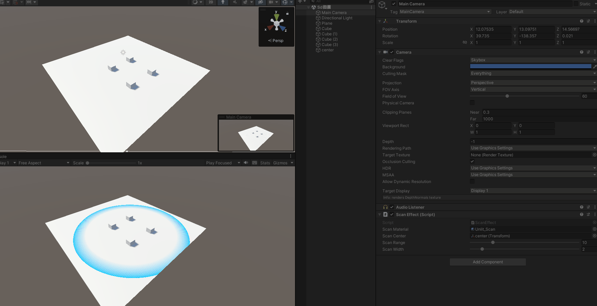

# 场景扫描效果（Scan / 后处理扫描）

> 目录文件：`Scan.shader`（全屏后处理 Shader）、`ScanEffect.cs`（驱动脚本）、`Unlit_Scan.mat`（已配置好的材质）

一个经典「科幻雷达 / 扫描」效果：以世界空间中某一点为圆心，用一层**球形扫描壳**扫过场景几何体，扫过之处在表面浮现**世界坐标网格线**，产生"数据可视化扫描"的观感。



---

## 一、效果概览

| 观察点 | 表现 |
| ------ | ---- |
| 载体 | 全屏后处理（`OnRenderImage`），作用于整个相机画面 |
| 扫描形状 | 以 `_ScanCenter` 为球心、`_ScanRange` 为半径的**球壳**（三维，不是地面圆环） |
| 扫过表面的表现 | 表面浮现一层**世界空间网格**，网格线沿表面切线方向铺开 |
| 动态来源 | `_ScanRange` 由外部驱动（脚本/代码）随时间变化，形成向外扩散的扫波 |

> 关键点：这是 **Post-process（后处理）** 而非模型 Shader——它利用相机**深度纹理 + 深度法线纹理**逐像素重建世界坐标，因此不需要给每个物体挂材质，任何进入画面的物体都会被扫描。

---

## 二、实现原理

### 1. 输入与前置条件

Shader 依赖两张 Unity 内置纹理：

```hlsl
sampler2D_float _CameraDepthTexture;      // 深度纹理（非线性深度）
sampler2D _CameraDepthNormalsTexture;     // 深度法线纹理（RGBA 编码：深度 + 视角空间法线）
```

这两张纹理必须通过 `cam.depthTextureMode |= DepthTextureMode.DepthNormals;` 让相机生成（`ScanEffect.Start()` 中已设置）。

### 2. 从屏幕 UV 还原每个像素的**世界坐标**

屏幕上的每个像素对应 3D 场景中的某个点。要判断"该点离扫描中心多远"，需要它的世界坐标。

**第一步：拿到每个像素朝向的射线（在顶点阶段）**

顶点着色器根据全屏四边形 4 个顶点的 UV 象限，从 `_FrustumCorner`（视锥四角方向向量，长度 = 远平面距离）中选出对应的视锥角向量，作为该顶点的 `interpolatedRay`：

```hlsl
o.interpolatedRay = _FrustumCorner[rayIndex];
```

**第二步：逐像素重建世界位置（在片元阶段）**

```hlsl
// 1) 采样深度纹理 → 非线性深度 → 转成 0~1 线性深度
float depth      = SAMPLE_DEPTH_TEXTURE(_CameraDepthTexture, i.uv_depth);
float linearDepth = Linear01Depth(depth);            // 1 = 远平面

// 2) 世界坐标 = 相机位置 + 线性深度 × 该像素的射线
float3 pixelWorldPos = _WorldSpaceCameraPos + linearDepth * i.interpolatedRay;
```

数学上即：

$$ \text{worldPos} = \text{cameraPos} + \text{linearDepth} \cdot \text{rayDir}_{\text{far}} $$

由于 `interpolatedRay` 的长度对应远平面距离，`linearDepth`（0~1）正好把射线缩短到该像素所在的实际深度位置。

> `_FrustumCorner`、`_CamToWorld` 等矩阵由 `ScanEffect.cs` 在 `OnRenderImage` 里按相机参数（FOV、near/far、aspect）逐帧计算并 `SetMatrix` 传入。

### 3. 用**世界坐标**生成网格

```hlsl
// 以 _MeshWidth（世界单位）为周期，把世界坐标折叠到每个格子内的 0~1
float3 modulo = pixelWorldPos - _MeshWidth * floor(pixelWorldPos / _MeshWidth);
modulo = modulo / _MeshWidth;

// 靠近 0 或 1 的地方（格子边界）为高值 → 网格线
float3 meshCol = smoothstep(_MeshLineWidth, 0, modulo)
               + smoothstep(1 - _MeshLineWidth, 1, modulo);
```

- `floor(worldPos / _MeshWidth)` 决定像素落在哪个格子里；
- `smoothstep` 让线宽有平滑过渡（`_MeshLineWidth` 是 0~1 比例）；
- 网格是**固定在世界空间**的，不随物体/相机移动，扫描时感觉像"给世界表面披上一层网格"。

### 4. 让网格"贴"在物体表面（法线参与）

如果直接按世界坐标 XYZ 三条轴都画网格，垂直于视线的"纵深轴"也会产生很多平行切片，视觉上杂乱。这里用一个技巧让网格**只沿表面切线铺开**：

```hlsl
// a) 从深度法线纹理解出【视角空间法线】→ 转到世界空间
DecodeDepthNormal(tex2D(_CameraDepthNormalsTexture, i.uv), tempDepth, normal);
normal = mul((float3x3)_CamToWorld, normal);

// b) “拍平”法线：|normal| - _Smoothness → 让接近坐标轴的表面被吸附到该轴上
normal = normalize(max(0, (abs(normal) - _Smoothness)));

// c) 用 1-normal 只保留网格中沿"切线方向"的分量
fixed4 scanMeshCol = lerp(_ScanBgColor, _ScanMeshColor,
                          saturate(dot(meshCol, 1 - normal)));
```

举例：地面法线 ≈ (0,1,0)，则 `1-normal ≈ (1,0,1)`，`dot` 只保留网格的 X、Z 分量（贴地网格），丢弃 Y 方向的纵深切片；墙面同理。

`_Smoothness` 的作用是"吸附/钝化"法线方向，让略微倾斜的表面也按最接近的坐标轴处理，网格更干净。

### 5. 球形扫描带（决定哪里显示网格）

```hlsl
float pixelDistance = distance(pixelWorldPos, _ScanCenter); // 像素到球心距离

// 仅当像素落在壳层 [Range-Width, Range] 内，且不是天空盒(linearDepth<1)
if (_ScanRange - pixelDistance > 0
 && _ScanRange - pixelDistance < _ScanWidth
 && linearDepth < 1)
{
    fixed scanPercent = 1 - (_ScanRange - pixelDistance) / _ScanWidth;
    col = lerp(col, scanMeshCol, scanPercent); // 原始画面 → 网格色
}
```

- 壳层判断：`distance ∈ (Range − Width, Range)`，即半径在 `Range` 与 `Range − Width` 之间的球壳；
- `scanPercent`：靠外（近 `Range`）为 1、靠内（近 `Range − Width`）渐变为 0，形成**外沿亮、向内淡出**的扫描带；
- 当外部把 `_ScanRange` 从 0 逐渐加大时，这条亮带就沿半径向外"扫"出去。

### 6. 输出

```hlsl
return col; // 壳层外的像素 = 原屏幕颜色
```

壳外的像素保持原始画面，因此这是一个**局部叠加**而非全屏染色。

---

## 三、使用方式

### 3.1 最小配置步骤

1. 把 `ScanEffect.cs` 挂到**要生效的相机**上（脚本已 `[RequireComponent(typeof(Camera))]`）。
2. 给 `ScanEffect` 的 `scanMaterial` 赋值：
   - 直接用本目录现成的 `Unlit_Scan.mat`，或
   - 新建材质并把 Shader 设为 `Unlit/Scan`。
3. 给 `scanCenter` 指定一个场景中的 Transform（作为扫描中心），例如玩家角色。
4. 调整 `scanRange`（扫描半径）与 `scanWidth`（扫描带宽度）观察效果。

运行后脚本会自动：
- `Start()`：开启相机的深度法线模式；
- `Update()`：把 `_ScanCenter / _ScanRange / _ScanWidth` 写入材质；
- `OnRenderImage()`：计算视锥角向量与 `_CamToWorld`，最后 `Graphics.Blit(src, dest, material)` 完成后处理。

### 3.2 让它"动起来"（关键）

`ScanEffect.cs` 目前只把 Inspector 里的 `scanRange` 当作静态值传给 Shader。**要看到扫描波向外扩散**，需要在外部每帧改变 `scanRange`。最简单的方式（挂在任意物体上）：

```csharp
using UnityEngine;

public class ScanAnimator : MonoBehaviour
{
    public ScanEffect scanEffect;   // 拖入带 ScanEffect 的相机
    public float maxRange = 30f;
    public float duration = 2f;

    void Update()
    {
        // 用时间循环：0 → maxRange → 0，形成往复扫波
        float t = Mathf.PingPong(Time.time, duration) / duration;
        scanEffect.scanRange = Mathf.Lerp(0f, maxRange, t);
    }
}
```

> 也可以做成"一次性外扩"：让 `scanRange` 从 0 线性增长到目标值后暂停/重置，适合触发式（技能、雷达）效果。

### 3.3 参数说明

| 参数 | 类型 | 含义 |
| ---- | ---- | ---- |
| `_ScanRange` | float | 扫描球体半径（世界单位），即扫描波前位置 |
| `_ScanWidth` | float | 扫描带宽度（世界单位），越大过渡越柔和 |
| `_ScanCenter` | Vector3 | 扫描中心的世界坐标（由脚本写入） |
| `_ScanBgColor` | Color | 网格区域背景色 |
| `_ScanMeshColor` | Color | 网格线条颜色 |
| `_MeshLineWidth` | float(0~1) | 网格线宽占格子的比例，默认 0.3 |
| `_MeshWidth` | float | 网格单元大小（世界单位），默认 1 |
| `_Smoothness` | float(0~0.5) | 法线平滑/吸附系数，默认 0.25 |
| `_MainTex` | 2D | 屏幕图像（后处理输入，自动绑定） |
| `_ScanTex` | 2D | 预留纹理，**本 Shader 未使用** |

> 注意：`_ScanBgColor` 与 `_ScanMeshColor` 默认都是白色，实际使用请按需调色（例如背景半透明黑、线条青色），网格才会清晰可辨。

---

## 四、关键注意点 / 已知限制

1. **必须开启深度法线**：相机的 `depthTextureMode` 需含 `DepthNormals`（脚本已自动设置）；否则 `_CameraDepthNormalsTexture`/`_CameraDepthTexture` 为空白，效果失效。
2. **透视相机**：世界坐标重建基于透视视锥（FOV + 远近裁剪），**正交相机下该重建不成立**。
3. **扫描中心为世界坐标**：`_ScanCenter` 是世界空间位置；中心离相机太远/超出视锥时，画面内可能看不到扫描带。
4. **天空盒被排除**：`linearDepth < 1` 的判定使扫描不会作用到天空。
5. **性能**：网格 + 深度重建是逐像素计算，属全屏后处理；分辨率越高开销越大，移动端建议降低 `_MeshWidth` 无关（此参数不耗性能），注意控制后处理叠加数量。
6. **`.mat` 引用路径**：材质与 Shader 在同一目录，若移动文件请保持引用，或按 Shader 名 `Unlit/Scan` 重新指定。

---

## 五、源码

### Shader
```hlsl
Shader "Unlit/Scan"
{
    Properties
    {
        _MainTex ("Texture", 2D) = "white" { }                     // 屏幕图像（后处理输入）
        _ScanTex ("ScanTexture", 2D) = "white" { }                 // 预留的扫描纹理（本Shader未使用）
        _ScanRange ("ScanRange", float) = 0                        // 扫描球体半径
        _ScanWidth ("ScanWidth", float) = 0                        // 扫描带的宽度（过渡区）
        _ScanBgColor ("ScanBgColor", Color) = (1, 1, 1, 1)        // 网格背景色
        _ScanMeshColor ("ScanMeshColor", Color) = (1, 1, 1, 1)    // 网格线条颜色
        _MeshLineWidth ("MeshLineWidth", float) = 0.3              // 网格线宽（0~1比例）
        _MeshWidth ("MeshWidth", float) = 1                        // 网格单元大小（世界单位）
        _Smoothness ("Smoothness", Range(0, 0.5)) = 0.25           // 法线平滑系数
    }

    SubShader
    {
        Pass
        {
            CGPROGRAM
            #pragma vertex vert
            #pragma fragment frag
            #include "UnityCG.cginc"      // 包含Unity常用函数和宏，如UnityObjectToClipPos、Linear01Depth、DecodeDepthNormal等

            // ---- 顶点输入结构 ----
            struct appdata
            {
                float4 vertex : POSITION;       // 顶点位置（全屏四边形的顶点）
                float2 uv : TEXCOORD0;          // 屏幕UV坐标
            };

            // ---- 顶点到片元的传递结构 ----
            struct v2f
            {
                float2 uv : TEXCOORD0;          // 屏幕UV（用于采样主纹理）
                float2 uv_depth : TEXCOORD1;    // 深度纹理UV（通常与uv相同）
                float4 interpolatedRay : TEXCOORD2; // 从相机指向远平面的方向向量（长度=远平面距离）
                float4 vertex : SV_POSITION;    // 裁剪空间顶点位置（系统语义，必须）
            };

            // ---- 外部传入的统一变量 ----
            float4x4 _FrustumCorner;            // 视锥四个角的方向向量（矩阵的四行分别对应左下、右下、右上、左上）
            sampler2D _MainTex;                 // 屏幕图像纹理
            sampler2D _ScanTex;                 // 预留扫描纹理（未使用）
            float _ScanRange;                   // 扫描半径
            float _ScanWidth;                   // 扫描带宽
            float3 _ScanCenter;                 // 扫描中心的世界坐标（由C#脚本传入）
            fixed4 _ScanBgColor;                // 网格背景色
            fixed4 _ScanMeshColor;              // 网格线条颜色
            float _MeshLineWidth;               // 网格线宽比例
            float _MeshWidth;                   // 网格单元大小
            float4x4 _CamToWorld;               // 相机到世界的变换矩阵（用于法线转换）
            fixed _Smoothness;                  // 法线平滑系数

            // 深度纹理和深度法线纹理（由Unity自动绑定的内置纹理）
            sampler2D_float _CameraDepthTexture;         // 深度纹理（存储非线性深度值）
            sampler2D _CameraDepthNormalsTexture;        // 深度法线纹理（编码了深度和法线，格式为RGBA）

            // ---- 顶点着色器 ----
            v2f vert(appdata v)
            {
                v2f o;
                // UnityObjectToClipPos: 将顶点从对象空间变换到裁剪空间（内置函数）
                o.vertex = UnityObjectToClipPos(v.vertex);
                o.uv = v.uv;                               // 传递屏幕UV
                o.uv_depth = v.uv;                         // 深度纹理UV（通常相同）

                // 根据UV象限选择对应的视锥角向量
                // 全屏四边形四个顶点的UV分别为：(0,0)、(1,0)、(1,1)、(0,1)
                int rayIndex;
                if (v.uv.x < 0.5 && v.uv.y < 0.5)          // 左下
                    rayIndex = 0;
                else if (v.uv.x > 0.5 && v.uv.y < 0.5)     // 右下
                    rayIndex = 1;
                else if (v.uv.x > 0.5 && v.uv.y > 0.5)     // 右上
                    rayIndex = 2;
                else                                        // 左上
                    rayIndex = 3;

                o.interpolatedRay = _FrustumCorner[rayIndex]; // 存储该顶点对应的射线方向
                return o;
            }

            // ---- 片元着色器 ----
            fixed4 frag(v2f i) : SV_Target
            {
                float tempDepth;        // 临时深度（从深度法线纹理解码而来）
                half3 normal;           // 法线（解码后的视角空间法线）

                // tex2D: 采样二维纹理（内置函数）
                // DecodeDepthNormal: Unity内置宏，从_CameraDepthNormalsTexture中解码出深度(tempDepth)和法线(normal)
                DecodeDepthNormal(tex2D(_CameraDepthNormalsTexture, i.uv), tempDepth, normal);

                // mul: 矩阵乘法（内置函数），将法线从视角空间转换到世界空间
                normal = mul((float3x3)_CamToWorld, normal);
                // abs: 绝对值（内置函数）
                // max: 取最大值（内置函数）
                // normalize: 归一化向量（内置函数）
                // 法线平滑处理：对各分量取绝对值后减去_Smoothness，再截断到非负并归一化
                normal = normalize(max(0, (abs(normal) - _Smoothness)));

                // 采样屏幕图像
                fixed4 col = tex2D(_MainTex, i.uv);

                // SAMPLE_DEPTH_TEXTURE: Unity宏，从深度纹理中采样深度值（返回非线性深度）
                float depth = SAMPLE_DEPTH_TEXTURE(_CameraDepthTexture, i.uv_depth);
                // Linear01Depth: 将非线性深度转换为0~1范围的线性深度（内置函数）
                float linearDepth = Linear01Depth(depth);

                // 重建像素的世界坐标
                // _WorldSpaceCameraPos: 内置变量，当前相机在世界空间中的位置
                float3 pixelWorldPos = _WorldSpaceCameraPos + linearDepth * i.interpolatedRay;

                // distance: 计算两点之间的距离（内置函数）
                float pixelDistance = distance(pixelWorldPos, _ScanCenter);

                // 计算像素到扫描中心的方向向量（未使用，可能是遗留代码）
                float3 pixelDir = pixelWorldPos - _ScanCenter;

                // ---- 生成世界空间网格 ----
                // floor: 向下取整（内置函数）
                // 将世界坐标按_MeshWidth取模，得到每个轴上的周期位置（0~1）
                float3 modulo = pixelWorldPos - _MeshWidth * floor(pixelWorldPos / _MeshWidth);
                modulo = modulo / _MeshWidth;

                // smoothstep: 平滑阶梯函数（内置函数），在a,b之间做Hermite插值
                // 这里用于生成网格线条：在靠近0和靠近1的位置产生高值
                float3 meshCol = smoothstep(_MeshLineWidth, 0, modulo) + smoothstep(1 - _MeshLineWidth, 1, modulo);

                // dot: 点积（内置函数）
                // saturate: 将值钳制到0~1（内置函数）
                // lerp: 线性插值（内置函数），在a和b之间按t混合
                // 将网格强度与法线方向混合：dot(meshCol, 1-normal)使得法线指向某轴时该轴贡献减小
                fixed4 scanMeshCol = lerp(_ScanBgColor, _ScanMeshColor, saturate(dot(meshCol, 1 - normal)));

                // ---- 扫描带判断 ----
                // 如果像素位于扫描带范围内（距离在[_ScanRange-_ScanWidth, _ScanRange]之间）且不是天空盒
                if (_ScanRange - pixelDistance > 0 && _ScanRange - pixelDistance < _ScanWidth && linearDepth < 1)
                {
                    // 计算扫描进度百分比（0~1，从外向内）
                    fixed scanPercent = 1 - (_ScanRange - pixelDistance) / _ScanWidth;
                    // 在原始颜色和扫描网格颜色之间插值
                    col = lerp(col, scanMeshCol, scanPercent);
                }

                return col; // 返回最终颜色
            }
            ENDCG
        }
    }
}
```

### C#
```CSharp
using UnityEngine;

[RequireComponent(typeof(Camera))]
public class ScanEffect : MonoBehaviour
{
    public Material scanMaterial;
    public Transform scanCenter;          // 扫描中心物体
    [Range(0, 50)] public float scanRange = 10f;
    [Range(0, 20)] public float scanWidth = 2f;

    private Camera cam;

    void Start()
    {
        cam = GetComponent<Camera>();
        // 必须开启深度法线纹理
        cam.depthTextureMode |= DepthTextureMode.DepthNormals;
    }

    void Update()
    {
        if (scanMaterial == null || scanCenter == null) return;

        // 更新扫描参数
        scanMaterial.SetVector("_ScanCenter", scanCenter.position);
        scanMaterial.SetFloat("_ScanRange", scanRange);
        scanMaterial.SetFloat("_ScanWidth", scanWidth);
    }

    void OnRenderImage(RenderTexture src, RenderTexture dest)
    {
        if (scanMaterial == null)
        {
            Graphics.Blit(src, dest);
            return;
        }

        // 计算视锥角向量（Frustum Corners）
        // 这里使用 Unity 内置方法，需要引入 using UnityEngine.Rendering;
        var frustumCorners = new Matrix4x4();
        var fov = cam.fieldOfView;
        var near = cam.nearClipPlane;
        var far = cam.farClipPlane;
        var aspect = cam.aspect;

        float halfHeight = far * Mathf.Tan(fov * 0.5f * Mathf.Deg2Rad);
        float halfWidth = halfHeight * aspect;

        // 四个角相对于相机的方向（未归一化，长度 = far）
        Vector3 topLeft = cam.transform.forward * far + cam.transform.up * halfHeight - cam.transform.right * halfWidth;
        Vector3 topRight = cam.transform.forward * far + cam.transform.up * halfHeight + cam.transform.right * halfWidth;
        Vector3 bottomLeft = cam.transform.forward * far - cam.transform.up * halfHeight - cam.transform.right * halfWidth;
        Vector3 bottomRight = cam.transform.forward * far - cam.transform.up * halfHeight + cam.transform.right * halfWidth;

        frustumCorners.SetRow(0, bottomLeft);
        frustumCorners.SetRow(1, bottomRight);
        frustumCorners.SetRow(2, topRight);
        frustumCorners.SetRow(3, topLeft);

        scanMaterial.SetMatrix("_FrustumCorner", frustumCorners);
        // 设置相机到世界的矩阵（用于法线转换）
        scanMaterial.SetMatrix("_CamToWorld", cam.cameraToWorldMatrix);

        Graphics.Blit(src, dest, scanMaterial);
    }
}
```