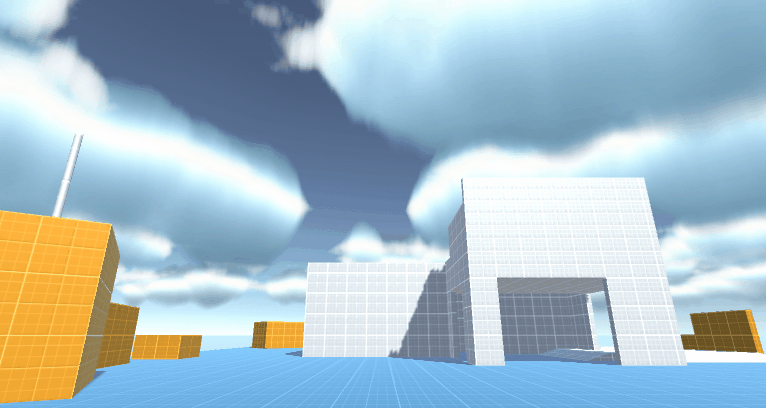
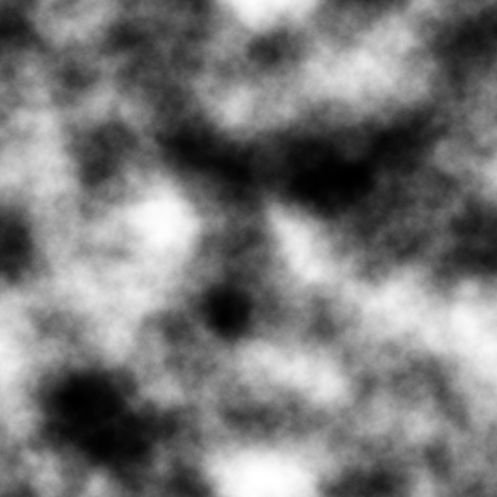
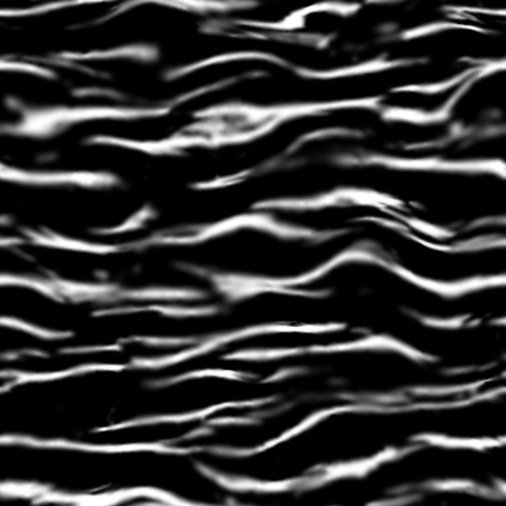
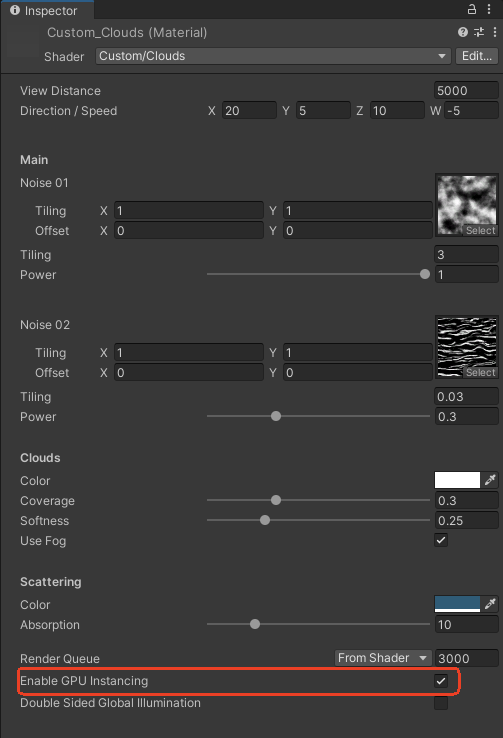
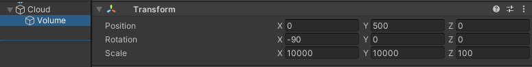
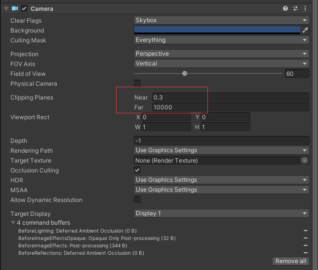
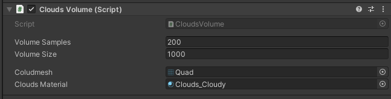

# 效果演示：



# 步骤：
## 1.搭建场景，不搭也行

## 2.Shader：
```C
Shader "Custom/Clouds" {
    Properties {
        _ViewDistance ("View Distance", Float) = 5000
        _DirectionSpeed ("Direction / Speed", Vector) = (20, 5, 10, -5)
        [Header(Main)][Space(10)]_Noise01 ("Noise 01", 2D) = "white" { }
        _Tiling01 ("Tiling", Float) = 0.02
        _Noise01Power ("Power", Range(0, 1)) = 0.75
        [Space(30)]_Noise02 ("Noise 02", 2D) = "white" { }
        _Tiling02 ("Tiling", Float) = 0.03
        _Noise02Power ("Power", Range(0, 1)) = 0.3
        [Space(10)][Header(Clouds)][Space(10)]_ScatteringColor ("Color", Color) = (1, 1, 1, 1)
        _Coverage ("Coverage", Range(0, 1)) = 0.3
        _Softness ("Softness", Range(0, 1)) = 0.25
        [Toggle(_USEFOG_ON)] _UseFog ("Use Fog", Float) = 1
        [Space(10)][Header(Scattering)][Space(10)]_CloudsColor ("Color", Color) = (0.1843137, 0.3568628, 0.4627451, 1)
        [HideInInspector]_cloudsPosition ("cloudsPosition", Float) = 1
        _ScatteringPower ("Absorption", Range(0, 50)) = 10
        [HideInInspector]_cloudsHeight ("cloudsHeight", Float) = 1
        [HideInInspector] __dirty ("", Int) = 1
    }

    SubShader {
        Tags { "RenderType" = "Transparent" "Queue" = "Transparent+0" "IgnoreProjector" = "True" "ForceNoShadowCasting" = "True" "IsEmissive" = "true" }
        Cull Off
        CGINCLUDE
        #include "UnityPBSLighting.cginc"
        #include "UnityShaderVariables.cginc"
        #include "UnityCG.cginc"
        #include "Lighting.cginc"
        #pragma target 3.0
        #pragma shader_feature_local _USEFOG_ON
        struct Input {
            float3 worldPos;
            float eyeDepth;
        };

        struct SurfaceOutputCustomLightingCustom {
            half3 Albedo;
            half3 Normal;
            half3 Emission;
            half Metallic;
            half Smoothness;
            half Occlusion;
            half Alpha;
            Input SurfInput;
            UnityGIInput GIData;
        };

        uniform float _cloudsPosition;
        uniform float _cloudsHeight;
        uniform float _Coverage;
        uniform float _ScatteringPower;
        uniform float4 _ScatteringColor;
        uniform float4 _CloudsColor;
        uniform float _ViewDistance;
        uniform sampler2D _Noise02;
        uniform float4 _DirectionSpeed;
        uniform float _Tiling02;
        uniform sampler2D _Noise01;
        uniform float _Tiling01;
        uniform float _Noise01Power;
        uniform float _Noise02Power;
        uniform float _Softness;

        void vertexDataFunc(inout appdata_full v, out Input o) {
            UNITY_INITIALIZE_OUTPUT(Input, o);
            o.eyeDepth = -UnityObjectToViewPos(v.vertex.xyz).z;
        }

        inline half4 LightingStandardCustomLighting(inout SurfaceOutputCustomLightingCustom s, half3 viewDir, UnityGI gi) {
            UnityGIInput data = s.GIData;
            Input i = s.SurfInput;
            half4 c = 0;
            float cameraDepthFade66 = ((i.eyeDepth - _ProjectionParams.y - 0.0) / _ViewDistance);
            float DistanceFade124 = (1.0 - cameraDepthFade66);
            float2 appendResult161 = (float2(_DirectionSpeed.z, _DirectionSpeed.w));
            float3 ase_worldPos = i.worldPos;
            float2 appendResult4 = (float2(ase_worldPos.x, ase_worldPos.z));
            float2 panner159 = (_Time.y * appendResult161 + appendResult4);
            float3 temp_cast_1 = (tex2D(_Noise02, (panner159 * (_Tiling02 / 10000.0))).r).xxx;
            float3 temp_cast_2 = (tex2D(_Noise02, (panner159 * (_Tiling02 / 10000.0))).r).xxx;
            float3 linearToGamma92 = LinearToGammaSpace(temp_cast_2);
            float2 appendResult160 = (float2(_DirectionSpeed.x, _DirectionSpeed.y));
            float2 panner157 = (_Time.y * appendResult160 + appendResult4);
            float3 temp_cast_3 = (tex2D(_Noise01, (panner157 * (_Tiling01 / 10000.0))).r).xxx;
            float3 temp_cast_4 = (tex2D(_Noise01, (panner157 * (_Tiling01 / 10000.0))).r).xxx;
            float3 linearToGamma91 = LinearToGammaSpace(temp_cast_4);
            float3 blendOpSrc155 = linearToGamma92;
            float3 blendOpDest155 = (linearToGamma91 * _Noise01Power);
            float3 lerpBlendMode155 = lerp(blendOpDest155, max(blendOpSrc155, blendOpDest155), _Noise02Power);
            float3 Noise121 = (saturate(lerpBlendMode155));
            float Coverage211 = _Coverage;
            float CloudHeight130 = (1.0 - pow(saturate((abs((_cloudsPosition - ase_worldPos.y)) / _cloudsHeight)), (1.0 - Coverage211)));
            float3 temp_cast_5 = ((1.0 - (0.0 + (Coverage211 - 0.0) * (1.0 - 0.0) / (0.98 - 0.0)))).xxx;
            float3 temp_cast_6 = (_Softness).xxx;
            float3 CloudCoverage134 = pow(saturate((float3(0, 0, 0) + ((Noise121 * CloudHeight130) - temp_cast_5) * (float3(1, 0, 0) - float3(0, 0, 0)) / (float3(1, 0, 0) - temp_cast_5))), temp_cast_6);
            c.rgb = 0;
            c.a = saturate((DistanceFade124 * CloudCoverage134)).x;
            return c;
        }

        inline void LightingStandardCustomLighting_GI(inout SurfaceOutputCustomLightingCustom s, UnityGIInput data, inout UnityGI gi) {
            s.GIData = data;
        }

        void surf(Input i, inout SurfaceOutputCustomLightingCustom o) {
            o.SurfInput = i;
            #if defined(LIGHTMAP_ON) && (UNITY_VERSION < 560 || (defined(LIGHTMAP_SHADOW_MIXING) && !defined(SHADOWS_SHADOWMASK) && defined(SHADOWS_SCREEN)))//aselc
                float4 ase_lightColor = 0;
            #else //aselc
                float4 ase_lightColor = _LightColor0;
            #endif //aselc
            float3 ase_worldPos = i.worldPos;
            float3 ase_worldViewDir = Unity_SafeNormalize(UnityWorldSpaceViewDir(ase_worldPos));
            #if defined(LIGHTMAP_ON) && UNITY_VERSION < 560 //aseld
                float3 ase_worldlightDir = 0;
            #else //aseld
                float3 ase_worldlightDir = normalize(UnityWorldSpaceLightDir(ase_worldPos));
            #endif //aseld
            float dotResult109 = dot(ase_worldViewDir, -ase_worldlightDir);
            float temp_output_114_0 = pow(saturate(dotResult109), 5.0);
            float Coverage211 = _Coverage;
            float CloudHeight130 = (1.0 - pow(saturate((abs((_cloudsPosition - ase_worldPos.y)) / _cloudsHeight)), (1.0 - Coverage211)));
            float temp_output_197_0 = pow((1 * CloudHeight130), _ScatteringPower);
            float4 Scattering119 = (((ase_lightColor * temp_output_114_0) + (temp_output_114_0 * unity_AmbientSky * ase_lightColor)) * temp_output_197_0);
            float Lerp223 = temp_output_197_0;
            float cameraDepthFade66 = ((i.eyeDepth - _ProjectionParams.y - 0.0) / _ViewDistance);
            float DistanceFade124 = (1.0 - cameraDepthFade66);
            #ifdef _USEFOG_ON
                float staticSwitch192 = saturate((DistanceFade124 / 1.0));
            #else
                float staticSwitch192 = 1.0;
            #endif
            float4 lerpResult181 = lerp(unity_FogColor, _CloudsColor, staticSwitch192);
            float4 CloudLighting137 = (Scattering119 + ((_ScatteringColor * Lerp223) + lerpResult181));
            o.Emission = CloudLighting137.rgb;
        }

        ENDCG
        CGPROGRAM
        #pragma surface surf StandardCustomLighting alpha:fade keepalpha fullforwardshadows nofog vertex:vertexDataFunc

        ENDCG
        Pass {
            Name "ShadowCaster"
            Tags { "LightMode" = "ShadowCaster" }
            ZWrite On
            CGPROGRAM
            #pragma vertex vert
            #pragma fragment frag
            #pragma target 3.0
            #pragma multi_compile_shadowcaster
            #pragma multi_compile UNITY_PASS_SHADOWCASTER
            #pragma skip_variants FOG_LINEAR FOG_EXP FOG_EXP2
            #include "HLSLSupport.cginc"
            #if (SHADER_API_D3D11 || SHADER_API_GLCORE || SHADER_API_GLES || SHADER_API_GLES3 || SHADER_API_METAL || SHADER_API_VULKAN)
                #define CAN_SKIP_VPOS
            #endif
            #include "UnityCG.cginc"
            #include "Lighting.cginc"
            #include "UnityPBSLighting.cginc"
            sampler3D _DitherMaskLOD;
            struct v2f {
                V2F_SHADOW_CASTER;
                float1 customPack1 : TEXCOORD1;
                float3 worldPos : TEXCOORD2;
                UNITY_VERTEX_INPUT_INSTANCE_ID
                UNITY_VERTEX_OUTPUT_STEREO
            };
            v2f vert(appdata_full v) {
                v2f o;
                UNITY_SETUP_INSTANCE_ID(v);
                UNITY_INITIALIZE_OUTPUT(v2f, o);
                UNITY_INITIALIZE_VERTEX_OUTPUT_STEREO(o);
                UNITY_TRANSFER_INSTANCE_ID(v, o);
                Input customInputData;
                vertexDataFunc(v, customInputData);
                float3 worldPos = mul(unity_ObjectToWorld, v.vertex).xyz;
                half3 worldNormal = UnityObjectToWorldNormal(v.normal);
                o.customPack1.x = customInputData.eyeDepth;
                o.worldPos = worldPos;
                TRANSFER_SHADOW_CASTER_NORMALOFFSET(o)
                return o;
            }
            half4 frag(v2f IN
            #if !defined(CAN_SKIP_VPOS)
                , UNITY_VPOS_TYPE vpos : VPOS
            #endif
            ) : SV_Target {
                UNITY_SETUP_INSTANCE_ID(IN);
                Input surfIN;
                UNITY_INITIALIZE_OUTPUT(Input, surfIN);
                surfIN.eyeDepth = IN.customPack1.x;
                float3 worldPos = IN.worldPos;
                half3 worldViewDir = normalize(UnityWorldSpaceViewDir(worldPos));
                surfIN.worldPos = worldPos;
                SurfaceOutputCustomLightingCustom o;
                UNITY_INITIALIZE_OUTPUT(SurfaceOutputCustomLightingCustom, o)
                surf(surfIN, o);
                UnityGI gi;
                UNITY_INITIALIZE_OUTPUT(UnityGI, gi);
                o.Alpha = LightingStandardCustomLighting(o, worldViewDir, gi).a;
                #if defined(CAN_SKIP_VPOS)
                    float2 vpos = IN.pos;
                #endif
                half alphaRef = tex3D(_DitherMaskLOD, float3(vpos.xy * 0.25, o.Alpha * 0.9375)).a;
                clip(alphaRef - 0.01);
                SHADOW_CASTER_FRAGMENT(IN)
            }
            ENDCG
        }
    }
    Fallback "Diffuse"
}
```
## 3.材质
这里需要两张噪声图：





### 参数设置：
创建材质，把shader给它，这些参数,参考图片,自行调整。
**Enable GPU Instancing 一定要勾上！**



## 4.体积云制作：
场景中新建空物体，命名Cloud，再新建子物体，调整子物体的Transform，参数参考图片



摄像机的视角调远点




子物体添加体积云控制脚本，这个脚本挂载到Volume上面
```CSharp
using System.Collections;
using System.Collections.Generic;
using UnityEngine;

[ExecuteInEditMode]
public class CloudsVolume : MonoBehaviour
{
    [Space(10)]
    public int volumeSamples = 50;
    public float volumeSize = 500f;
    float volumeOffset;

    [Space(10)]
    public Mesh Coludmesh;
    public Material cloudsMaterial;

    private Matrix4x4 matrix;
    private Matrix4x4[] matrices;
  

    // Update is called once per frame
    void Update()
    {
        cloudsMaterial.SetFloat("_cloudsPosition", transform.position.y);
        cloudsMaterial.SetFloat("_cloudsHeight", volumeSize);

        volumeOffset = volumeSize / volumeSamples / 2f;
        Vector3 startPosition = transform.position + (Vector3.up * (volumeOffset * volumeSamples / 2f));
        matrices = new Matrix4x4[volumeSamples];
        for (int i = 0; i < volumeSamples; i++)
        {
            matrix = Matrix4x4.TRS(startPosition - (Vector3.up * volumeOffset * i), transform.rotation, transform.localScale);
            matrices[i] = matrix;
            Graphics.DrawMesh(Coludmesh, matrix, cloudsMaterial, 0);
        }
        Graphics.DrawMeshInstanced(Coludmesh, 0, cloudsMaterial, matrices, volumeSamples);
    }
}
```
把之前做的材质附上去，网格用Quad，（Quad是Unity自带的网格）

